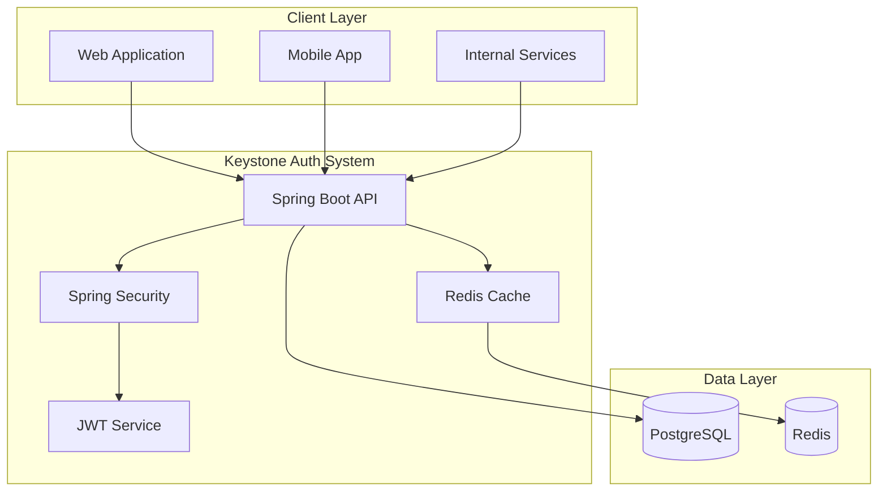
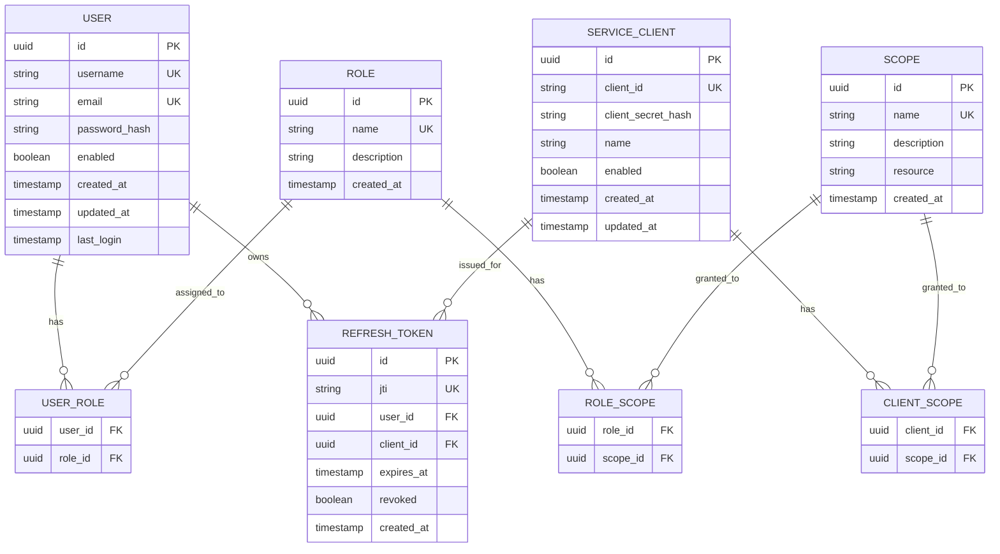

# Keystone Authentication System - Architecture Overview

## 🏗️ System Architecture



## 🎯 Core Components

### 1. Authentication Layer
- **User Authentication**: Username/password with OAuth2 flows
- **Service Authentication**: Client credentials flow for service-to-service
- **Token Management**: JWT access/refresh tokens with JTI support

### 2. Authorization Layer
- **RBAC**: Role-based access control
- **Scope-based**: OAuth2-style scope validation
- **Audience Validation**: Service-specific token validation

### 3. Security Features
- **Password Policies**: Entropy, length, reuse prevention
- **Rate Limiting**: Brute-force protection
- **Token Security**: Secure signing, expiration, revocation

## 📊 Database Schema Design

### Core Entities



## 🔐 Token Strategy

### Token Types & Lifetimes

| Token Type | Lifetime | Audience | Use Case |
|------------|----------|----------|----------|
| Access Token | 15 minutes | Target Service | API calls |
| Refresh Token | 7-30 days | Auth Server | Refresh access tokens |
| Service Token | 5-15 minutes | Target Service | Service-to-service |

### JWT Claims Structure

```json
{
  "iss": "keystone-auth",
  "aud": ["trading-api", "mt5-api"],
  "sub": "user-uuid-or-client-id",
  "exp": 1234567890,
  "iat": 1234567890,
  "nbf": 1234567890,
  "jti": "unique-token-id",
  "type": "access|refresh|service",
  "roles": ["user", "trader"],
  "scopes": ["read:profile", "write:trades"],
  "client_id": "service-client-id"
}
```

## 🛠️ Technology Stack

### Core Framework
- **Spring Boot 3.x**: Main application framework
- **Spring Security 6.x**: Authentication and authorization
- **Spring Data JPA**: Database access layer
- **Spring Boot Actuator**: Health checks and metrics

### Database & Caching
- **PostgreSQL 15+**: Primary database
- **Redis 7+**: Token caching and session storage
- **HikariCP**: Connection pooling

### Security & JWT
- **jjwt**: JWT library for token handling
- **Argon2**: Password hashing
- **Bouncy Castle**: Cryptographic operations

### Testing & Documentation
- **JUnit 5**: Unit testing
- **Testcontainers**: Integration testing
- **OpenAPI 3**: API documentation
- **WireMock**: External service mocking

### Deployment
- **Docker**: Containerization
- **Docker Compose**: Multi-container orchestration

## 🔄 API Endpoints Design

### Authentication Endpoints
```
POST /auth/token          # User login (password grant)
POST /auth/refresh        # Refresh access token
POST /auth/service-token  # Service client credentials
POST /auth/revoke         # Revoke tokens
POST /auth/introspect     # Token introspection (optional)
```

### User Management
```
POST /users/register      # User registration
GET  /users/profile       # Get user profile
PUT  /users/profile       # Update user profile
POST /users/change-password # Change password
```

### Admin Endpoints
```
GET    /admin/users       # List users
POST   /admin/users       # Create user
PUT    /admin/users/{id}  # Update user
DELETE /admin/users/{id}  # Delete user

GET    /admin/clients     # List service clients
POST   /admin/clients     # Create service client
PUT    /admin/clients/{id} # Update service client
DELETE /admin/clients/{id} # Delete service client
```

## 🚀 Deployment Architecture

### Docker Compose Services
```yaml
services:
  keystone-app:
    # Spring Boot application
  postgres:
    # PostgreSQL database
  redis:
    # Redis cache
  nginx:
    # Reverse proxy (optional)
```

### Environment Configuration
- **Development**: H2 in-memory + embedded Redis
- **Production**: PostgreSQL + Redis cluster
- **Testing**: Testcontainers for integration tests

## 📈 Performance Considerations

### Caching Strategy
- **Redis**: Token blacklist, user sessions, rate limiting
- **Application**: Role/scope mappings, public keys
- **Database**: Connection pooling, query optimization

### Security Measures
- **Rate Limiting**: Per IP, per user, per endpoint
- **Token Rotation**: Automatic refresh token rotation
- **Audit Logging**: All authentication events
- **Monitoring**: Failed login attempts, token usage

## 🧪 Testing Strategy

### Unit Tests
- Token generation and validation
- Password policy enforcement
- Role and scope authorization
- Error handling scenarios

### Integration Tests
- End-to-end authentication flows
- Database operations
- Redis caching
- API endpoint testing

### Security Tests
- Token tampering attempts
- Brute force protection
- SQL injection prevention
- XSS protection