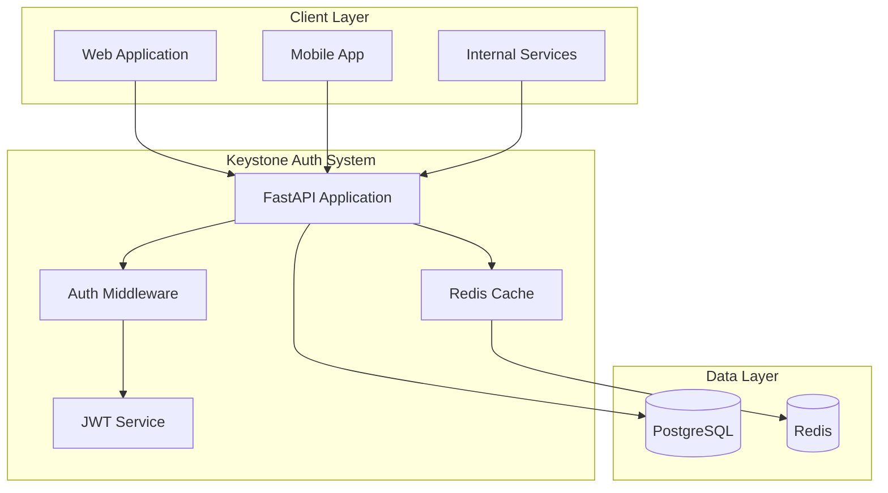
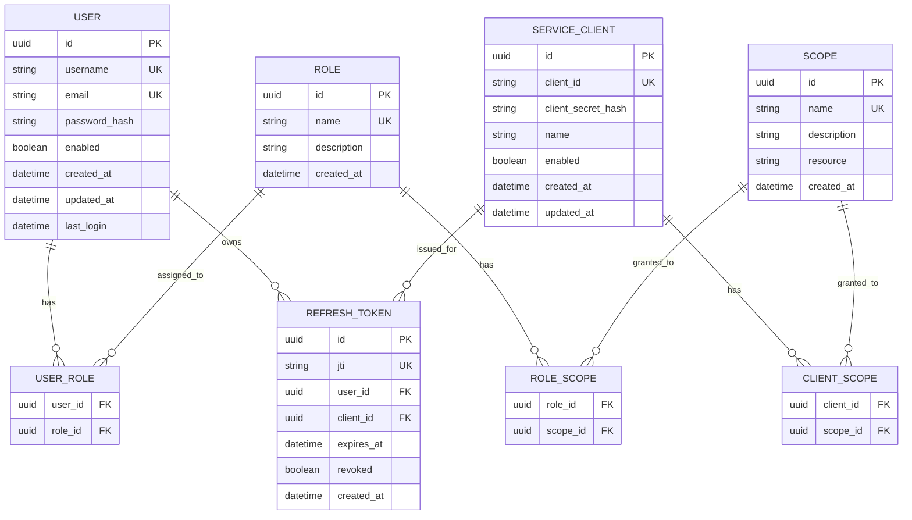

# Keystone Authentication System - FastAPI Architecture

## 🏗️ System Architecture



## 🎯 Core Components

### 1. FastAPI Application Layer
- **Async/Await Support**: High-performance async request handling
- **Automatic OpenAPI**: Built-in API documentation generation
- **Pydantic Models**: Request/response validation and serialization
- **Dependency Injection**: Clean separation of concerns

### 2. Authentication & Authorization
- **JWT Token Management**: PyJWT for secure token handling
- **Password Security**: Passlib with Argon2 hashing
- **OAuth2 Flows**: Password grant and client credentials
- **Role-Based Access**: Custom decorators for authorization

### 3. Database Layer
- **SQLAlchemy ORM**: Async database operations
- **Alembic Migrations**: Database schema versioning
- **Connection Pooling**: Efficient database connections
- **Query Optimization**: Lazy loading and relationship management

## 📊 Database Schema Design

### Core Entities (SQLAlchemy Models)



## 🛠️ Technology Stack

### Core Framework
- **FastAPI 0.104+**: Modern, fast web framework
- **Uvicorn**: ASGI server for production
- **Pydantic 2.x**: Data validation and serialization
- **Python 3.11+**: Latest Python features and performance

### Database & ORM
- **SQLAlchemy 2.x**: Async ORM with modern syntax
- **Asyncpg**: High-performance PostgreSQL driver
- **Alembic**: Database migration tool
- **PostgreSQL 15+**: Primary database

### Caching & Session Management
- **Redis 7+**: Token caching and session storage
- **aioredis**: Async Redis client
- **Redis Sentinel**: High availability (optional)

### Security & Authentication
- **PyJWT**: JWT token handling
- **Passlib**: Password hashing with Argon2
- **python-multipart**: Form data handling
- **cryptography**: Cryptographic operations

### Testing & Development
- **pytest**: Testing framework
- **pytest-asyncio**: Async test support
- **httpx**: Async HTTP client for testing
- **testcontainers**: Integration testing with Docker

### Monitoring & Logging
- **structlog**: Structured logging
- **prometheus-client**: Metrics collection
- **slowapi**: Rate limiting middleware
- **sentry-sdk**: Error tracking (optional)

## 🔄 API Architecture

### FastAPI Router Structure
```python
from fastapi import FastAPI, APIRouter

# Main application
app = FastAPI(
    title="Keystone Authentication API",
    description="Centralized Authentication and Authorization System",
    version="1.0.0"
)

# Router organization
auth_router = APIRouter(prefix="/auth", tags=["authentication"])
user_router = APIRouter(prefix="/users", tags=["user-management"])
admin_router = APIRouter(prefix="/admin", tags=["administration"])

app.include_router(auth_router)
app.include_router(user_router)
app.include_router(admin_router)
```

### Dependency Injection Pattern
```python
from fastapi import Depends, HTTPException, status
from fastapi.security import HTTPBearer

security = HTTPBearer()

async def get_current_user(token: str = Depends(security)) -> User:
    """Extract and validate current user from JWT token"""
    try:
        payload = jwt.decode(token.credentials, SECRET_KEY, algorithms=["HS256"])
        user_id = payload.get("sub")
        if user_id is None:
            raise HTTPException(status_code=401, detail="Invalid token")
        
        user = await get_user_by_id(user_id)
        if user is None:
            raise HTTPException(status_code=401, detail="User not found")
        
        return user
    except JWTError:
        raise HTTPException(status_code=401, detail="Invalid token")

async def require_admin(current_user: User = Depends(get_current_user)) -> User:
    """Require admin role for endpoint access"""
    if not current_user.has_role("admin"):
        raise HTTPException(status_code=403, detail="Admin access required")
    return current_user
```

## 🔐 Security Implementation

### JWT Token Structure
```python
from datetime import datetime, timedelta
from typing import Dict, List, Optional
import jwt

class TokenService:
    def create_access_token(
        self,
        subject: str,
        scopes: List[str],
        audience: List[str],
        expires_delta: Optional[timedelta] = None
    ) -> str:
        if expires_delta:
            expire = datetime.utcnow() + expires_delta
        else:
            expire = datetime.utcnow() + timedelta(minutes=15)
        
        payload = {
            "iss": "keystone-auth",
            "aud": audience,
            "sub": subject,
            "exp": expire,
            "iat": datetime.utcnow(),
            "nbf": datetime.utcnow(),
            "jti": str(uuid4()),
            "type": "access",
            "scopes": scopes
        }
        
        return jwt.encode(payload, SECRET_KEY, algorithm="HS256")
```

### Password Security
```python
from passlib.context import CryptContext
from passlib.hash import argon2

pwd_context = CryptContext(
    schemes=["argon2"],
    deprecated="auto",
    argon2__memory_cost=65536,  # 64 MB
    argon2__time_cost=3,        # 3 iterations
    argon2__parallelism=1,      # 1 thread
)

class PasswordService:
    @staticmethod
    def hash_password(password: str) -> str:
        return pwd_context.hash(password)
    
    @staticmethod
    def verify_password(plain_password: str, hashed_password: str) -> bool:
        return pwd_context.verify(plain_password, hashed_password)
    
    @staticmethod
    def validate_password_policy(password: str) -> List[str]:
        errors = []
        if len(password) < 8:
            errors.append("Password must be at least 8 characters long")
        if not re.search(r"[A-Z]", password):
            errors.append("Password must contain uppercase letters")
        if not re.search(r"[a-z]", password):
            errors.append("Password must contain lowercase letters")
        if not re.search(r"\d", password):
            errors.append("Password must contain digits")
        if not re.search(r"[!@#$%^&*(),.?\":{}|<>]", password):
            errors.append("Password must contain special characters")
        return errors
```

## 🚀 Performance Optimizations

### Async Database Operations
```python
from sqlalchemy.ext.asyncio import AsyncSession, create_async_engine
from sqlalchemy.orm import sessionmaker

# Async engine configuration
engine = create_async_engine(
    DATABASE_URL,
    echo=False,
    pool_size=20,
    max_overflow=0,
    pool_pre_ping=True,
    pool_recycle=3600
)

AsyncSessionLocal = sessionmaker(
    engine, class_=AsyncSession, expire_on_commit=False
)

async def get_db() -> AsyncSession:
    async with AsyncSessionLocal() as session:
        try:
            yield session
        finally:
            await session.close()
```

### Redis Caching Strategy
```python
import aioredis
from typing import Optional, Any
import json

class CacheService:
    def __init__(self, redis_url: str):
        self.redis = aioredis.from_url(redis_url, decode_responses=True)
    
    async def get(self, key: str) -> Optional[Any]:
        value = await self.redis.get(key)
        return json.loads(value) if value else None
    
    async def set(self, key: str, value: Any, expire: int = 3600):
        await self.redis.set(key, json.dumps(value), ex=expire)
    
    async def delete(self, key: str):
        await self.redis.delete(key)
    
    async def exists(self, key: str) -> bool:
        return await self.redis.exists(key)
```

## 📊 Monitoring & Observability

### Structured Logging
```python
import structlog
from fastapi import Request
import time

# Configure structured logging
structlog.configure(
    processors=[
        structlog.stdlib.filter_by_level,
        structlog.stdlib.add_logger_name,
        structlog.stdlib.add_log_level,
        structlog.stdlib.PositionalArgumentsFormatter(),
        structlog.processors.TimeStamper(fmt="iso"),
        structlog.processors.StackInfoRenderer(),
        structlog.processors.format_exc_info,
        structlog.processors.UnicodeDecoder(),
        structlog.processors.JSONRenderer()
    ],
    context_class=dict,
    logger_factory=structlog.stdlib.LoggerFactory(),
    wrapper_class=structlog.stdlib.BoundLogger,
    cache_logger_on_first_use=True,
)

logger = structlog.get_logger()

@app.middleware("http")
async def logging_middleware(request: Request, call_next):
    start_time = time.time()
    
    response = await call_next(request)
    
    process_time = time.time() - start_time
    logger.info(
        "HTTP request processed",
        method=request.method,
        url=str(request.url),
        status_code=response.status_code,
        process_time=process_time
    )
    
    return response
```

### Metrics Collection
```python
from prometheus_client import Counter, Histogram, generate_latest
from fastapi import Response

# Define metrics
REQUEST_COUNT = Counter('http_requests_total', 'Total HTTP requests', ['method', 'endpoint', 'status'])
REQUEST_DURATION = Histogram('http_request_duration_seconds', 'HTTP request duration')
AUTH_ATTEMPTS = Counter('auth_attempts_total', 'Authentication attempts', ['result'])
TOKEN_GENERATED = Counter('tokens_generated_total', 'Tokens generated', ['type'])

@app.get("/metrics")
async def metrics():
    return Response(generate_latest(), media_type="text/plain")
```

## 🧪 Testing Strategy

### Test Structure
```python
import pytest
from httpx import AsyncClient
from fastapi.testclient import TestClient
from sqlalchemy.ext.asyncio import AsyncSession

@pytest.fixture
async def async_client():
    async with AsyncClient(app=app, base_url="http://test") as client:
        yield client

@pytest.fixture
async def db_session():
    # Create test database session
    async with AsyncSessionLocal() as session:
        yield session
        await session.rollback()

@pytest.mark.asyncio
async def test_user_authentication(async_client: AsyncClient):
    response = await async_client.post(
        "/auth/token",
        json={
            "username": "test@example.com",
            "password": "TestPassword123!",
            "grant_type": "password"
        }
    )
    assert response.status_code == 200
    data = response.json()
    assert "access_token" in data
    assert "refresh_token" in data
```

## 🐳 Containerization

### Dockerfile
```dockerfile
FROM python:3.11-slim

WORKDIR /app

# Install system dependencies
RUN apt-get update && apt-get install -y \
    gcc \
    && rm -rf /var/lib/apt/lists/*

# Install Python dependencies
COPY requirements.txt .
RUN pip install --no-cache-dir -r requirements.txt

# Copy application code
COPY . .

# Create non-root user
RUN adduser --disabled-password --gecos '' appuser
RUN chown -R appuser:appuser /app
USER appuser

EXPOSE 8000

CMD ["uvicorn", "main:app", "--host", "0.0.0.0", "--port", "8000"]
```

This FastAPI-based architecture provides a modern, high-performance foundation for the Keystone authentication system with excellent async support, automatic API documentation, and robust security features.