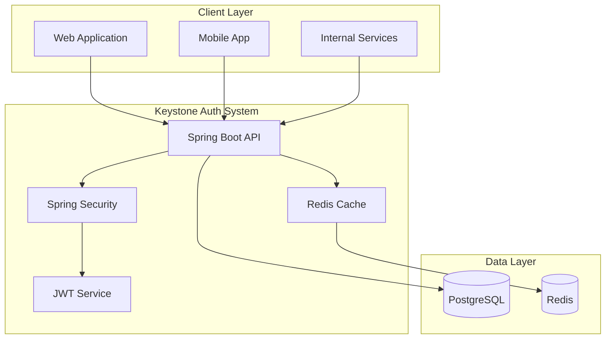

# 🔐 Keystone Authentication System

A comprehensive, dockerized centralized authentication and authorization system built with Spring Boot, designed for enterprise-grade security and scalability.

## 🎯 Overview

Keystone provides a robust identity and authorization platform that supports:

- **User Authentication**: Username/password with OAuth2 flows
- **Service-to-Service Authentication**: Client credentials flow for internal services
- **Role-Based Access Control (RBAC)**: Flexible role and permission management
- **Scope-Based Authorization**: OAuth2-style scope validation
- **JWT Token Management**: Secure token generation, validation, and revocation
- **Enterprise Security**: Password policies, rate limiting, audit logging

## 🏗️ Architecture



## 🚀 Quick Start

### Prerequisites

- Docker and Docker Compose
- Java 21+ (for local development)
- Maven 3.9+ (for local development)

### Running with Docker Compose

1. **Clone the repository**
   ```bash
   git clone <repository-url>
   cd keystone
   ```

2. **Set up environment secrets**
   ```bash
   mkdir -p secrets
   echo "your-strong-db-password" > secrets/db_password.txt
   echo "your-redis-password" > secrets/redis_password.txt
   echo "your-256-bit-jwt-secret-key" > secrets/jwt_secret.txt
   ```

3. **Start the services**
   ```bash
   docker-compose up -d
   ```

4. **Verify the deployment**
   ```bash
   curl http://localhost:8080/api/v1/actuator/health
   ```

### Local Development

1. **Start dependencies**
   ```bash
   docker-compose -f docker-compose.dev.yml up -d postgres redis
   ```

2. **Run the application**
   ```bash
   mvn spring-boot:run -Dspring-boot.run.profiles=dev
   ```

## 📚 Documentation

| Document | Description |
|----------|-------------|
| [Architecture Overview](ARCHITECTURE.md) | System design, components, and database schema |
| [Project Structure](PROJECT_STRUCTURE.md) | Code organization and technical specifications |
| [API Specification](API_SPECIFICATION.md) | Complete API documentation with examples |
| [Security & Deployment](SECURITY_DEPLOYMENT_GUIDE.md) | Security measures and production deployment |

## 🔑 Core Features

### Authentication Types

| Type | Grant Type | Use Case | Token Lifetime |
|------|------------|----------|----------------|
| User Auth | `password` | Web/Mobile apps | 15 minutes |
| Service Auth | `client_credentials` | Service-to-service | 15 minutes |
| Token Refresh | `refresh_token` | Token renewal | 30 days |

### Token Management

- **JWT-based tokens** with secure signing (HS256/RS256)
- **JTI support** for token uniqueness and revocation
- **Audience validation** for service-specific tokens
- **Automatic token rotation** for enhanced security

### Security Features

- **Password policies** with entropy validation
- **Rate limiting** and brute-force protection
- **Account lockout** mechanisms
- **Audit logging** for all security events
- **Input validation** and SQL injection prevention

## 🛠️ Technology Stack

### Core Framework
- **Spring Boot 3.x** - Main application framework
- **Spring Security 6.x** - Authentication and authorization
- **Spring Data JPA** - Database access layer
- **Spring Boot Actuator** - Health checks and metrics

### Database & Caching
- **PostgreSQL 15+** - Primary database
- **Redis 7+** - Token caching and session storage
- **HikariCP** - Connection pooling

### Security & JWT
- **jjwt** - JWT library for token handling
- **BCrypt/Argon2** - Password hashing
- **Bouncy Castle** - Cryptographic operations

## 📊 API Endpoints

### Authentication
```http
POST /api/v1/auth/token          # User login
POST /api/v1/auth/refresh        # Refresh access token
POST /api/v1/auth/service-token  # Service authentication
POST /api/v1/auth/revoke         # Revoke tokens
```

### User Management
```http
POST /api/v1/users/register      # User registration
GET  /api/v1/users/profile       # Get user profile
PUT  /api/v1/users/profile       # Update user profile
POST /api/v1/users/change-password # Change password
```

### Admin Operations
```http
GET    /api/v1/admin/users       # List users
POST   /api/v1/admin/users       # Create user
GET    /api/v1/admin/clients     # List service clients
POST   /api/v1/admin/clients     # Create service client
```

## 🔐 Security Configuration

### Environment Variables

| Variable | Description | Required |
|----------|-------------|----------|
| `JWT_SECRET` | JWT signing secret (256-bit) | Yes |
| `DB_HOST` | PostgreSQL host | Yes |
| `DB_USERNAME` | Database username | Yes |
| `DB_PASSWORD` | Database password | Yes |
| `REDIS_HOST` | Redis host | Yes |
| `REDIS_PASSWORD` | Redis password | No |

### Default Roles and Scopes

#### Roles
- `user` - Basic user access
- `admin` - Administrative privileges
- `trader` - Trading system access
- `service` - Service-to-service communication

#### Scopes
- `read:profile` - Read user profile
- `write:profile` - Update user profile
- `read:trades` - Read trading data
- `write:trades` - Execute trades
- `admin:users` - User management
- `admin:clients` - Client management

## 🧪 Testing

### Run Tests
```bash
# Unit tests
mvn test

# Integration tests
mvn test -Dtest=**/*IntegrationTest

# All tests with coverage
mvn clean test jacoco:report
```

### Test Coverage
- **Unit Tests**: Service layer, security components, utilities
- **Integration Tests**: API endpoints, database operations, Redis caching
- **Security Tests**: Authentication flows, authorization, token validation

## 📈 Monitoring & Observability

### Health Checks
```bash
# Application health
curl http://localhost:8080/api/v1/actuator/health

# Detailed health with authentication
curl -H "Authorization: Bearer <token>" \
     http://localhost:8080/api/v1/actuator/health
```

### Metrics
```bash
# Available metrics
curl http://localhost:8080/api/v1/actuator/metrics

# Specific metric
curl http://localhost:8080/api/v1/actuator/metrics/keystone.auth.login.attempts
```

### Custom Metrics
- `keystone.auth.login.attempts` - Login attempt counter
- `keystone.auth.token.generated` - Token generation counter
- `keystone.auth.token.validated` - Token validation counter
- `keystone.auth.failures` - Authentication failure counter

## 🚀 Deployment

### Production Deployment

1. **Prepare secrets**
   ```bash
   # Generate strong secrets
   openssl rand -base64 32 > secrets/jwt_secret.txt
   openssl rand -base64 24 > secrets/db_password.txt
   openssl rand -base64 24 > secrets/redis_password.txt
   ```

2. **Configure SSL certificates**
   ```bash
   # Place SSL certificates
   mkdir -p nginx/ssl
   cp your-cert.pem nginx/ssl/cert.pem
   cp your-key.pem nginx/ssl/key.pem
   ```

3. **Deploy with Docker Compose**
   ```bash
   docker-compose -f docker-compose.yml up -d
   ```

### Scaling Considerations

- **Horizontal scaling**: Multiple application instances behind load balancer
- **Database scaling**: Read replicas for improved performance
- **Redis clustering**: For high availability caching
- **CDN integration**: For static content delivery

## 🔧 Configuration

### Application Profiles

| Profile | Purpose | Database | Cache |
|---------|---------|----------|-------|
| `dev` | Development | H2 in-memory | Embedded Redis |
| `test` | Testing | Testcontainers | Embedded Redis |
| `prod` | Production | PostgreSQL | Redis cluster |

### Custom Configuration
```yaml
keystone:
  jwt:
    access-token-expiration: 900000    # 15 minutes
    refresh-token-expiration: 2592000000 # 30 days
  security:
    password-policy:
      min-length: 8
      require-uppercase: true
    rate-limiting:
      login-attempts: 5
      lockout-duration: 300000 # 5 minutes
```

## 🤝 Contributing

1. Fork the repository
2. Create a feature branch (`git checkout -b feature/amazing-feature`)
3. Commit your changes (`git commit -m 'Add amazing feature'`)
4. Push to the branch (`git push origin feature/amazing-feature`)
5. Open a Pull Request

### Development Guidelines

- Follow Spring Boot best practices
- Write comprehensive tests for new features
- Update documentation for API changes
- Follow security coding standards
- Use conventional commit messages

## 📝 License

This project is licensed under the MIT License - see the [LICENSE](LICENSE) file for details.

## 🆘 Support

### Common Issues

**Issue**: Application fails to start with database connection error
**Solution**: Ensure PostgreSQL is running and credentials are correct

**Issue**: JWT tokens are invalid
**Solution**: Verify JWT_SECRET is properly set and consistent across instances

**Issue**: Rate limiting not working
**Solution**: Check Redis connection and ensure rate limiting is enabled

### Getting Help

- Check the [documentation](docs/) for detailed guides
- Review [API specification](API_SPECIFICATION.md) for endpoint details
- Examine logs in `/app/logs/` directory
- Use health check endpoints for system status

## 🗺️ Roadmap

### Phase 1 (Current)
- [x] Core authentication and authorization
- [x] JWT token management
- [x] Basic user management
- [x] Docker containerization

### Phase 2 (Planned)
- [ ] Social login integration (Google, GitHub)
- [ ] Multi-factor authentication (MFA)
- [ ] Advanced audit logging
- [ ] Admin web interface

### Phase 3 (Future)
- [ ] OIDC provider capabilities
- [ ] Federated authentication
- [ ] Advanced analytics dashboard
- [ ] Mobile SDK

---

**Built with ❤️ for secure, scalable authentication**