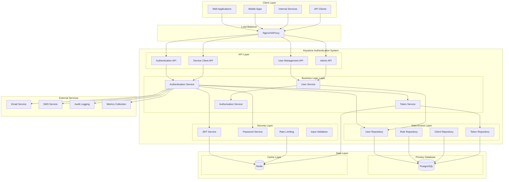
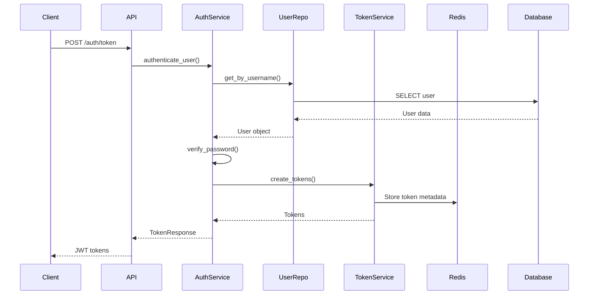
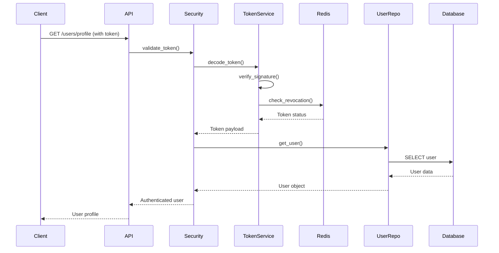
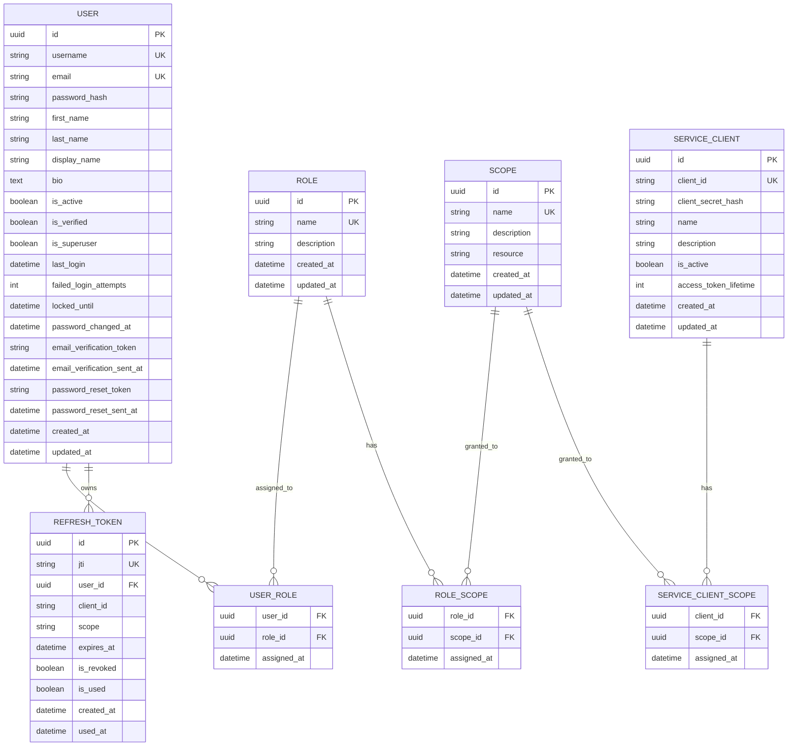
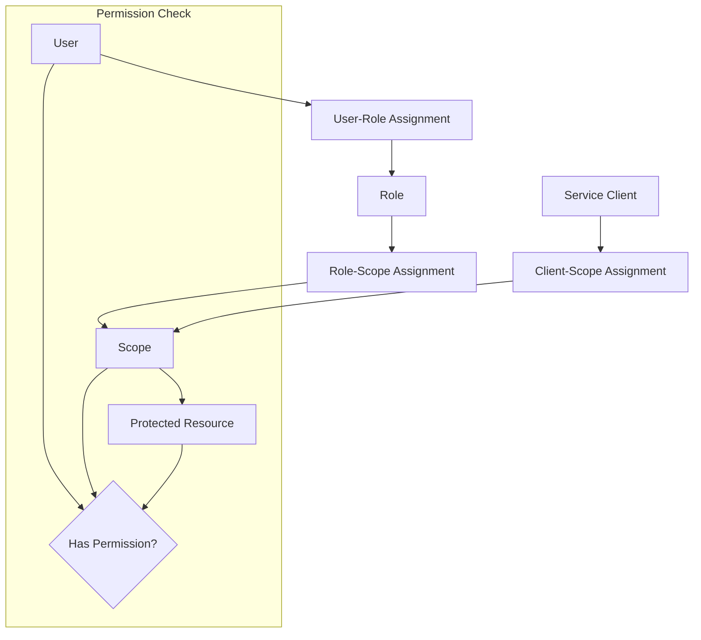
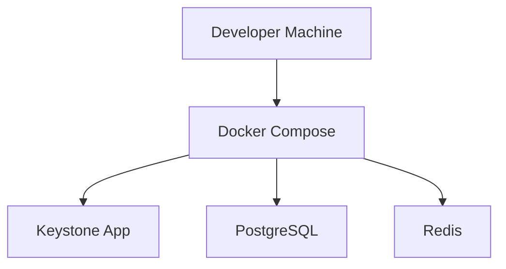
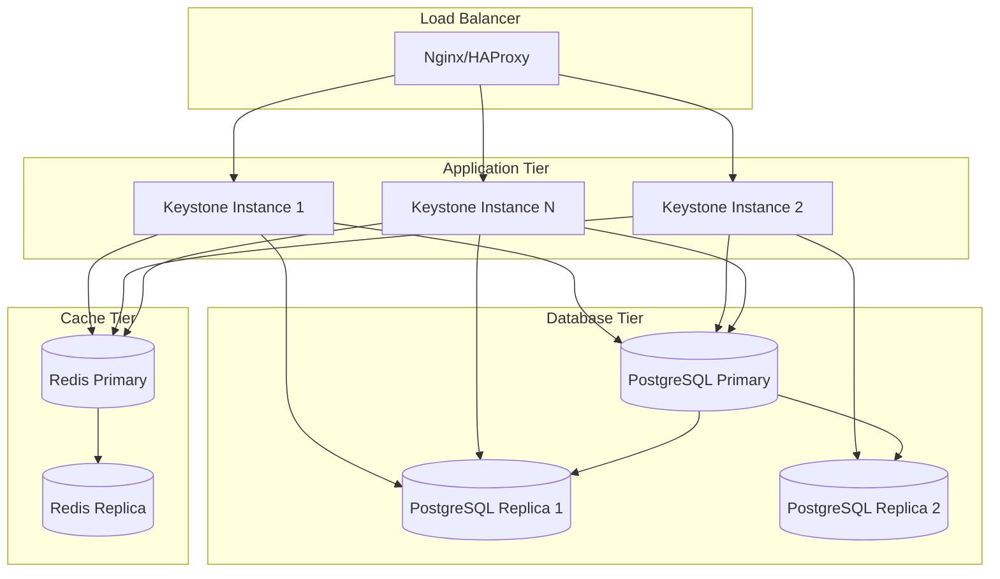

# 🏗️ System Architecture Overview

This document provides a comprehensive overview of the Keystone Authentication System architecture, including its components, data flow, and design principles.

## 🎯 System Overview

Keystone is a FastAPI-based centralized authentication and authorization system designed for enterprise-grade security and scalability. It provides OAuth2-compliant authentication with JWT tokens, role-based access control, and comprehensive security features.

## 📊 High-Level Architecture



## 🔧 Core Components

### 1. API Layer

The API layer provides RESTful endpoints following OAuth2 and OpenAPI specifications.

#### Authentication API (`/api/v1/auth`)
- User login/logout
- Token refresh
- Service client authentication
- Token introspection and revocation

#### User Management API (`/api/v1/users`)
- User registration
- Profile management
- Password changes
- Account verification

#### Admin API (`/api/v1/admin`)
- User administration
- Role and scope management
- Service client management
- System configuration

#### Service Client API (`/api/v1/clients`)
- Service client registration
- Client credential management
- Scope assignment

### 2. Business Logic Layer

#### Authentication Service
```python
class AuthenticationService:
    async def authenticate_user(username: str, password: str) -> TokenResponse
    async def authenticate_service(client_id: str, client_secret: str) -> TokenResponse
    async def refresh_token(refresh_token: str) -> TokenResponse
    async def revoke_token(token: str) -> None
```

#### User Service
```python
class UserService:
    async def create_user(user_data: UserCreate) -> User
    async def get_user(user_id: str) -> User
    async def update_user(user_id: str, user_data: UserUpdate) -> User
    async def delete_user(user_id: str) -> None
```

#### Token Service
```python
class TokenService:
    async def create_access_token(user: User, scopes: List[str]) -> str
    async def create_refresh_token(user: User) -> str
    async def validate_token(token: str) -> TokenPayload
    async def revoke_token(jti: str) -> None
```

#### Authorization Service
```python
class AuthorizationService:
    async def check_permission(user: User, resource: str, action: str) -> bool
    async def get_user_scopes(user: User) -> List[str]
    async def assign_role(user: User, role: Role) -> None
```

### 3. Security Layer

#### JWT Service
- Token generation and validation
- Signature verification
- Claims extraction and validation
- Token expiration handling

#### Password Service
- Argon2 password hashing
- Password policy enforcement
- Password strength validation
- Secure password generation

#### Rate Limiting
- IP-based rate limiting
- User-based rate limiting
- Endpoint-specific limits
- Sliding window implementation

#### Input Validation
- Request schema validation
- SQL injection prevention
- XSS protection
- CSRF protection

### 4. Data Access Layer

#### Repository Pattern
```python
class UserRepository:
    async def create(user: User) -> User
    async def get_by_id(user_id: str) -> Optional[User]
    async def get_by_username(username: str) -> Optional[User]
    async def update(user: User) -> User
    async def delete(user_id: str) -> None
```

#### Database Models
- **User**: User accounts and profiles
- **Role**: User roles for RBAC
- **Scope**: Permissions and access scopes
- **ServiceClient**: Service-to-service clients
- **RefreshToken**: Refresh token management

## 🔄 Data Flow

### User Authentication Flow



### Token Validation Flow



## 🗄️ Database Design

### Entity Relationship Diagram



### Database Indexes

```sql
-- Performance indexes
CREATE INDEX idx_users_username ON users(username);
CREATE INDEX idx_users_email ON users(email);
CREATE INDEX idx_users_active ON users(is_active);
CREATE INDEX idx_refresh_tokens_jti ON refresh_tokens(jti);
CREATE INDEX idx_refresh_tokens_user_id ON refresh_tokens(user_id);
CREATE INDEX idx_refresh_tokens_expires_at ON refresh_tokens(expires_at);

-- Composite indexes
CREATE INDEX idx_users_username_active ON users(username, is_active);
CREATE INDEX idx_refresh_tokens_user_client ON refresh_tokens(user_id, client_id);
```

## 🔐 Security Architecture

### Authentication Mechanisms

1. **Password-based Authentication**
   - Argon2 password hashing
   - Password policy enforcement
   - Account lockout protection

2. **JWT Token Authentication**
   - HS256/RS256 signature algorithms
   - Short-lived access tokens (15 minutes)
   - Long-lived refresh tokens (30 days)
   - Token revocation support

3. **Service Client Authentication**
   - Client credentials flow
   - Client secret hashing
   - Scope-based authorization

### Authorization Model



### Security Features

1. **Rate Limiting**
   - IP-based limits
   - User-based limits
   - Endpoint-specific limits
   - Sliding window algorithm

2. **Account Security**
   - Failed login attempt tracking
   - Account lockout mechanism
   - Password expiration
   - Email verification

3. **Token Security**
   - JWT ID (JTI) for uniqueness
   - Token revocation blacklist
   - Audience validation
   - Expiration enforcement

4. **Input Validation**
   - Pydantic schema validation
   - SQL injection prevention
   - XSS protection
   - CSRF protection

## 🚀 Scalability Considerations

### Horizontal Scaling

1. **Stateless Design**
   - JWT tokens eliminate server-side sessions
   - Redis for shared state (token blacklist, rate limits)
   - Database connection pooling

2. **Load Balancing**
   - Multiple application instances
   - Health check endpoints
   - Session affinity not required

3. **Database Scaling**
   - Read replicas for query scaling
   - Connection pooling
   - Query optimization

4. **Cache Strategy**
   - Redis for token blacklist
   - User session caching
   - Rate limit counters
   - Query result caching

### Performance Optimizations

1. **Database Optimizations**
   - Proper indexing strategy
   - Query optimization
   - Connection pooling
   - Async database operations

2. **Caching Strategy**
   - Token validation caching
   - User permission caching
   - Rate limit counters
   - Configuration caching

3. **Async Processing**
   - FastAPI async/await
   - Async database operations
   - Background task processing
   - Non-blocking I/O

## 🔧 Technology Stack

### Core Framework
- **FastAPI 0.104+**: Modern, fast web framework
- **Python 3.11+**: Latest Python features
- **Pydantic 2.5+**: Data validation and serialization
- **SQLAlchemy 2.0+**: Modern ORM with async support

### Database & Caching
- **PostgreSQL 15+**: Primary database
- **Redis 7+**: Caching and session storage
- **Alembic**: Database migrations
- **asyncpg**: Async PostgreSQL driver

### Security & Authentication
- **PyJWT**: JWT token handling
- **Passlib**: Password hashing with Argon2
- **python-multipart**: Form data handling
- **slowapi**: Rate limiting

### Development & Testing
- **pytest**: Testing framework
- **testcontainers**: Integration testing
- **black**: Code formatting
- **mypy**: Type checking

### Monitoring & Observability
- **structlog**: Structured logging
- **prometheus-client**: Metrics collection
- **uvicorn**: ASGI server

## 📊 Deployment Architecture

### Development Environment



### Production Environment



## 🔍 Monitoring and Observability

### Health Checks
- Application health endpoint
- Database connectivity check
- Redis connectivity check
- Dependency health validation

### Metrics Collection
- Request/response metrics
- Authentication success/failure rates
- Token generation/validation metrics
- Database query performance
- Cache hit/miss ratios

### Logging Strategy
- Structured JSON logging
- Request/response logging
- Security event logging
- Error tracking and alerting

### Alerting
- Failed authentication attempts
- High error rates
- Database connectivity issues
- Performance degradation

## 📚 Related Documentation

- [Database Schema](database-schema.md) - Detailed database design
- [Security Model](security-model.md) - Security architecture details
- [Deployment Guide](deployment.md) - Production deployment strategies
- [API Documentation](../api/authentication.md) - API endpoint specifications

---

**Architecture designed for scale! 🏗️ Build secure, scalable authentication systems with Keystone.**