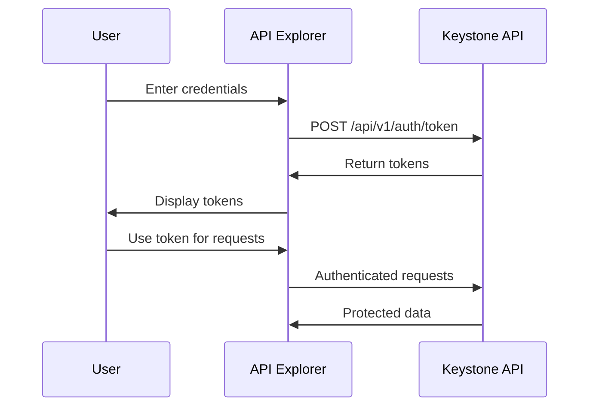

# API Explorer

The Keystone API Explorer provides an interactive interface for testing and exploring all available API endpoints. This tool helps developers understand the API structure, test requests, and see real-time responses.

## Overview

The API Explorer is a web-based interface that allows you to:
- Browse all available API endpoints
- Test API calls with real data
- View request/response schemas
- Generate code examples
- Manage authentication tokens
- Save and share API collections

## Accessing the API Explorer

### Development Environment
```
http://localhost:8000/docs
```

### Production Environment
The API Explorer is disabled in production for security reasons. Use the development environment or local instance for testing.

## Features

### 1. Interactive Documentation

The API Explorer provides interactive documentation for all endpoints:

- **Endpoint Details**: Method, URL, description
- **Parameters**: Required and optional parameters with types
- **Request Body**: JSON schema and examples
- **Response Formats**: Success and error response schemas
- **Authentication**: Required scopes and permissions

### 2. Try It Out Functionality

Test any endpoint directly from the browser:

1. Click "Try it out" on any endpoint
2. Fill in required parameters
3. Add authentication token if needed
4. Execute the request
5. View the response in real-time

### 3. Authentication Management

#### Bearer Token Authentication

1. Click the "Authorize" button at the top
2. Enter your access token in the format: `Bearer <your_token>`
3. Click "Authorize"
4. All subsequent requests will include the token

#### Getting an Access Token

```bash
# Get access token via curl
curl -X POST "http://localhost:8000/api/v1/auth/token" \
  -H "Content-Type: application/x-www-form-urlencoded" \
  -d "username=your_username&password=your_password"
```

### 4. Code Generation

Generate code examples in multiple languages:

- **cURL**: Command-line requests
- **JavaScript**: Fetch API and Axios
- **Python**: Requests library
- **Java**: OkHttp and HttpClient
- **C#**: HttpClient
- **Go**: net/http

## API Endpoints Overview

### Authentication Endpoints

#### POST /api/v1/auth/token
- **Purpose**: User login and token generation
- **Required**: username, password
- **Returns**: access_token, refresh_token, session_id

#### POST /api/v1/auth/refresh
- **Purpose**: Refresh access token
- **Required**: refresh_token
- **Returns**: new access_token and refresh_token

#### POST /api/v1/auth/logout
- **Purpose**: User logout and token revocation
- **Required**: Bearer token
- **Returns**: logout confirmation

### User Management Endpoints

#### GET /api/v1/users/me
- **Purpose**: Get current user profile
- **Required**: Bearer token
- **Returns**: user profile data

#### PUT /api/v1/users/me
- **Purpose**: Update current user profile
- **Required**: Bearer token, profile data
- **Returns**: updated user profile

#### POST /api/v1/users/me/change-password
- **Purpose**: Change user password
- **Required**: Bearer token, current_password, new_password
- **Returns**: success confirmation

### Session Management Endpoints

#### GET /api/v1/sessions
- **Purpose**: Get user's active sessions
- **Required**: Bearer token
- **Returns**: list of active sessions

#### POST /api/v1/sessions/{session_id}/renew
- **Purpose**: Renew a specific session
- **Required**: Bearer token, session_id
- **Returns**: updated session info

#### DELETE /api/v1/sessions/{session_id}
- **Purpose**: Invalidate a specific session
- **Required**: Bearer token, session_id
- **Returns**: success confirmation

### Role and Permission Endpoints

#### GET /api/v1/roles
- **Purpose**: List all roles
- **Required**: Bearer token with admin:roles scope
- **Returns**: list of roles with permissions

#### POST /api/v1/roles
- **Purpose**: Create a new role
- **Required**: Bearer token with admin:roles scope, role data
- **Returns**: created role information

## Testing Workflows

### 1. Basic Authentication Flow



### 2. User Management Flow

1. **Login**: Use `/api/v1/auth/token` to get access token
2. **Get Profile**: Use `/api/v1/users/me` to view current user
3. **Update Profile**: Use `PUT /api/v1/users/me` to modify profile
4. **Change Password**: Use `/api/v1/users/me/change-password`
5. **Logout**: Use `/api/v1/auth/logout` to end session

### 3. Session Management Flow

1. **Login**: Get access token and session_id
2. **View Sessions**: Use `/api/v1/sessions` to see active sessions
3. **Renew Session**: Use `/api/v1/sessions/{id}/renew` to extend session
4. **Terminate Session**: Use `DELETE /api/v1/sessions/{id}` to end session

## Common Use Cases

### 1. Testing User Registration and Login

```javascript
// Example: Test user login
const loginData = {
  username: "testuser",
  password: "TestPassword123!"
};

fetch('/api/v1/auth/token', {
  method: 'POST',
  headers: {
    'Content-Type': 'application/x-www-form-urlencoded',
  },
  body: new URLSearchParams(loginData)
})
.then(response => response.json())
.then(data => {
  console.log('Login successful:', data);
  // Use data.access_token for subsequent requests
});
```

### 2. Testing Protected Endpoints

```javascript
// Example: Get user profile
const token = 'your_access_token_here';

fetch('/api/v1/users/me', {
  method: 'GET',
  headers: {
    'Authorization': `Bearer ${token}`,
    'Content-Type': 'application/json',
  }
})
.then(response => response.json())
.then(data => {
  console.log('User profile:', data);
});
```

### 3. Testing Role-Based Access

```javascript
// Example: Create a new role (admin only)
const roleData = {
  name: "moderator",
  description: "Content moderator role",
  scopes: ["read:content", "write:content", "moderate:content"]
};

fetch('/api/v1/roles', {
  method: 'POST',
  headers: {
    'Authorization': `Bearer ${adminToken}`,
    'Content-Type': 'application/json',
  },
  body: JSON.stringify(roleData)
})
.then(response => response.json())
.then(data => {
  console.log('Role created:', data);
});
```

## Error Testing

### Common Error Scenarios

1. **401 Unauthorized**: Missing or invalid token
2. **403 Forbidden**: Insufficient permissions
3. **400 Bad Request**: Invalid request data
4. **404 Not Found**: Resource not found
5. **429 Too Many Requests**: Rate limit exceeded

### Testing Error Responses

Use the API Explorer to test error conditions:

1. **Test without token**: Remove authorization header
2. **Test with expired token**: Use an old token
3. **Test with invalid data**: Send malformed JSON
4. **Test rate limiting**: Make rapid successive requests

## Advanced Features

### 1. Request/Response Logging

The API Explorer logs all requests and responses for debugging:

- View request headers and body
- Inspect response status and data
- Copy requests as cURL commands
- Export request collections

### 2. Schema Validation

Real-time validation of request data:

- Highlights required fields
- Validates data types
- Shows format requirements
- Provides example values

### 3. Response Formatting

Enhanced response display:

- Syntax highlighting for JSON
- Collapsible response sections
- Response time measurement
- Status code explanations

## Best Practices

### 1. Security

- Never use production credentials in the explorer
- Use development environment for testing
- Rotate test tokens regularly
- Don't share tokens in screenshots or documentation

### 2. Testing

- Test both success and error scenarios
- Verify all required parameters
- Test with different user roles
- Validate response schemas

### 3. Documentation

- Use the explorer to understand API behavior
- Generate code examples for your language
- Test integration patterns before implementation
- Verify authentication flows

## Troubleshooting

### Common Issues

1. **CORS Errors**: Ensure proper CORS configuration
2. **Authentication Failures**: Check token format and expiration
3. **Permission Errors**: Verify user roles and scopes
4. **Network Errors**: Check API server status

### Getting Help

- Check the [FAQ](../support/faq.md) for common issues
- Review [API documentation](../api/authentication.md) for details
- Visit [community forums](../community/forums.md) for support
- Report bugs through [bug reports](../support/bug-reports.md)

## Integration with Development Workflow

### 1. API Design

Use the explorer during API design to:
- Test endpoint behavior
- Validate request/response schemas
- Verify authentication requirements
- Document API usage patterns

### 2. Development

Integrate with your development process:
- Test new endpoints before client implementation
- Verify API changes don't break existing functionality
- Generate client code examples
- Validate integration patterns

### 3. Quality Assurance

Use for QA testing:
- Test all API endpoints systematically
- Verify error handling
- Test with different user permissions
- Validate rate limiting behavior

The API Explorer is an essential tool for understanding and integrating with the Keystone Authentication System. Use it to explore the API, test your integrations, and ensure your applications work correctly with the authentication platform.