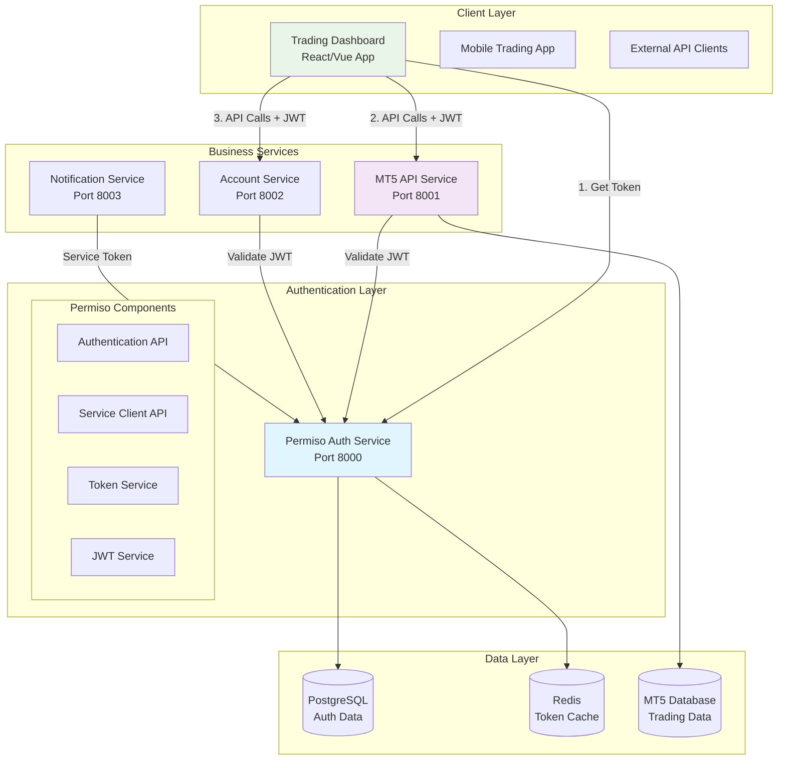
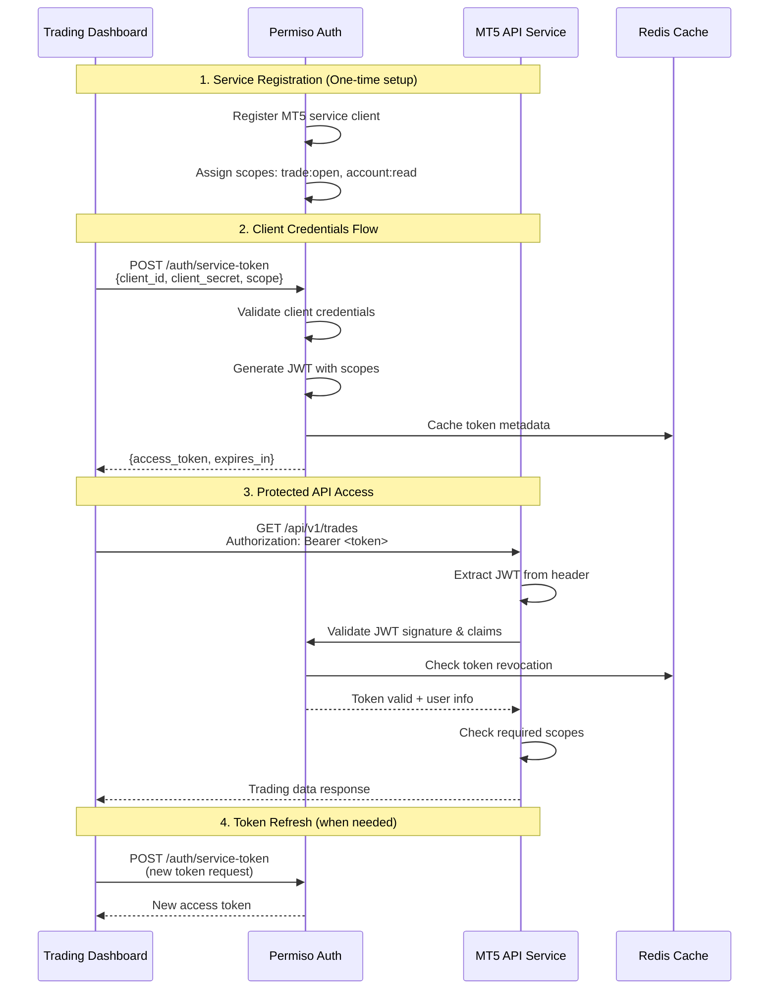

# 🏗️ Comprehensive Service-to-Service Integration Guide

This comprehensive guide provides step-by-step instructions for integrating Permiso Auth into a service-to-service architecture, including practical examples with a trading dashboard, MT5 API service, and complete Docker deployment.

## 📋 Table of Contents

1. [Architecture Overview](#architecture-overview)
2. [Service Client Registration](#service-client-registration)
3. [OAuth2 Client Credentials Flow](#oauth2-client-credentials-flow)
4. [MT5 API Service Protection](#mt5-api-service-protection)
5. [Client Application Implementation](#client-application-implementation)
6. [JWT Validation and Scope Enforcement](#jwt-validation-and-scope-enforcement)
7. [Docker Deployment](#docker-deployment)
8. [Environment Management](#environment-management)
9. [Token Management Patterns](#token-management-patterns)
10. [Testing Integration](#testing-integration)
11. [Monitoring and Auditing](#monitoring-and-auditing)
12. [Troubleshooting](#troubleshooting)
13. [Complete Working Example](#complete-working-example)

## 🏛️ Architecture Overview

### System Components



### Authentication Flow



## 🔐 Service Client Registration

### 1. Register MT5 API Service

First, register your MT5 API service as a client in Permiso:

```python
# scripts/register_mt5_service.py
import asyncio
import httpx
from app.core.password import hash_password
from app.models.service_client import ServiceClient
from app.models.scope import Scope
from app.config.database import get_db

async def register_mt5_service():
    """Register MT5 API service as a client."""
    
    # Service client configuration
    client_config = {
        "client_id": "mt5-api-service",
        "name": "MT5 Trading API Service",
        "description": "MetaTrader 5 integration service for trading operations",
        "client_type": "confidential",
        "is_active": True,
        "is_trusted": True,  # Trusted for internal services
        "access_token_lifetime": 3600,  # 1 hour
        "refresh_token_lifetime": 86400,  # 24 hours
        "rate_limit_per_minute": 300,
        "rate_limit_per_hour": 10000,
        "contact_email": "admin@trading.com",
        "allowed_ips": "10.0.0.0/8,172.16.0.0/12,192.168.0.0/16",  # Internal networks
        "scopes": [
            "trade:open",      # Open new trades
            "trade:close",     # Close existing trades
            "trade:modify",    # Modify trade parameters
            "account:read",    # Read account information
            "account:balance", # Access balance information
            "market:data",     # Access market data
            "service:mt5"      # MT5 service access
        ]
    }
    
    # Generate secure client secret
    client_secret = generate_secure_secret(32)
    client_secret_hash = hash_password(client_secret)
    
    async with get_db() as db:
        # Create service client
        service_client = ServiceClient(
            client_id=client_config["client_id"],
            client_secret_hash=client_secret_hash,
            name=client_config["name"],
            description=client_config["description"],
            client_type=client_config["client_type"],
            is_active=client_config["is_active"],
            is_trusted=client_config["is_trusted"],
            access_token_lifetime=client_config["access_token_lifetime"],
            refresh_token_lifetime=client_config["refresh_token_lifetime"],
            rate_limit_per_minute=client_config["rate_limit_per_minute"],
            rate_limit_per_hour=client_config["rate_limit_per_hour"],
            contact_email=client_config["contact_email"],
            allowed_ips=client_config["allowed_ips"]
        )
        
        # Assign scopes
        for scope_name in client_config["scopes"]:
            scope = await db.execute(
                select(Scope).where(Scope.name == scope_name)
            )
            scope = scope.scalar_one_or_none()
            if scope:
                service_client.scopes.append(scope)
        
        db.add(service_client)
        await db.commit()
        
        print(f"✅ Service client registered successfully!")
        print(f"Client ID: {client_config['client_id']}")
        print(f"Client Secret: {client_secret}")
        print(f"⚠️  Store the client secret securely - it won't be shown again!")
        
        return {
            "client_id": client_config["client_id"],
            "client_secret": client_secret
        }

def generate_secure_secret(length: int = 32) -> str:
    """Generate a cryptographically secure client secret."""
    import secrets
    import string
    
    alphabet = string.ascii_letters + string.digits + "!@#$%^&*"
    return ''.join(secrets.choice(alphabet) for _ in range(length))

if __name__ == "__main__":
    asyncio.run(register_mt5_service())
```

### 2. Register Trading Dashboard Client

```python
# scripts/register_dashboard_client.py
async def register_dashboard_client():
    """Register trading dashboard as a client."""
    
    client_config = {
        "client_id": "trading-dashboard",
        "name": "Trading Dashboard Web App",
        "description": "Web-based trading dashboard for retail clients",
        "client_type": "confidential",
        "is_active": True,
        "is_trusted": False,  # External-facing application
        "access_token_lifetime": 1800,  # 30 minutes
        "refresh_token_lifetime": 604800,  # 7 days
        "rate_limit_per_minute": 120,
        "rate_limit_per_hour": 5000,
        "contact_email": "frontend@trading.com",
        "scopes": [
            "read:profile",    # Read user profile
            "write:profile",   # Update user profile
            "trade:read",      # View trades
            "trade:open",      # Open new trades
            "account:read",    # Read account info
            "market:data"      # Access market data
        ]
    }
    
    # Implementation similar to MT5 service registration
    # ... (registration code)
```

### 3. Using Admin API for Registration

Alternatively, use the admin API to register clients:

```bash
# Register MT5 service via API
curl -X POST "http://localhost:8000/api/v1/admin/service-clients" \
  -H "Authorization: Bearer ADMIN_TOKEN" \
  -H "Content-Type: application/json" \
  -d '{
    "client_id": "mt5-api-service",
    "name": "MT5 Trading API Service",
    "description": "MetaTrader 5 integration service",
    "client_type": "confidential",
    "is_trusted": true,
    "access_token_lifetime": 3600,
    "rate_limit_per_minute": 300,
    "scope_ids": ["trade:open", "trade:close", "account:read", "service:mt5"]
  }'
```

## 🎫 OAuth2 Client Credentials Flow

### 1. Basic Token Request

```python
# services/auth_client.py
import httpx
import asyncio
import time
from typing import Optional, Dict, Any
from dataclasses import dataclass
import logging

logger = logging.getLogger(__name__)

@dataclass
class TokenResponse:
    access_token: str
    token_type: str
    expires_in: int
    scope: Optional[str] = None
    expires_at: Optional[float] = None

class PermisoAuthClient:
    """Client for Permiso authentication service."""
    
    def __init__(
        self, 
        auth_base_url: str, 
        client_id: str, 
        client_secret: str,
        timeout: int = 30
    ):
        self.auth_base_url = auth_base_url.rstrip('/')
        self.client_id = client_id
        self.client_secret = client_secret
        self.timeout = timeout
        self._current_token: Optional[TokenResponse] = None
        
    async def get_service_token(
        self, 
        scopes: Optional[list] = None,
        force_refresh: bool = False
    ) -> str:
        """
        Get service access token using client credentials flow.
        
        Args:
            scopes: List of requested scopes
            force_refresh: Force token refresh even if current token is valid
            
        Returns:
            Access token string
        """
        # Check if current token is still valid
        if not force_refresh and self._is_token_valid():
            return self._current_token.access_token
        
        # Request new token
        scope_str = " ".join(scopes) if scopes else None
        
        async with httpx.AsyncClient(timeout=self.timeout) as client:
            try:
                response = await client.post(
                    f"{self.auth_base_url}/api/v1/auth/service-token",
                    data={
                        "client_id": self.client_id,
                        "client_secret": self.client_secret,
                        "scope": scope_str
                    },
                    headers={
                        "Content-Type": "application/x-www-form-urlencoded",
                        "Accept": "application/json"
                    }
                )
                
                if response.status_code != 200:
                    error_detail = response.json() if response.headers.get("content-type", "").startswith("application/json") else response.text
                    raise AuthenticationError(
                        f"Token request failed with status {response.status_code}: {error_detail}"
                    )
                
                token_data = response.json()
                
                # Create token response
                self._current_token = TokenResponse(
                    access_token=token_data["access_token"],
                    token_type=token_data.get("token_type", "Bearer"),
                    expires_in=token_data["expires_in"],
                    scope=token_data.get("scope"),
                    expires_at=time.time() + token_data["expires_in"]
                )
                
                logger.info(f"Successfully obtained service token for client {self.client_id}")
                return self._current_token.access_token
                
            except httpx.RequestError as e:
                raise AuthenticationError(f"Network error during token request: {str(e)}")
            except Exception as e:
                raise AuthenticationError(f"Unexpected error during token request: {str(e)}")
    
    def _is_token_valid(self) -> bool:
        """Check if current token is valid and not expired."""
        if not self._current_token:
            return False
        
        # Add 60-second buffer to prevent using tokens that expire very soon
        return time.time() < (self._current_token.expires_at - 60)
    
    async def make_authenticated_request(
        self,
        method: str,
        url: str,
        scopes: Optional[list] = None,
        **kwargs
    ) -> httpx.Response:
        """
        Make an authenticated HTTP request to a protected service.
        
        Args:
            method: HTTP method (GET, POST, etc.)
            url: Target URL
            scopes: Required scopes for the request
            **kwargs: Additional arguments for httpx.request
            
        Returns:
            HTTP response
        """
        token = await self.get_service_token(scopes=scopes)
        
        # Add authorization header
        headers = kwargs.get("headers", {})
        headers["Authorization"] = f"Bearer {token}"
        kwargs["headers"] = headers
        
        async with httpx.AsyncClient(timeout=self.timeout) as client:
            return await client.request(method, url, **kwargs)

class AuthenticationError(Exception):
    """Authentication-related error."""
    pass
```

### 2. Advanced Token Management with Retry Logic

```python
# services/advanced_auth_client.py
import asyncio
from typing import Optional, Dict, Any, Callable
import backoff
import structlog

logger = structlog.get_logger(__name__)

class AdvancedAuthClient(PermisoAuthClient):
    """Advanced authentication client with retry logic and error handling."""
    
    def __init__(self, *args, **kwargs):
        super().__init__(*args, **kwargs)
        self.max_retries = kwargs.get('max_retries', 3)
        self.backoff_factor = kwargs.get('backoff_factor', 2)
        
    @backoff.on_exception(
        backoff.expo,
        (httpx.RequestError, AuthenticationError),
        max_tries=3,
        base=1,
        max_value=10
    )
    async def get_service_token_with_retry(
        self, 
        scopes: Optional[list] = None
    ) -> str:
        """Get service token with exponential backoff retry."""
        return await self.get_service_token(scopes=scopes)
    
    async def make_authenticated_request_with_retry(
        self,
        method: str,
        url: str,
        scopes: Optional[list] = None,
        max_retries: int = 2,
        **kwargs
    ) -> httpx.Response:
        """
        Make authenticated request with automatic token refresh on 401.
        
        Args:
            method: HTTP method
            url: Target URL
            scopes: Required scopes
            max_retries: Maximum retry attempts
            **kwargs: Additional request arguments
            
        Returns:
            HTTP response
        """
        for attempt in range(max_retries + 1):
            try:
                response = await self.make_authenticated_request(
                    method, url, scopes=scopes, **kwargs
                )
                
                # If we get 401, token might be expired - try refreshing
                if response.status_code == 401 and attempt < max_retries:
                    logger.warning(
                        "Received 401, refreshing token and retrying",
                        attempt=attempt + 1,
                        url=url
                    )
                    # Force token refresh
                    await self.get_service_token(scopes=scopes, force_refresh=True)
                    continue
                
                return response
                
            except httpx.RequestError as e:
                if attempt < max_retries:
                    wait_time = self.backoff_factor ** attempt
                    logger.warning(
                        "Request failed, retrying",
                        attempt=attempt + 1,
                        wait_time=wait_time,
                        error=str(e)
                    )
                    await asyncio.sleep(wait_time)
                    continue
                raise
        
        raise AuthenticationError(f"Failed to complete request after {max_retries} retries")
```

### 3. Token Caching with Redis

```python
# services/cached_auth_client.py
import json
import redis.asyncio as redis
from typing import Optional

class CachedAuthClient(PermisoAuthClient):
    """Authentication client with Redis token caching."""
    
    def __init__(self, *args, redis_url: str = None, **kwargs):
        super().__init__(*args, **kwargs)
        self.redis_url = redis_url or "redis://localhost:6379/0"
        self._redis: Optional[redis.Redis] = None
        
    async def _get_redis(self) -> redis.Redis:
        """Get Redis connection."""
        if not self._redis:
            self._redis = redis.from_url(self.redis_url)
        return self._redis
    
    async def get_service_token(
        self, 
        scopes: Optional[list] = None,
        force_refresh: bool = False
    ) -> str:
        """Get service token with Redis caching."""
        cache_key = f"service_token:{self.client_id}"
        if scopes:
            cache_key += f":{':'.join(sorted(scopes))}"
        
        redis_client = await self._get_redis()
        
        # Try to get token from cache first
        if not force_refresh:
            cached_token = await redis_client.get(cache_key)
            if cached_token:
                token_data = json.loads(cached_token)
                if time.time() < token_data["expires_at"] - 60:  # 60s buffer
                    logger.debug("Using cached service token", client_id=self.client_id)
                    return token_data["access_token"]
        
        # Get new token
        token = await super().get_service_token(scopes=scopes, force_refresh=True)
        
        # Cache the token
        if self._current_token:
            cache_data = {
                "access_token": self._current_token.access_token,
                "expires_at": self._current_token.expires_at,
                "scope": self._current_token.scope
            }
            
            # Set cache with TTL
            ttl = int(self._current_token.expires_at - time.time() - 60)
            if ttl > 0:
                await redis_client.setex(
                    cache_key, 
                    ttl, 
                    json.dumps(cache_data)
                )
        
        return token
    
    async def close(self):
        """Close Redis connection."""
        if self._redis:
            await self._redis.close()
```

## 🛡️ MT5 API Service Protection

### 1. FastAPI Service with JWT Middleware

```python
# mt5_service/main.py
from fastapi import FastAPI, Depends, HTTPException, status
from fastapi.middleware.cors import CORSMiddleware
from fastapi.security import HTTPBearer, HTTPAuthorizationCredentials
import httpx
import structlog
from typing import List, Optional, Dict, Any

from .config import settings
from .models import Trade, Account, MarketData
from .dependencies import get_current_token, require_scopes, get_mt5_connection

logger = structlog.get_logger(__name__)

app = FastAPI(
    title="MT5 Trading API",
    description="MetaTrader 5 integration service with Permiso authentication",
    version="1.0.0"
)

# CORS middleware
app.add_middleware(
    CORSMiddleware,
    allow_origins=settings.ALLOWED_ORIGINS,
    allow_credentials=True,
    allow_methods=["*"],
    allow_headers=["*"],
)

# Security scheme
security = HTTPBearer()

@app.get("/health")
async def health_check():
    """Health check endpoint."""
    return {
        "status": "healthy",
        "service": "mt5-api",
        "version": "1.0.0"
    }

# Trading endpoints
@app.get("/api/v1/trades", response_model=List[Trade])
async def get_trades(
    token_payload: dict = Depends(require_scopes(["trade:read", "account:read"])),
    mt5_conn = Depends(get_mt5_connection)
):
    """Get all trades for the authenticated user/service."""
    try:
        # Extract client information from token
        client_id = token_payload.get("client_id")
        user_id = token_payload.get("sub")
        
        logger.info(
            "Fetching trades",
            client_id=client_id,
            user_id=user_id,
            scopes=token_payload.get("scopes", [])
        )
        
        # Get trades from MT5
        trades = await mt5_conn.get_trades(user_id=user_id)
        
        return [Trade.from_mt5_trade(trade) for trade in trades]
        
    except Exception as e:
        logger.error("Failed to fetch trades", error=str(e))
        raise HTTPException(
            status_code=status.HTTP_500_INTERNAL_SERVER_ERROR,
            detail="Failed to fetch trades"
        )

@app.post("/api/v1/trades", response_model=Trade)
async def open_trade(
    trade_request: TradeRequest,
    token_payload: dict = Depends(require_scopes(["trade:open"])),
    mt5_conn = Depends(get_mt5_connection)
):
    """Open a new trade."""
    try:
        client_id = token_payload.get("client_id")
        user_id = token_payload.get("sub")
        
        # Validate trade request
        if not trade_request.symbol or not trade_request.volume:
            raise HTTPException(
                status_code=status.HTTP_400_BAD_REQUEST,
                detail="Symbol and volume are required"
            )
        
        logger.info(
            "Opening trade",
            client_id=client_id,
            user_id=user_id,
            symbol=trade_request.symbol,
            volume=trade_request.volume
        )
        
        # Execute trade through MT5
        trade_result = await mt5_conn.open_trade(
            user_id=user_id,
            symbol=trade_request.symbol,
            volume=trade_request.volume,
            trade_type=trade_request.trade_type,
            price=trade_request.price,
            stop_loss=trade_request.stop_loss,
            take_profit=trade_request.take_profit
        )
        
        if not trade_result.success:
            raise HTTPException(
                status_code=status.HTTP_400_BAD_REQUEST,
                detail=f"Trade execution failed: {trade_result.error}"
            )
        
        return Trade.from_mt5_trade(trade_result.trade)
        
    except HTTPException:
        raise
    except Exception as e:
        logger.error("Failed to open trade", error=str(e))
        raise HTTPException(
            status_code=status.HTTP_500_INTERNAL_SERVER_ERROR,
            detail="Failed to open trade"
        )

@app.delete("/api/v1/trades/{trade_id}")
async def close_trade(
    trade_id: int,
    token_payload: dict = Depends(require_scopes(["trade:close"])),
    mt5_conn = Depends(get_mt5_connection)
):
    """Close an existing trade."""
    try:
        client_id = token_payload.get("client_id")
        user_id = token_payload.get("sub")
        
        logger.info(
            "Closing trade",
            client_id=client_id,
            user_id=user_id,
            trade_id=trade_id
        )
        
        # Close trade through MT5
        close_result = await mt5_conn.close_trade(
            user_id=user_id,
            trade_id=trade_id
        )
        
        if not close_result.success:
            raise HTTPException(
                status_code=status.HTTP_400_BAD_REQUEST,
                detail=f"Trade close failed: {close_result.error}"
            )
        
        return {"message": "Trade closed successfully", "trade_id": trade_id}
        
    except HTTPException:
        raise
    except Exception as e:
        logger.error("Failed to close trade", error=str(e))
        raise HTTPException(
            status_code=status.HTTP_500_INTERNAL_SERVER_ERROR,
            detail="Failed to close trade"
        )

# Account endpoints
@app.get("/api/v1/account", response_model=Account)
async def get_account_info(
    token_payload: dict = Depends(require_scopes(["account:read"])),
    mt5_conn = Depends(get_mt5_connection)
):
    """Get account information."""
    try:
        user_id = token_payload.get("sub")
        
        # Get account info from MT5
        account_info = await mt5_conn.get_account_info(user_id=user_id)
        
        return Account.from_mt5_account(account_info)
        
    except Exception as e:
        logger.error("Failed to fetch account info", error=str(e))
        raise HTTPException(
            status_code=status.HTTP_500_INTERNAL_SERVER_ERROR,
            detail="Failed to fetch account information"
        )

@app.get("/api/v1/account/balance")
async def get_account_balance(
    token_payload: dict = Depends(require_scopes(["account:balance"])),
    mt5_conn = Depends(get_mt5_connection)
):
    """Get account balance information."""
    try:
        user_id = token_payload.get("sub")
        
        balance_info = await mt5_conn.get_balance_info(user_id=user_id)
        
        return {
            "balance": balance_info.balance,
            "equity": balance_info.equity,
            "margin": balance_info.margin,
            "free_margin": balance_info.free_margin,
            "margin_level": balance_info.margin_level,
            "currency": balance_info.currency
        }
        
    except Exception as e:
        logger.error("Failed to fetch balance info", error=str(e))
        raise HTTPException(
            status_code=status.HTTP_500_INTERNAL_SERVER_ERROR,
            detail="Failed to fetch balance information"
        )

# Market data endpoints
@app.get("/api/v1/market/{symbol}", response_model=MarketData)
async def get_market_data(
    symbol: str,
    token_payload: dict = Depends(require_scopes(["market:data"])),
    mt5_conn = Depends(get_mt5_connection)
):
    """Get market data for a symbol."""
    try:
        market_data = await mt5_conn.get_market_data(symbol=symbol)
        
        return MarketData.from_mt5_data(market_data)
        
    except Exception as e:
        logger.error("Failed to fetch market data", error=str(e), symbol=symbol)
        raise HTTPException(
            status_code=status.HTTP_500_INTERNAL_SERVER_ERROR,
            detail=f"Failed to fetch market data for {symbol}"
        )

# Admin endpoints (requires trusted service client)
@app.get("/api/v1/admin/stats")
async def get_admin_stats(
    token_payload: dict = Depends(require_scopes(["admin:system"])),
    mt5_conn = Depends(get_mt5_connection)
):
    """Get administrative statistics (trusted clients only)."""
    # Verify this is a trusted service client
    if not token_payload.get("is_trusted", False):
        raise HTTPException(
            status_code=status.HTTP_403_FORBIDDEN,
            detail="This endpoint requires a trusted service client"
        )
    
    try:
        stats = await mt5_conn.get_system_stats()
        return stats
        
    except Exception as e:
        logger.error("Failed to fetch admin stats", error=str(e))
        raise HTTPException(
            status_code=status.HTTP_500_INTERNAL_SERVER_ERROR,
            detail="Failed to fetch administrative statistics"
        )
```

### 2. JWT Validation Dependencies

```python
# mt5_service/dependencies.py
from fastapi import Depends, HTTPException, status
from fastapi.security import HTTPBearer, HTTPAuthorizationCredentials
import httpx
import jwt
from typing import List, Optional, Dict, Any
import structlog

from .config import settings

logger = structlog.get_logger(__name__)
security = HTTPBearer()

class TokenValidationError(Exception):
    """Token validation error."""
    pass

async def get_current_token(
    credentials: HTTPAuthorizationCredentials = Depends(security)
) -> dict:
    """
    Validate JWT token with Permiso auth service.
    
    Returns:
        Token payload dictionary
    """
    if not credentials or not credentials.credentials:
        raise HTTPException(
            status_code=status.HTTP_401_UNAUTHORIZED,
            detail="No authentication token provided",
            headers={"WWW-Authenticate": "Bearer"},
        )
    
    token = credentials.credentials
    
    try:
        # Option 1: Validate token locally (faster, requires shared secret/public key)
        if settings.JWT_PUBLIC_KEY:
            payload = await validate_token_locally(token)
        else:
            # Option 2: Validate token via Permiso API (more secure, slower)
            payload = await validate_token_remotely(token)
        
        return payload
        
    except TokenValidationError as e:
        logger.warning("Token validation failed", error=str(e), token_prefix=token[:20])
        raise HTTPException(