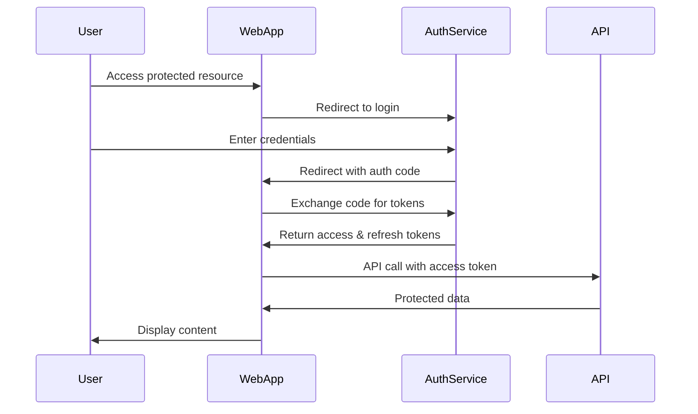
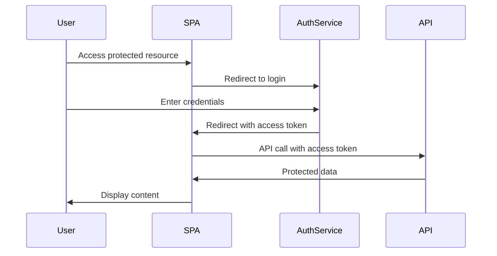

# Web Application Integration Tutorial

## Overview

This tutorial demonstrates how to integrate web applications with the permiso authentication system. It covers user authentication flows, session management, and frontend integration patterns for modern web applications.

## Authentication Flows

### 1. Authorization Code Flow (Recommended)

The Authorization Code flow is the most secure method for web applications with a backend server.



### 2. Implicit Flow (SPA)

For Single Page Applications without a backend server.



## Backend Integration

### 1. FastAPI Web Application

```python
from fastapi import FastAPI, Depends, Request, HTTPException
from fastapi.responses import RedirectResponse, HTMLResponse
from fastapi.templating import Jinja2Templates
from fastapi.staticfiles import StaticFiles
import httpx
import secrets
from typing import Optional

app = FastAPI()
app.mount("/static", StaticFiles(directory="static"), name="static")
templates = Jinja2Templates(directory="templates")

# Configuration
AUTH_SERVICE_URL = "https://auth.yourcompany.com"
CLIENT_ID = "web-app"
CLIENT_SECRET = "your-client-secret"
REDIRECT_URI = "https://yourapp.com/auth/callback"

class AuthManager:
    def __init__(self):
        self.sessions = {}  # In production, use Redis or database
    
    def generate_state(self) -> str:
        """Generate CSRF protection state parameter."""
        return secrets.token_urlsafe(32)
    
    def get_login_url(self, state: str) -> str:
        """Generate authorization URL."""
        params = {
            "response_type": "code",
            "client_id": CLIENT_ID,
            "redirect_uri": REDIRECT_URI,
            "scope": "read:profile write:profile",
            "state": state
        }
        query_string = "&".join([f"{k}={v}" for k, v in params.items()])
        return f"{AUTH_SERVICE_URL}/auth/authorize?{query_string}"
    
    async def exchange_code_for_tokens(self, code: str) -> dict:
        """Exchange authorization code for tokens."""
        async with httpx.AsyncClient() as client:
            response = await client.post(
                f"{AUTH_SERVICE_URL}/auth/token",
                data={
                    "grant_type": "authorization_code",
                    "client_id": CLIENT_ID,
                    "client_secret": CLIENT_SECRET,
                    "code": code,
                    "redirect_uri": REDIRECT_URI
                },
                headers={"Content-Type": "application/x-www-form-urlencoded"}
            )
            
            if response.status_code != 200:
                raise HTTPException(status_code=400, detail="Token exchange failed")
            
            return response.json()
    
    async def refresh_access_token(self, refresh_token: str) -> dict:
        """Refresh access token using refresh token."""
        async with httpx.AsyncClient() as client:
            response = await client.post(
                f"{AUTH_SERVICE_URL}/auth/refresh",
                json={"refresh_token": refresh_token}
            )
            
            if response.status_code != 200:
                raise HTTPException(status_code=401, detail="Token refresh failed")
            
            return response.json()
    
    async def get_user_info(self, access_token: str) -> dict:
        """Get user information using access token."""
        async with httpx.AsyncClient() as client:
            response = await client.get(
                f"{AUTH_SERVICE_URL}/api/v1/users/me",
                headers={"Authorization": f"Bearer {access_token}"}
            )
            
            if response.status_code != 200:
                raise HTTPException(status_code=401, detail="Invalid token")
            
            return response.json()

auth_manager = AuthManager()

@app.get("/")
async def home(request: Request):
    """Home page - shows login/logout based on session."""
    session_id = request.cookies.get("session_id")
    user_info = None
    
    if session_id and session_id in auth_manager.sessions:
        session = auth_manager.sessions[session_id]
        try:
            user_info = await auth_manager.get_user_info(session["access_token"])
        except HTTPException:
            # Token expired, try refresh
            try:
                tokens = await auth_manager.refresh_access_token(session["refresh_token"])
                session.update(tokens)
                user_info = await auth_manager.get_user_info(tokens["access_token"])
            except HTTPException:
                # Refresh failed, clear session
                del auth_manager.sessions[session_id]
    
    return templates.TemplateResponse("home.html", {
        "request": request,
        "user": user_info
    })

@app.get("/login")
async def login():
    """Initiate login flow."""
    state = auth_manager.generate_state()
    login_url = auth_manager.get_login_url(state)
    
    response = RedirectResponse(url=login_url)
    response.set_cookie("auth_state", state, httponly=True, secure=True)
    return response

@app.get("/auth/callback")
async def auth_callback(request: Request, code: str, state: str):
    """Handle OAuth callback."""
    # Verify state parameter
    stored_state = request.cookies.get("auth_state")
    if not stored_state or stored_state != state:
        raise HTTPException(status_code=400, detail="Invalid state parameter")
    
    # Exchange code for tokens
    tokens = await auth_manager.exchange_code_for_tokens(code)
    
    # Create session
    session_id = secrets.token_urlsafe(32)
    auth_manager.sessions[session_id] = tokens
    
    response = RedirectResponse(url="/")
    response.set_cookie("session_id", session_id, httponly=True, secure=True)
    response.delete_cookie("auth_state")
    return response

@app.get("/logout")
async def logout(request: Request):
    """Logout user and clear session."""
    session_id = request.cookies.get("session_id")
    if session_id and session_id in auth_manager.sessions:
        # Optionally revoke tokens
        session = auth_manager.sessions[session_id]
        try:
            async with httpx.AsyncClient() as client:
                await client.post(
                    f"{AUTH_SERVICE_URL}/auth/revoke",
                    json={"token": session["access_token"]},
                    headers={"Authorization": f"Bearer {session['access_token']}"}
                )
        except:
            pass  # Ignore revocation errors
        
        del auth_manager.sessions[session_id]
    
    response = RedirectResponse(url="/")
    response.delete_cookie("session_id")
    return response

@app.get("/profile")
async def profile(request: Request):
    """Protected route requiring authentication."""
    session_id = request.cookies.get("session_id")
    if not session_id or session_id not in auth_manager.sessions:
        return RedirectResponse(url="/login")
    
    session = auth_manager.sessions[session_id]
    try:
        user_info = await auth_manager.get_user_info(session["access_token"])
    except HTTPException:
        # Try refresh token
        try:
            tokens = await auth_manager.refresh_access_token(session["refresh_token"])
            session.update(tokens)
            user_info = await auth_manager.get_user_info(tokens["access_token"])
        except HTTPException:
            return RedirectResponse(url="/login")
    
    return templates.TemplateResponse("profile.html", {
        "request": request,
        "user": user_info
    })
```

### 2. Django Integration

```python
# settings.py
permiso_AUTH = {
    'AUTH_SERVICE_URL': 'https://auth.yourcompany.com',
    'CLIENT_ID': 'django-app',
    'CLIENT_SECRET': 'your-client-secret',
    'REDIRECT_URI': 'https://yourapp.com/auth/callback/',
    'SCOPES': ['read:profile', 'write:profile'],
}

# auth/views.py
from django.shortcuts import redirect
from django.http import JsonResponse
from django.contrib.auth import login
from django.contrib.auth.models import User
from django.conf import settings
import httpx
import secrets

class permisoAuthBackend:
    """Custom authentication backend for permiso."""
    
    def authenticate(self, request, access_token=None):
        if not access_token:
            return None
        
        try:
            # Get user info from permiso
            response = httpx.get(
                f"{settings.permiso_AUTH['AUTH_SERVICE_URL']}/api/v1/users/me",
                headers={"Authorization": f"Bearer {access_token}"}
            )
            
            if response.status_code != 200:
                return None
            
            user_data = response.json()
            
            # Get or create Django user
            user, created = User.objects.get_or_create(
                username=user_data['username'],
                defaults={
                    'email': user_data['email'],
                    'first_name': user_data.get('first_name', ''),
                    'last_name': user_data.get('last_name', ''),
                }
            )
            
            return user
            
        except Exception:
            return None
    
    def get_user(self, user_id):
        try:
            return User.objects.get(pk=user_id)
        except User.DoesNotExist:
            return None

def login_view(request):
    """Initiate OAuth login."""
    state = secrets.token_urlsafe(32)
    request.session['oauth_state'] = state
    
    params = {
        'response_type': 'code',
        'client_id': settings.permiso_AUTH['CLIENT_ID'],
        'redirect_uri': settings.permiso_AUTH['REDIRECT_URI'],
        'scope': ' '.join(settings.permiso_AUTH['SCOPES']),
        'state': state,
    }
    
    auth_url = f"{settings.permiso_AUTH['AUTH_SERVICE_URL']}/auth/authorize"
    query_string = '&'.join([f"{k}={v}" for k, v in params.items()])
    
    return redirect(f"{auth_url}?{query_string}")

def callback_view(request):
    """Handle OAuth callback."""
    code = request.GET.get('code')
    state = request.GET.get('state')
    
    # Verify state
    if state != request.session.get('oauth_state'):
        return JsonResponse({'error': 'Invalid state'}, status=400)
    
    # Exchange code for tokens
    response = httpx.post(
        f"{settings.permiso_AUTH['AUTH_SERVICE_URL']}/auth/token",
        data={
            'grant_type': 'authorization_code',
            'client_id': settings.permiso_AUTH['CLIENT_ID'],
            'client_secret': settings.permiso_AUTH['CLIENT_SECRET'],
            'code': code,
            'redirect_uri': settings.permiso_AUTH['REDIRECT_URI'],
        }
    )
    
    if response.status_code != 200:
        return JsonResponse({'error': 'Token exchange failed'}, status=400)
    
    tokens = response.json()
    
    # Authenticate user
    backend = permisoAuthBackend()
    user = backend.authenticate(request, access_token=tokens['access_token'])
    
    if user:
        login(request, user, backend='path.to.permisoAuthBackend')
        request.session['access_token'] = tokens['access_token']
        request.session['refresh_token'] = tokens['refresh_token']
        return redirect('/')
    
    return JsonResponse({'error': 'Authentication failed'}, status=401)
```

## Frontend Integration

### 1. React Application

```typescript
// auth/AuthContext.tsx
import React, { createContext, useContext, useState, useEffect } from 'react';

interface User {
  id: string;
  username: string;
  email: string;
  first_name?: string;
  last_name?: string;
}

interface AuthContextType {
  user: User | null;
  login: () => void;
  logout: () => void;
  isLoading: boolean;
}

const AuthContext = createContext<AuthContextType | undefined>(undefined);

export const useAuth = () => {
  const context = useContext(AuthContext);
  if (!context) {
    throw new Error('useAuth must be used within an AuthProvider');
  }
  return context;
};

export const AuthProvider: React.FC<{ children: React.ReactNode }> = ({ children }) => {
  const [user, setUser] = useState<User | null>(null);
  const [isLoading, setIsLoading] = useState(true);

  useEffect(() => {
    checkAuthStatus();
  }, []);

  const checkAuthStatus = async () => {
    try {
      const response = await fetch('/api/auth/me', {
        credentials: 'include'
      });
      
      if (response.ok) {
        const userData = await response.json();
        setUser(userData);
      }
    } catch (error) {
      console.error('Auth check failed:', error);
    } finally {
      setIsLoading(false);
    }
  };

  const login = () => {
    window.location.href = '/api/auth/login';
  };

  const logout = async () => {
    try {
      await fetch('/api/auth/logout', {
        method: 'POST',
        credentials: 'include'
      });
      setUser(null);
      window.location.href = '/';
    } catch (error) {
      console.error('Logout failed:', error);
    }
  };

  return (
    <AuthContext.Provider value={{ user, login, logout, isLoading }}>
      {children}
    </AuthContext.Provider>
  );
};

// components/ProtectedRoute.tsx
import React from 'react';
import { useAuth } from '../auth/AuthContext';

interface ProtectedRouteProps {
  children: React.ReactNode;
  fallback?: React.ReactNode;
}

export const ProtectedRoute: React.FC<ProtectedRouteProps> = ({ 
  children, 
  fallback = <div>Please log in to access this page.</div> 
}) => {
  const { user, isLoading } = useAuth();

  if (isLoading) {
    return <div>Loading...</div>;
  }

  if (!user) {
    return <>{fallback}</>;
  }

  return <>{children}</>;
};

// components/LoginButton.tsx
import React from 'react';
import { useAuth } from '../auth/AuthContext';

export const LoginButton: React.FC = () => {
  const { user, login, logout } = useAuth();

  if (user) {
    return (
      <div className="user-menu">
        <span>Welcome, {user.first_name || user.username}!</span>
        <button onClick={logout}>Logout</button>
      </div>
    );
  }

  return <button onClick={login}>Login</button>;
};

// App.tsx
import React from 'react';
import { BrowserRouter as Router, Routes, Route } from 'react-router-dom';
import { AuthProvider } from './auth/AuthContext';
import { ProtectedRoute } from './components/ProtectedRoute';
import { LoginButton } from './components/LoginButton';

function App() {
  return (
    <AuthProvider>
      <Router>
        <nav>
          <LoginButton />
        </nav>
        
        <Routes>
          <Route path="/" element={<Home />} />
          <Route 
            path="/profile" 
            element={
              <ProtectedRoute>
                <Profile />
              </ProtectedRoute>
            } 
          />
        </Routes>
      </Router>
    </AuthProvider>
  );
}
```

### 2. Vue.js Application

```typescript
// auth/auth.ts
import { ref, computed } from 'vue';

interface User {
  id: string;
  username: string;
  email: string;
  first_name?: string;
  last_name?: string;
}

const user = ref<User | null>(null);
const isLoading = ref(true);

export const useAuth = () => {
  const isAuthenticated = computed(() => !!user.value);

  const checkAuthStatus = async () => {
    try {
      const response = await fetch('/api/auth/me', {
        credentials: 'include'
      });
      
      if (response.ok) {
        user.value = await response.json();
      }
    } catch (error) {
      console.error('Auth check failed:', error);
    } finally {
      isLoading.value = false;
    }
  };

  const login = () => {
    window.location.href = '/api/auth/login';
  };

  const logout = async () => {
    try {
      await fetch('/api/auth/logout', {
        method: 'POST',
        credentials: 'include'
      });
      user.value = null;
      window.location.href = '/';
    } catch (error) {
      console.error('Logout failed:', error);
    }
  };

  return {
    user: computed(() => user.value),
    isAuthenticated,
    isLoading: computed(() => isLoading.value),
    checkAuthStatus,
    login,
    logout
  };
};

// components/AuthGuard.vue
<template>
  <div v-if="isLoading">Loading...</div>
  <div v-else-if="!isAuthenticated">
    <slot name="fallback">
      <p>Please log in to access this page.</p>
    </slot>
  </div>
  <slot v-else />
</template>

<script setup lang="ts">
import { useAuth } from '../auth/auth';

const { isAuthenticated, isLoading } = useAuth();
</script>

// components/LoginButton.vue
<template>
  <div v-if="user" class="user-menu">
    <span>Welcome, {{ user.first_name || user.username }}!</span>
    <button @click="logout">Logout</button>
  </div>
  <button v-else @click="login">Login</button>
</template>

<script setup lang="ts">
import { useAuth } from '../auth/auth';

const { user, login, logout } = useAuth();
</script>
```

### 3. Vanilla JavaScript

```javascript
// auth.js
class AuthManager {
  constructor() {
    this.user = null;
    this.callbacks = [];
    this.checkAuthStatus();
  }

  async checkAuthStatus() {
    try {
      const response = await fetch('/api/auth/me', {
        credentials: 'include'
      });
      
      if (response.ok) {
        this.user = await response.json();
        this.notifyCallbacks();
      }
    } catch (error) {
      console.error('Auth check failed:', error);
    }
  }

  login() {
    window.location.href = '/api/auth/login';
  }

  async logout() {
    try {
      await fetch('/api/auth/logout', {
        method: 'POST',
        credentials: 'include'
      });
      this.user = null;
      this.notifyCallbacks();
      window.location.href = '/';
    } catch (error) {
      console.error('Logout failed:', error);
    }
  }

  onAuthChange(callback) {
    this.callbacks.push(callback);
    // Call immediately with current state
    callback(this.user);
  }

  notifyCallbacks() {
    this.callbacks.forEach(callback => callback(this.user));
  }
}

const authManager = new AuthManager();

// Usage
authManager.onAuthChange((user) => {
  const loginButton = document.getElementById('login-button');
  const userMenu = document.getElementById('user-menu');
  
  if (user) {
    loginButton.style.display = 'none';
    userMenu.style.display = 'block';
    userMenu.innerHTML = `
      <span>Welcome, ${user.first_name || user.username}!</span>
      <button onclick="authManager.logout()">Logout</button>
    `;
  } else {
    loginButton.style.display = 'block';
    userMenu.style.display = 'none';
  }
});

// Protect routes
function requireAuth() {
  if (!authManager.user) {
    authManager.login();
    return false;
  }
  return true;
}
```

## Session Management

### 1. Secure Session Storage

```python
import redis
import json
import secrets
from datetime import datetime, timedelta
from typing import Optional, Dict, Any

class SessionManager:
    def __init__(self, redis_url: str):
        self.redis = redis.from_url(redis_url)
        self.session_prefix = "session:"
        self.default_ttl = 3600 * 24  # 24 hours

    def create_session(self, user_data: Dict[str, Any], ttl: Optional[int] = None) -> str:
        """Create a new session and return session ID."""
        session_id = secrets.token_urlsafe(32)
        session_data = {
            "user": user_data,
            "created_at": datetime.utcnow().isoformat(),
            "last_accessed": datetime.utcnow().isoformat()
        }
        
        self.redis.setex(
            f"{self.session_prefix}{session_id}",
            ttl or self.default_ttl,
            json.dumps(session_data)
        )
        
        return session_id

    def get_session(self, session_id: str) -> Optional[Dict[str, Any]]:
        """Get session data by session ID."""
        session_data = self.redis.get(f"{self.session_prefix}{session_id}")
        if session_data:
            data = json.loads(session_data)
            # Update last accessed time
            data["last_accessed"] = datetime.utcnow().isoformat()
            self.redis.setex(
                f"{self.session_prefix}{session_id}",
                self.default_ttl,
                json.dumps(data)
            )
            return data
        return None

    def update_session(self, session_id: str, updates: Dict[str, Any]) -> bool:
        """Update session data."""
        session_data = self.get_session(session_id)
        if session_data:
            session_data.update(updates)
            self.redis.setex(
                f"{self.session_prefix}{session_id}",
                self.default_ttl,
                json.dumps(session_data)
            )
            return True
        return False

    def delete_session(self, session_id: str) -> bool:
        """Delete a session."""
        return bool(self.redis.delete(f"{self.session_prefix}{session_id}"))

    def cleanup_expired_sessions(self):
        """Clean up expired sessions (handled automatically by Redis TTL)."""
        pass
```

### 2. Token Refresh Middleware

```python
from fastapi import Request, Response
from starlette.middleware.base import BaseHTTPMiddleware
import httpx
import json

class TokenRefreshMiddleware(BaseHTTPMiddleware):
    def __init__(self, app, auth_service_url: str):
        super().__init__(app)
        self.auth_service_url = auth_service_url

    async def dispatch(self, request: Request, call_next):
        # Check if user has a session
        session_id = request.cookies.get("session_id")
        if session_id and session_id in auth_manager.sessions:
            session = auth_manager.sessions[session_id]
            
            # Check if token is close to expiring (within 5 minutes)
            import time
            if time.time() > session.get("expires_at", 0) - 300:
                try:
                    # Refresh token
                    tokens = await auth_manager.refresh_access_token(
                        session["refresh_token"]
                    )
                    session.update(tokens)
                except Exception:
                    # Refresh failed, clear session
                    del auth_manager.sessions[session_id]

        response = await call_next(request)
        return response
```

## Security Best Practices

### 1. CSRF Protection

```python
import secrets
from fastapi import Request, Form, HTTPException

class CSRFProtection:
    def __init__(self):
        self.token_name = "csrf_token"
    
    def generate_token(self) -> str:
        return secrets.token_urlsafe(32)
    
    def validate_token(self, request: Request, token: str) -> bool:
        session_token = request.session.get(self.token_name)
        return session_token and secrets.compare_digest(session_token, token)

csrf = CSRFProtection()

@app.post("/api/protected-action")
async def protected_action(
    request: Request,
    csrf_token: str = Form(...),
    # ... other form fields
):
    if not csrf.validate_token(request, csrf_token):
        raise HTTPException(status_code=403, detail="CSRF token invalid")
    
    # Process the action
    return {"success": True}
```

### 2. Secure Cookie Configuration

```python
from fastapi import Response

def set_secure_cookie(response: Response, name: str, value: str, max_age: int = 3600):
    """Set a secure cookie with proper security flags."""
    response.set_cookie(
        name,
        value,
        max_age=max_age,
        httponly=True,  # Prevent XSS
        secure=True,    # HTTPS only
        samesite="lax", # CSRF protection
        domain=".yourcompany.com"  # Subdomain sharing
    )
```

### 3. Content Security Policy

```python
from fastapi.middleware.trustedhost import TrustedHostMiddleware
from fastapi.middleware.cors import CORSMiddleware

# Add security headers
@app.middleware("http")
async def add_security_headers(request: Request, call_next):
    response = await call_next(request)
    
    response.headers["X-Content-Type-Options"] = "nosniff"
    response.headers["X-Frame-Options"] = "DENY"
    response.headers["X-XSS-Protection"] = "1; mode=block"
    response.headers["Referrer-Policy"] = "strict-origin-when-cross-origin"
    response.headers["Content-Security-Policy"] = (
        "default-src 'self'; "
        "script-src 'self' 'unsafe-inline'; "
        "style-src 'self' 'unsafe-inline'; "
        "img-src 'self' data: https:; "
        "connect-src 'self' https://auth.yourcompany.com"
    )
    
    return response

# Configure CORS
app.add_middleware(
    CORSMiddleware,
    allow_origins=["https://yourapp.com"],
    allow_credentials=True,
    allow_methods=["GET", "POST"],
    allow_headers=["*"],
)

# Trusted hosts
app.add_middleware(
    TrustedHostMiddleware,
    allowed_hosts=["yourapp.com", "*.yourapp.com"]
)
```

## Testing Web Integration

### 1. End-to-End Tests

```python
import pytest
from playwright.async_api import async_playwright

@pytest.mark.asyncio
async def test_login_flow():
    async with async_playwright() as p:
        browser = await p.chromium.launch()
        page = await browser.new_page()
        
        # Navigate to app
        await page.goto("http://localhost:8000")
        
        # Click login button
        await page.click("text=Login")
        
        # Should redirect to auth service
        await page.wait_for_url("**/auth/authorize**")
        
        # Fill login form
        await page.fill('input[name="username"]', "testuser")
        await page.fill('input[name="password"]', "testpass")
        await page.click('button[type="submit"]')
        
        # Should redirect back to app
        await page.wait_for_url("http://localhost:8000")
        
        # Check if logged in
        await page.wait_for_text("Welcome, testuser!")
        
        await browser.close()

@pytest.mark.asyncio
async def test_protected_route():
    async with async_playwright() as p:
        browser = await p.chromium.launch()
        page = await browser.new_page()
        
        # Try to access protected route without login
        await page.goto("http://localhost:8000/profile")
        
        # Should redirect to login
        await page.wait_for_url("**/auth/authorize**")
        
        await browser.close()
```

### 2. Integration Tests

```python
import pytest
from fastapi.testclient import TestClient
from unittest.mock import patch, AsyncMock

def test_auth_callback_success():
    with patch('httpx.post') as mock_post:
        # Mock token exchange response
        mock_post.return_value.status_code = 200
        mock_post.return_value.json.return_value = {
            "access_token": "test-token",
            "refresh_token": "test-refresh",
            "expires_in": 3600
        }
        
        client = TestClient(app)
        
        # Set state cookie
        client.cookies = {"auth_state": "test-state"}
        
        response = client.get("/auth/callback?code=test-code&state=test-state")
        
        assert response.status_code == 302  # Redirect
        assert "session_id" in response.cookies

def test_protected_route_without_auth():
    client = TestClient(app)
    response = client.get("/profile")
    
    assert response.status_code == 302  # Redirect to login
    assert "/login" in response.headers["location"]
```

This comprehensive tutorial covers all aspects of integrating web applications with the permiso authentication system, from backend implementation to frontend integration and security best practices.