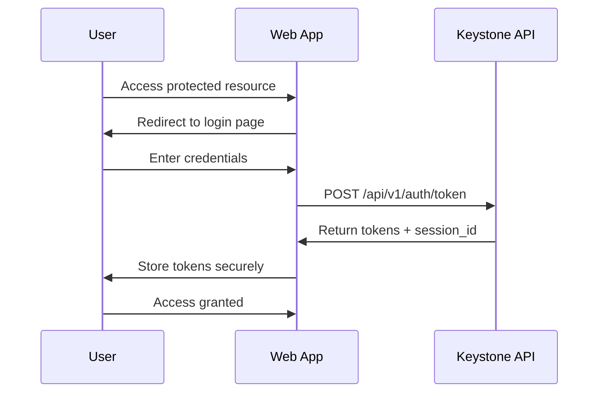

# Web Application Integration Guide

This guide provides comprehensive instructions for integrating web applications with the Keystone Authentication System using modern web technologies.

## Overview

Web application integration with Keystone involves implementing OAuth2 authentication flows, managing JWT tokens, and handling user sessions securely in browser environments.

## Supported Frameworks

- **React** (with hooks and context)
- **Vue.js** (with Vuex/Pinia)
- **Angular** (with services and guards)
- **Vanilla JavaScript** (ES6+)
- **Next.js** (with API routes)
- **Nuxt.js** (with middleware)

## Authentication Flow

### 1. Authorization Code Flow (Recommended)



### 2. Token Storage Options

#### Option A: HTTP-Only Cookies (Most Secure)
```javascript
// Server-side token storage (recommended for SSR)
app.post('/auth/login', async (req, res) => {
  const { username, password } = req.body;
  
  try {
    const response = await fetch('http://keystone-api/api/v1/auth/token', {
      method: 'POST',
      headers: { 'Content-Type': 'application/x-www-form-urlencoded' },
      body: new URLSearchParams({ username, password })
    });
    
    const tokens = await response.json();
    
    // Store tokens in HTTP-only cookies
    res.cookie('access_token', tokens.access_token, {
      httpOnly: true,
      secure: true,
      sameSite: 'strict',
      maxAge: tokens.expires_in * 1000
    });
    
    res.cookie('refresh_token', tokens.refresh_token, {
      httpOnly: true,
      secure: true,
      sameSite: 'strict',
      maxAge: 30 * 24 * 60 * 60 * 1000 // 30 days
    });
    
    res.json({ success: true, session_id: tokens.session_id });
  } catch (error) {
    res.status(401).json({ error: 'Authentication failed' });
  }
});
```

#### Option B: Secure Local Storage (Client-side)
```javascript
// Client-side token storage (for SPA)
class TokenManager {
  static setTokens(tokens) {
    // Store access token in memory (most secure)
    this.accessToken = tokens.access_token;
    
    // Store refresh token in secure storage
    localStorage.setItem('refresh_token', tokens.refresh_token);
    localStorage.setItem('session_id', tokens.session_id);
    
    // Set expiration timer
    this.setTokenExpiration(tokens.expires_in);
  }
  
  static getAccessToken() {
    return this.accessToken;
  }
  
  static setTokenExpiration(expiresIn) {
    // Auto-refresh before expiration
    setTimeout(() => {
      this.refreshToken();
    }, (expiresIn - 60) * 1000); // Refresh 1 minute before expiry
  }
  
  static async refreshToken() {
    const refreshToken = localStorage.getItem('refresh_token');
    if (!refreshToken) return null;
    
    try {
      const response = await fetch('/api/v1/auth/refresh', {
        method: 'POST',
        headers: { 'Content-Type': 'application/json' },
        body: JSON.stringify({ refresh_token: refreshToken })
      });
      
      const tokens = await response.json();
      this.setTokens(tokens);
      return tokens.access_token;
    } catch (error) {
      this.clearTokens();
      window.location.href = '/login';
    }
  }
  
  static clearTokens() {
    this.accessToken = null;
    localStorage.removeItem('refresh_token');
    localStorage.removeItem('session_id');
  }
}
```

## Framework-Specific Implementations

### React Integration

#### 1. Authentication Context

```jsx
// contexts/AuthContext.js
import React, { createContext, useContext, useReducer, useEffect } from 'react';

const AuthContext = createContext();

const authReducer = (state, action) => {
  switch (action.type) {
    case 'LOGIN_START':
      return { ...state, loading: true, error: null };
    case 'LOGIN_SUCCESS':
      return {
        ...state,
        loading: false,
        isAuthenticated: true,
        user: action.payload.user,
        sessionId: action.payload.session_id
      };
    case 'LOGIN_ERROR':
      return { ...state, loading: false, error: action.payload };
    case 'LOGOUT':
      return { ...state, isAuthenticated: false, user: null, sessionId: null };
    default:
      return state;
  }
};

export const AuthProvider = ({ children }) => {
  const [state, dispatch] = useReducer(authReducer, {
    isAuthenticated: false,
    user: null,
    sessionId: null,
    loading: false,
    error: null
  });

  const login = async (username, password) => {
    dispatch({ type: 'LOGIN_START' });
    
    try {
      const response = await fetch('/api/v1/auth/token', {
        method: 'POST',
        headers: { 'Content-Type': 'application/x-www-form-urlencoded' },
        body: new URLSearchParams({ username, password })
      });
      
      if (!response.ok) throw new Error('Login failed');
      
      const tokens = await response.json();
      TokenManager.setTokens(tokens);
      
      // Get user profile
      const userResponse = await fetch('/api/v1/users/me', {
        headers: { 'Authorization': `Bearer ${tokens.access_token}` }
      });
      
      const user = await userResponse.json();
      
      dispatch({
        type: 'LOGIN_SUCCESS',
        payload: { user, session_id: tokens.session_id }
      });
    } catch (error) {
      dispatch({ type: 'LOGIN_ERROR', payload: error.message });
    }
  };

  const logout = async () => {
    try {
      await fetch('/api/v1/auth/logout', {
        method: 'POST',
        headers: { 'Authorization': `Bearer ${TokenManager.getAccessToken()}` }
      });
    } catch (error) {
      console.error('Logout error:', error);
    } finally {
      TokenManager.clearTokens();
      dispatch({ type: 'LOGOUT' });
    }
  };

  return (
    <AuthContext.Provider value={{ ...state, login, logout }}>
      {children}
    </AuthContext.Provider>
  );
};

export const useAuth = () => {
  const context = useContext(AuthContext);
  if (!context) {
    throw new Error('useAuth must be used within AuthProvider');
  }
  return context;
};
```

#### 2. Protected Route Component

```jsx
// components/ProtectedRoute.js
import React from 'react';
import { Navigate } from 'react-router-dom';
import { useAuth } from '../contexts/AuthContext';

const ProtectedRoute = ({ children, requiredScopes = [] }) => {
  const { isAuthenticated, user, loading } = useAuth();

  if (loading) {
    return <div>Loading...</div>;
  }

  if (!isAuthenticated) {
    return <Navigate to="/login" replace />;
  }

  // Check required scopes
  if (requiredScopes.length > 0) {
    const userScopes = user?.scope_names || [];
    const hasRequiredScopes = requiredScopes.every(scope => 
      userScopes.includes(scope)
    );

    if (!hasRequiredScopes) {
      return <Navigate to="/unauthorized" replace />;
    }
  }

  return children;
};

export default ProtectedRoute;
```

#### 3. Login Component

```jsx
// components/Login.js
import React, { useState } from 'react';
import { useAuth } from '../contexts/AuthContext';
import { Navigate } from 'react-router-dom';

const Login = () => {
  const [credentials, setCredentials] = useState({ username: '', password: '' });
  const { login, isAuthenticated, loading, error } = useAuth();

  if (isAuthenticated) {
    return <Navigate to="/dashboard" replace />;
  }

  const handleSubmit = async (e) => {
    e.preventDefault();
    await login(credentials.username, credentials.password);
  };

  return (
    <form onSubmit={handleSubmit}>
      <div>
        <label>Username:</label>
        <input
          type="text"
          value={credentials.username}
          onChange={(e) => setCredentials({
            ...credentials,
            username: e.target.value
          })}
          required
        />
      </div>
      
      <div>
        <label>Password:</label>
        <input
          type="password"
          value={credentials.password}
          onChange={(e) => setCredentials({
            ...credentials,
            password: e.target.value
          })}
          required
        />
      </div>
      
      {error && <div className="error">{error}</div>}
      
      <button type="submit" disabled={loading}>
        {loading ? 'Logging in...' : 'Login'}
      </button>
    </form>
  );
};

export default Login;
```

### Vue.js Integration

#### 1. Authentication Store (Pinia)

```javascript
// stores/auth.js
import { defineStore } from 'pinia';
import { ref, computed } from 'vue';

export const useAuthStore = defineStore('auth', () => {
  const user = ref(null);
  const sessionId = ref(null);
  const loading = ref(false);
  const error = ref(null);

  const isAuthenticated = computed(() => !!user.value);

  const login = async (username, password) => {
    loading.value = true;
    error.value = null;

    try {
      const response = await fetch('/api/v1/auth/token', {
        method: 'POST',
        headers: { 'Content-Type': 'application/x-www-form-urlencoded' },
        body: new URLSearchParams({ username, password })
      });

      if (!response.ok) throw new Error('Login failed');

      const tokens = await response.json();
      TokenManager.setTokens(tokens);

      // Get user profile
      const userResponse = await fetch('/api/v1/users/me', {
        headers: { 'Authorization': `Bearer ${tokens.access_token}` }
      });

      user.value = await userResponse.json();
      sessionId.value = tokens.session_id;
    } catch (err) {
      error.value = err.message;
      throw err;
    } finally {
      loading.value = false;
    }
  };

  const logout = async () => {
    try {
      await fetch('/api/v1/auth/logout', {
        method: 'POST',
        headers: { 'Authorization': `Bearer ${TokenManager.getAccessToken()}` }
      });
    } catch (err) {
      console.error('Logout error:', err);
    } finally {
      TokenManager.clearTokens();
      user.value = null;
      sessionId.value = null;
    }
  };

  return {
    user,
    sessionId,
    loading,
    error,
    isAuthenticated,
    login,
    logout
  };
});
```

#### 2. Route Guards

```javascript
// router/index.js
import { createRouter, createWebHistory } from 'vue-router';
import { useAuthStore } from '../stores/auth';

const routes = [
  {
    path: '/login',
    component: () => import('../views/Login.vue'),
    meta: { requiresGuest: true }
  },
  {
    path: '/dashboard',
    component: () => import('../views/Dashboard.vue'),
    meta: { requiresAuth: true }
  },
  {
    path: '/admin',
    component: () => import('../views/Admin.vue'),
    meta: { 
      requiresAuth: true,
      requiredScopes: ['admin:system']
    }
  }
];

const router = createRouter({
  history: createWebHistory(),
  routes
});

router.beforeEach((to, from, next) => {
  const authStore = useAuthStore();

  if (to.meta.requiresAuth && !authStore.isAuthenticated) {
    next('/login');
  } else if (to.meta.requiresGuest && authStore.isAuthenticated) {
    next('/dashboard');
  } else if (to.meta.requiredScopes) {
    const userScopes = authStore.user?.scope_names || [];
    const hasRequiredScopes = to.meta.requiredScopes.every(scope =>
      userScopes.includes(scope)
    );

    if (!hasRequiredScopes) {
      next('/unauthorized');
    } else {
      next();
    }
  } else {
    next();
  }
});

export default router;
```

### Angular Integration

#### 1. Authentication Service

```typescript
// services/auth.service.ts
import { Injectable } from '@angular/core';
import { HttpClient } from '@angular/common/http';
import { BehaviorSubject, Observable, throwError } from 'rxjs';
import { map, catchError } from 'rxjs/operators';

interface User {
  id: string;
  username: string;
  email: string;
  scope_names: string[];
}

interface TokenResponse {
  access_token: string;
  refresh_token: string;
  session_id: string;
  expires_in: number;
}

@Injectable({
  providedIn: 'root'
})
export class AuthService {
  private currentUserSubject = new BehaviorSubject<User | null>(null);
  public currentUser$ = this.currentUserSubject.asObservable();

  constructor(private http: HttpClient) {
    // Check for existing session on service initialization
    this.checkExistingSession();
  }

  login(username: string, password: string): Observable<User> {
    const body = new URLSearchParams();
    body.set('username', username);
    body.set('password', password);

    return this.http.post<TokenResponse>('/api/v1/auth/token', body.toString(), {
      headers: { 'Content-Type': 'application/x-www-form-urlencoded' }
    }).pipe(
      map(tokens => {
        TokenManager.setTokens(tokens);
        return this.getCurrentUser();
      }),
      catchError(error => {
        console.error('Login error:', error);
        return throwError(error);
      })
    );
  }

  logout(): Observable<any> {
    return this.http.post('/api/v1/auth/logout', {}).pipe(
      map(() => {
        TokenManager.clearTokens();
        this.currentUserSubject.next(null);
      }),
      catchError(error => {
        // Even if logout fails, clear local tokens
        TokenManager.clearTokens();
        this.currentUserSubject.next(null);
        return throwError(error);
      })
    );
  }

  getCurrentUser(): Observable<User> {
    return this.http.get<User>('/api/v1/users/me').pipe(
      map(user => {
        this.currentUserSubject.next(user);
        return user;
      })
    );
  }

  hasScope(scope: string): boolean {
    const user = this.currentUserSubject.value;
    return user?.scope_names?.includes(scope) || false;
  }

  hasAnyScope(scopes: string[]): boolean {
    const user = this.currentUserSubject.value;
    return scopes.some(scope => user?.scope_names?.includes(scope));
  }

  private checkExistingSession(): void {
    const token = TokenManager.getAccessToken();
    if (token) {
      this.getCurrentUser().subscribe();
    }
  }
}
```

#### 2. Authentication Guard

```typescript
// guards/auth.guard.ts
import { Injectable } from '@angular/core';
import { CanActivate, Router, ActivatedRouteSnapshot } from '@angular/router';
import { Observable } from 'rxjs';
import { map, take } from 'rxjs/operators';
import { AuthService } from '../services/auth.service';

@Injectable({
  providedIn: 'root'
})
export class AuthGuard implements CanActivate {
  constructor(
    private authService: AuthService,
    private router: Router
  ) {}

  canActivate(route: ActivatedRouteSnapshot): Observable<boolean> {
    return this.authService.currentUser$.pipe(
      take(1),
      map(user => {
        if (!user) {
          this.router.navigate(['/login']);
          return false;
        }

        // Check required scopes
        const requiredScopes = route.data['requiredScopes'] as string[];
        if (requiredScopes && requiredScopes.length > 0) {
          const hasRequiredScopes = requiredScopes.every(scope =>
            this.authService.hasScope(scope)
          );

          if (!hasRequiredScopes) {
            this.router.navigate(['/unauthorized']);
            return false;
          }
        }

        return true;
      })
    );
  }
}
```

## HTTP Interceptors

### Automatic Token Attachment

```javascript
// interceptors/auth.interceptor.js
class AuthInterceptor {
  static async interceptRequest(config) {
    const token = TokenManager.getAccessToken();
    
    if (token) {
      config.headers.Authorization = `Bearer ${token}`;
    }
    
    return config;
  }
  
  static async interceptResponse(response) {
    // Handle token refresh on 401
    if (response.status === 401) {
      const newToken = await TokenManager.refreshToken();
      
      if (newToken) {
        // Retry original request with new token
        response.config.headers.Authorization = `Bearer ${newToken}`;
        return fetch(response.config.url, response.config);
      } else {
        // Redirect to login
        window.location.href = '/login';
      }
    }
    
    return response;
  }
}

// Setup with Axios
axios.interceptors.request.use(AuthInterceptor.interceptRequest);
axios.interceptors.response.use(
  response => response,
  AuthInterceptor.interceptResponse
);
```

## Session Management

### Session Monitoring

```javascript
// utils/sessionMonitor.js
class SessionMonitor {
  constructor() {
    this.checkInterval = null;
    this.warningShown = false;
  }
  
  start() {
    // Check session every 5 minutes
    this.checkInterval = setInterval(() => {
      this.checkSession();
    }, 5 * 60 * 1000);
  }
  
  stop() {
    if (this.checkInterval) {
      clearInterval(this.checkInterval);
      this.checkInterval = null;
    }
  }
  
  async checkSession() {
    try {
      const response = await fetch('/api/v1/sessions', {
        headers: { 'Authorization': `Bearer ${TokenManager.getAccessToken()}` }
      });
      
      if (response.ok) {
        const sessions = await response.json();
        const currentSession = sessions.sessions.find(s => 
          s.session_id === localStorage.getItem('session_id')
        );
        
        if (currentSession) {
          this.checkSessionExpiry(currentSession);
        }
      }
    } catch (error) {
      console.error('Session check failed:', error);
    }
  }
  
  checkSessionExpiry(session) {
    const expiresAt = new Date(session.expires_at);
    const now = new Date();
    const timeUntilExpiry = expiresAt.getTime() - now.getTime();
    
    // Warn if session expires in less than 10 minutes
    if (timeUntilExpiry < 10 * 60 * 1000 && !this.warningShown) {
      this.showExpiryWarning(timeUntilExpiry);
      this.warningShown = true;
    }
  }
  
  showExpiryWarning(timeUntilExpiry) {
    const minutes = Math.floor(timeUntilExpiry / (60 * 1000));
    
    if (confirm(`Your session will expire in ${minutes} minutes. Would you like to extend it?`)) {
      this.renewSession();
    }
  }
  
  async renewSession() {
    try {
      const sessionId = localStorage.getItem('session_id');
      const response = await fetch(`/api/v1/sessions/${sessionId}/renew`, {
        method: 'POST',
        headers: { 'Authorization': `Bearer ${TokenManager.getAccessToken()}` }
      });
      
      if (response.ok) {
        this.warningShown = false;
        console.log('Session renewed successfully');
      }
    } catch (error) {
      console.error('Session renewal failed:', error);
    }
  }
}

// Usage
const sessionMonitor = new SessionMonitor();
sessionMonitor.start();
```

## Error Handling

### Centralized Error Handler

```javascript
// utils/errorHandler.js
class ErrorHandler {
  static handle(error, context = '') {
    console.error(`Error in ${context}:`, error);
    
    switch (error.status) {
      case 401:
        this.handleUnauthorized(error);
        break;
      case 403:
        this.handleForbidden(error);
        break;
      case 429:
        this.handleRateLimit(error);
        break;
      default:
        this.handleGenericError(error);
    }
  }
  
  static handleUnauthorized(error) {
    // Clear tokens and redirect to login
    TokenManager.clearTokens();
    window.location.href = '/login?reason=session_expired';
  }
  
  static handleForbidden(error) {
    // Show permission denied message
    alert('You do not have permission to perform this action.');
  }
  
  static handleRateLimit(error) {
    const retryAfter = error.headers?.['retry-after'] || 60;
    alert(`Rate limit exceeded. Please try again in ${retryAfter} seconds.`);
  }
  
  static handleGenericError(error) {
    alert('An error occurred. Please try again later.');
  }
}
```

## Best Practices

### 1. Security

- Store tokens securely (HTTP-only cookies preferred)
- Implement automatic token refresh
- Use HTTPS in production
- Validate tokens on every request
- Implement proper CORS policies

### 2. User Experience

- Show loading states during authentication
- Handle network errors gracefully
- Implement session expiry warnings
- Provide clear error messages
- Support remember me functionality

### 3. Performance

- Cache user profile data
- Implement request deduplication
- Use connection pooling
- Minimize token refresh requests
- Implement proper retry logic

### 4. Monitoring

- Log authentication events
- Monitor token refresh rates
- Track session durations
- Alert on authentication failures
- Monitor API response times

This comprehensive guide provides everything needed to integrate web applications with the Keystone Authentication System securely and efficiently.