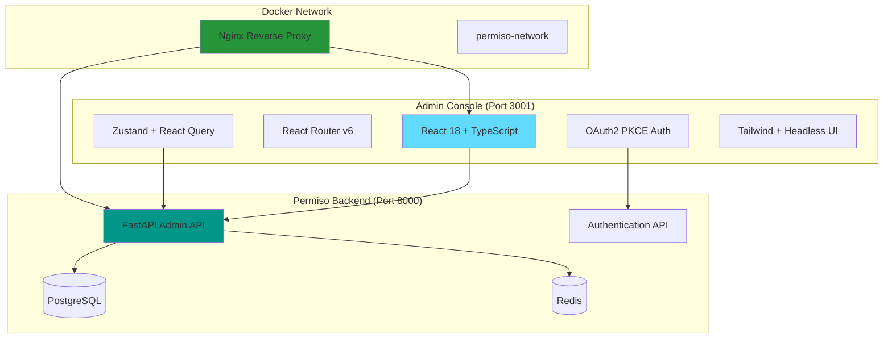
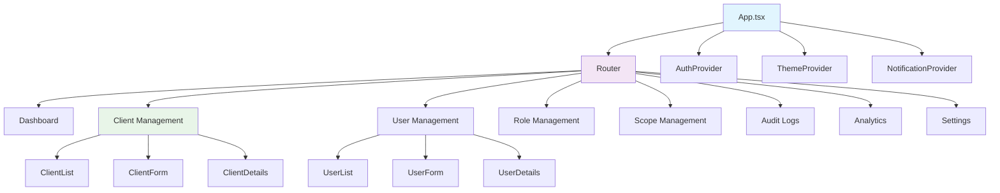

# 🏗️ Admin Console Architecture & Specifications

This document provides detailed architecture specifications and implementation guidelines for the Permiso Admin Console.

## 🎯 System Architecture

### High-Level Architecture



### Component Architecture



## 📦 Project Structure Specifications

### Core Dependencies

```json
{
  "dependencies": {
    "react": "^18.2.0",
    "react-dom": "^18.2.0",
    "react-router-dom": "^6.8.0",
    "@tanstack/react-query": "^4.24.0",
    "zustand": "^4.3.0",
    "react-hook-form": "^7.43.0",
    "@hookform/resolvers": "^2.9.0",
    "zod": "^3.20.0",
    "react-oauth2-code-pkce": "^1.16.0",
    "jwt-decode": "^3.1.2",
    "@headlessui/react": "^1.7.0",
    "@heroicons/react": "^2.0.0",
    "tailwindcss": "^3.2.0",
    "recharts": "^2.5.0",
    "@tanstack/react-table": "^8.7.0",
    "date-fns": "^2.29.0",
    "react-hot-toast": "^2.4.0",
    "clsx": "^1.2.0",
    "axios": "^1.3.0"
  },
  "devDependencies": {
    "@types/react": "^18.0.0",
    "@types/react-dom": "^18.0.0",
    "@vitejs/plugin-react": "^3.1.0",
    "vite": "^4.1.0",
    "typescript": "^4.9.0",
    "@typescript-eslint/eslint-plugin": "^5.52.0",
    "@typescript-eslint/parser": "^5.52.0",
    "eslint": "^8.34.0",
    "eslint-plugin-react-hooks": "^4.6.0",
    "eslint-plugin-react-refresh": "^0.3.4",
    "prettier": "^2.8.0",
    "autoprefixer": "^10.4.0",
    "postcss": "^8.4.0",
    "@testing-library/react": "^13.4.0",
    "@testing-library/jest-dom": "^5.16.0",
    "@testing-library/user-event": "^14.4.0",
    "vitest": "^0.28.0",
    "jsdom": "^21.1.0"
  }
}
```

### Environment Configuration

```bash
# .env.example
# API Configuration
VITE_API_BASE_URL=http://localhost:8000
VITE_API_VERSION=v1

# Authentication
VITE_CLIENT_ID=admin-console
VITE_CLIENT_SECRET=admin-console-secret
VITE_REDIRECT_URI=http://localhost:3001/callback
VITE_LOGOUT_REDIRECT_URI=http://localhost:3001/login

# OAuth2 Configuration
VITE_AUTHORIZATION_ENDPOINT=http://localhost:8000/api/v1/auth/authorize
VITE_TOKEN_ENDPOINT=http://localhost:8000/api/v1/auth/token
VITE_REVOKE_ENDPOINT=http://localhost:8000/api/v1/auth/revoke

# Features
VITE_ENABLE_ANALYTICS=true
VITE_ENABLE_AUDIT_LOGS=true
VITE_ENABLE_SYSTEM_CONFIG=true
VITE_ENABLE_DARK_MODE=true

# UI Configuration
VITE_THEME=light
VITE_BRAND_NAME=Permiso Admin
VITE_BRAND_LOGO=/logo.png
VITE_PRIMARY_COLOR=#3b82f6

# Development
VITE_DEBUG=true
VITE_LOG_LEVEL=debug
```

### TypeScript Configuration

```json
{
  "compilerOptions": {
    "target": "ES2020",
    "useDefineForClassFields": true,
    "lib": ["ES2020", "DOM", "DOM.Iterable"],
    "module": "ESNext",
    "skipLibCheck": true,
    "moduleResolution": "bundler",
    "allowImportingTsExtensions": true,
    "resolveJsonModule": true,
    "isolatedModules": true,
    "noEmit": true,
    "jsx": "react-jsx",
    "strict": true,
    "noUnusedLocals": true,
    "noUnusedParameters": true,
    "noFallthroughCasesInSwitch": true,
    "baseUrl": ".",
    "paths": {
      "@/*": ["src/*"],
      "@/components/*": ["src/components/*"],
      "@/pages/*": ["src/pages/*"],
      "@/services/*": ["src/services/*"],
      "@/hooks/*": ["src/hooks/*"],
      "@/contexts/*": ["src/contexts/*"],
      "@/utils/*": ["src/utils/*"],
      "@/types/*": ["src/types/*"]
    }
  },
  "include": ["src"],
  "references": [{ "path": "./tsconfig.node.json" }]
}
```

### Vite Configuration

```typescript
// vite.config.ts
import { defineConfig } from 'vite'
import react from '@vitejs/plugin-react'
import path from 'path'

export default defineConfig({
  plugins: [react()],
  resolve: {
    alias: {
      '@': path.resolve(__dirname, './src'),
    },
  },
  server: {
    port: 3000,
    host: true,
    proxy: {
      '/api': {
        target: 'http://localhost:8000',
        changeOrigin: true,
        secure: false,
      },
    },
  },
  build: {
    outDir: 'dist',
    sourcemap: true,
    rollupOptions: {
      output: {
        manualChunks: {
          vendor: ['react', 'react-dom'],
          router: ['react-router-dom'],
          ui: ['@headlessui/react', '@heroicons/react'],
          charts: ['recharts'],
          forms: ['react-hook-form', '@hookform/resolvers', 'zod'],
        },
      },
    },
  },
})
```

### Tailwind Configuration

```javascript
// tailwind.config.js
module.exports = {
  content: [
    "./index.html",
    "./src/**/*.{js,ts,jsx,tsx}",
  ],
  theme: {
    extend: {
      colors: {
        primary: {
          50: '#eff6ff',
          100: '#dbeafe',
          200: '#bfdbfe',
          300: '#93c5fd',
          400: '#60a5fa',
          500: '#3b82f6',
          600: '#2563eb',
          700: '#1d4ed8',
          800: '#1e40af',
          900: '#1e3a8a',
        },
        gray: {
          50: '#f9fafb',
          100: '#f3f4f6',
          200: '#e5e7eb',
          300: '#d1d5db',
          400: '#9ca3af',
          500: '#6b7280',
          600: '#4b5563',
          700: '#374151',
          800: '#1f2937',
          900: '#111827',
        },
      },
      fontFamily: {
        sans: ['Inter', 'system-ui', 'sans-serif'],
      },
      animation: {
        'fade-in': 'fadeIn 0.5s ease-in-out',
        'slide-in': 'slideIn 0.3s ease-out',
        'bounce-in': 'bounceIn 0.6s ease-out',
      },
      keyframes: {
        fadeIn: {
          '0%': { opacity: '0' },
          '100%': { opacity: '1' },
        },
        slideIn: {
          '0%': { transform: 'translateY(-10px)', opacity: '0' },
          '100%': { transform: 'translateY(0)', opacity: '1' },
        },
        bounceIn: {
          '0%': { transform: 'scale(0.3)', opacity: '0' },
          '50%': { transform: 'scale(1.05)' },
          '70%': { transform: 'scale(0.9)' },
          '100%': { transform: 'scale(1)', opacity: '1' },
        },
      },
    },
  },
  plugins: [
    require('@tailwindcss/forms'),
    require('@tailwindcss/typography'),
  ],
}
```

## 🔐 Authentication Architecture

### OAuth2 PKCE Flow Implementation

```typescript
// Authentication flow specification
interface AuthConfig {
  clientId: string;
  redirectUri: string;
  authorizationEndpoint: string;
  tokenEndpoint: string;
  revokeEndpoint: string;
  scopes: string[];
}

interface TokenResponse {
  access_token: string;
  refresh_token?: string;
  token_type: string;
  expires_in: number;
  scope: string;
}

interface UserInfo {
  sub: string;
  username: string;
  email: string;
  roles: string[];
  scopes: string[];
  is_superuser: boolean;
}
```

### Authentication Context Structure

```typescript
interface AuthContextType {
  // State
  isAuthenticated: boolean;
  isLoading: boolean;
  user: UserInfo | null;
  tokens: TokenResponse | null;
  
  // Actions
  login: () => Promise<void>;
  logout: () => Promise<void>;
  refreshToken: () => Promise<void>;
  
  // Permissions
  hasPermission: (permission: string) => boolean;
  hasRole: (role: string) => boolean;
  hasScope: (scope: string) => boolean;
}
```

## 📊 State Management Architecture

### Global State Structure

```typescript
// Zustand store structure
interface AppState {
  // UI State
  theme: 'light' | 'dark';
  sidebarOpen: boolean;
  notifications: Notification[];
  
  // Data State
  clients: ServiceClient[];
  users: User[];
  roles: Role[];
  scopes: Scope[];
  auditLogs: AuditLog[];
  
  // Actions
  setTheme: (theme: 'light' | 'dark') => void;
  toggleSidebar: () => void;
  addNotification: (notification: Notification) => void;
  removeNotification: (id: string) => void;
}
```

### React Query Configuration

```typescript
// Query client configuration
const queryClient = new QueryClient({
  defaultOptions: {
    queries: {
      staleTime: 5 * 60 * 1000, // 5 minutes
      cacheTime: 10 * 60 * 1000, // 10 minutes
      retry: (failureCount, error) => {
        if (error.status === 401) return false;
        return failureCount < 3;
      },
    },
    mutations: {
      retry: false,
    },
  },
});
```

## 🎨 UI Component Architecture

### Design System Specifications

```typescript
// Component variants and sizes
type ButtonVariant = 'primary' | 'secondary' | 'danger' | 'ghost';
type ButtonSize = 'sm' | 'md' | 'lg';
type InputVariant = 'default' | 'error' | 'success';
type TableVariant = 'default' | 'striped' | 'bordered';

// Color palette
const colors = {
  primary: '#3b82f6',
  secondary: '#6b7280',
  success: '#10b981',
  warning: '#f59e0b',
  danger: '#ef4444',
  info: '#06b6d4',
};

// Typography scale
const typography = {
  h1: 'text-3xl font-bold',
  h2: 'text-2xl font-semibold',
  h3: 'text-xl font-medium',
  h4: 'text-lg font-medium',
  body: 'text-base',
  small: 'text-sm',
  xs: 'text-xs',
};
```

### Component Library Structure

```typescript
// Base components
interface ButtonProps {
  variant?: ButtonVariant;
  size?: ButtonSize;
  disabled?: boolean;
  loading?: boolean;
  icon?: React.ReactNode;
  children: React.ReactNode;
  onClick?: () => void;
}

interface InputProps {
  label?: string;
  error?: string;
  helperText?: string;
  variant?: InputVariant;
  required?: boolean;
  disabled?: boolean;
}

interface TableProps<T> {
  data: T[];
  columns: ColumnDef<T>[];
  variant?: TableVariant;
  pagination?: boolean;
  sorting?: boolean;
  filtering?: boolean;
}
```

## 🔌 API Integration Architecture

### API Client Structure

```typescript
// Base API client
class ApiClient {
  private baseURL: string;
  private authToken: string | null = null;
  
  constructor(baseURL: string) {
    this.baseURL = baseURL;
  }
  
  setAuthToken(token: string) {
    this.authToken = token;
  }
  
  async request<T>(
    endpoint: string,
    options: RequestOptions = {}
  ): Promise<ApiResponse<T>> {
    // Implementation with error handling, retries, etc.
  }
}

// Service-specific clients
class ClientsService extends ApiClient {
  async getClients(params?: GetClientsParams): Promise<ServiceClient[]>;
  async getClient(id: string): Promise<ServiceClient>;
  async createClient(data: CreateClientData): Promise<ServiceClient>;
  async updateClient(id: string, data: UpdateClientData): Promise<ServiceClient>;
  async deleteClient(id: string): Promise<void>;
  async rotateSecret(id: string): Promise<{ client_secret: string }>;
}
```

### Error Handling Strategy

```typescript
// Error types
interface ApiError {
  code: string;
  message: string;
  details?: Record<string, any>;
  status: number;
}

// Error handling
class ErrorHandler {
  static handle(error: ApiError): void {
    switch (error.status) {
      case 401:
        // Redirect to login
        break;
      case 403:
        // Show permission denied
        break;
      case 422:
        // Show validation errors
        break;
      default:
        // Show generic error
        break;
    }
  }
}
```

## 🧪 Testing Architecture

### Testing Strategy

```typescript
// Component testing
describe('ClientList', () => {
  it('should render clients correctly', () => {
    render(<ClientList clients={mockClients} />);
    expect(screen.getByText('Service Clients')).toBeInTheDocument();
  });
  
  it('should handle client deletion', async () => {
    const onDelete = jest.fn();
    render(<ClientList clients={mockClients} onDelete={onDelete} />);
    
    fireEvent.click(screen.getByText('Delete'));
    await waitFor(() => {
      expect(onDelete).toHaveBeenCalledWith(mockClients[0].id);
    });
  });
});

// Service testing
describe('ClientsService', () => {
  it('should fetch clients successfully', async () => {
    const clients = await clientsService.getClients();
    expect(clients).toHaveLength(2);
    expect(clients[0]).toHaveProperty('client_id');
  });
});
```

### E2E Testing Structure

```typescript
// Playwright E2E tests
describe('Admin Console E2E', () => {
  test('should login and navigate to clients', async ({ page }) => {
    await page.goto('/login');
    await page.fill('[data-testid="username"]', 'admin');
    await page.fill('[data-testid="password"]', 'password');
    await page.click('[data-testid="login-button"]');
    
    await expect(page).toHaveURL('/dashboard');
    await page.click('[data-testid="clients-nav"]');
    await expect(page).toHaveURL('/clients');
  });
});
```

## 🐳 Docker Architecture

### Multi-stage Dockerfile

```dockerfile
# Development stage
FROM node:18-alpine as development
WORKDIR /app
COPY package*.json ./
RUN npm ci
COPY . .
EXPOSE 3000
CMD ["npm", "run", "dev"]

# Build stage
FROM node:18-alpine as build
WORKDIR /app
COPY package*.json ./
RUN npm ci --only=production
COPY . .
RUN npm run build

# Production stage
FROM nginx:alpine as production
COPY --from=build /app/dist /usr/share/nginx/html
COPY docker/nginx.conf /etc/nginx/conf.d/default.conf
EXPOSE 80
CMD ["nginx", "-g", "daemon off;"]
```

### Docker Compose Integration

```yaml
# docker-compose.yml
version: '3.8'

services:
  admin-console:
    build:
      context: .
      dockerfile: Dockerfile
      target: production
    container_name: permiso-admin-console
    ports:
      - "3001:80"
    environment:
      - VITE_API_BASE_URL=http://permiso-auth:8000
      - VITE_CLIENT_ID=admin-console
    depends_on:
      - permiso-auth
    networks:
      - permiso-network

networks:
  permiso-network:
    external: true
```

## 📈 Performance Optimization

### Code Splitting Strategy

```typescript
// Lazy loading for routes
const Dashboard = lazy(() => import('@/pages/Dashboard'));
const Clients = lazy(() => import('@/pages/Clients'));
const Users = lazy(() => import('@/pages/Users'));

// Component-level code splitting
const ClientForm = lazy(() => import('@/components/ClientForm'));
const UserForm = lazy(() => import('@/components/UserForm'));
```

### Caching Strategy

```typescript
// React Query caching
const useClients = () => {
  return useQuery({
    queryKey: ['clients'],
    queryFn: () => clientsService.getClients(),
    staleTime: 5 * 60 * 1000, // 5 minutes
    cacheTime: 10 * 60 * 1000, // 10 minutes
  });
};

// Browser caching
const cacheConfig = {
  'Cache-Control': 'public, max-age=31536000', // 1 year for static assets
  'ETag': true,
  'Last-Modified': true,
};
```

## 🔒 Security Architecture

### Security Headers

```typescript
// Security headers configuration
const securityHeaders = {
  'Content-Security-Policy': "default-src 'self'; script-src 'self' 'unsafe-inline'; style-src 'self' 'unsafe-inline';",
  'X-Frame-Options': 'DENY',
  'X-Content-Type-Options': 'nosniff',
  'Referrer-Policy': 'strict-origin-when-cross-origin',
  'Permissions-Policy': 'geolocation=(), microphone=(), camera=()',
};
```

### Input Validation

```typescript
// Zod schemas for validation
const clientSchema = z.object({
  client_id: z.string().min(3).max(50).regex(/^[a-zA-Z0-9_-]+$/),
  name: z.string().min(1).max(100),
  description: z.string().max(500).optional(),
  scopes: z.array(z.string()).min(1),
  is_trusted: z.boolean(),
});

// Form validation
const { register, handleSubmit, formState: { errors } } = useForm({
  resolver: zodResolver(clientSchema),
});
```

This architecture provides a comprehensive foundation for building a secure, scalable, and maintainable admin console for the Permiso Auth system.