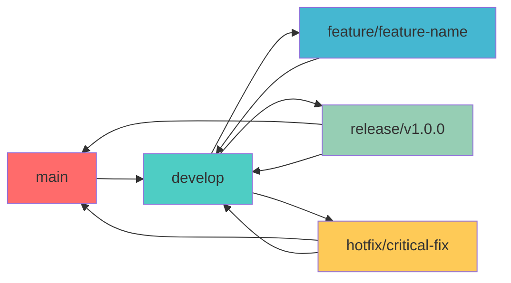

# 🛠️ Development Workflow & Guide

This document provides comprehensive guidance for developing, debugging, and maintaining the Permiso Admin Console.

## 🚀 Getting Started

### Prerequisites

Before starting development, ensure you have:

- **Node.js** 18.0.0 or higher
- **npm** 8.0.0 or higher
- **Git** for version control
- **Docker** and **Docker Compose** for containerized development
- **VS Code** (recommended) with suggested extensions

### Initial Setup

```bash
# Clone the repository
git clone <repository-url>
cd permiso-admin-console

# Install dependencies
npm install

# Copy environment configuration
cp .env.example .env.local

# Start development server
npm run dev
```

### Recommended VS Code Extensions

```json
{
  "recommendations": [
    "bradlc.vscode-tailwindcss",
    "esbenp.prettier-vscode",
    "dbaeumer.vscode-eslint",
    "ms-vscode.vscode-typescript-next",
    "formulahendry.auto-rename-tag",
    "christian-kohler.path-intellisense",
    "ms-vscode.vscode-json",
    "redhat.vscode-yaml",
    "ms-playwright.playwright",
    "vitest.explorer"
  ]
}
```

## 🔄 Development Workflow

### Git Workflow

We follow the **GitFlow** branching strategy:



#### Branch Types

- **main**: Production-ready code
- **develop**: Integration branch for features
- **feature/**: New features or enhancements
- **release/**: Release preparation
- **hotfix/**: Critical production fixes

#### Commit Convention

We use **Conventional Commits** for consistent commit messages:

```bash
# Format: <type>[optional scope]: <description>

# Examples:
feat(auth): add OAuth2 PKCE flow implementation
fix(users): resolve pagination issue in user list
docs(api): update authentication documentation
style(ui): improve button component styling
refactor(hooks): optimize useAuth hook performance
test(components): add unit tests for UserForm
chore(deps): update React to v18.2.0
```

### Development Process

#### 1. Feature Development

```bash
# Create feature branch from develop
git checkout develop
git pull origin develop
git checkout -b feature/user-management-ui

# Make changes and commit
git add .
git commit -m "feat(users): implement user creation form"

# Push and create pull request
git push origin feature/user-management-ui
```

#### 2. Code Review Process

**Pull Request Template:**

```markdown
## Description
Brief description of changes made.

## Type of Change
- [ ] Bug fix (non-breaking change which fixes an issue)
- [ ] New feature (non-breaking change which adds functionality)
- [ ] Breaking change (fix or feature that would cause existing functionality to not work as expected)
- [ ] Documentation update

## Testing
- [ ] Unit tests pass
- [ ] Integration tests pass
- [ ] E2E tests pass
- [ ] Manual testing completed

## Security Checklist
- [ ] Input validation implemented
- [ ] Authentication/authorization checked
- [ ] No sensitive data exposed
- [ ] Security headers configured

## Screenshots (if applicable)
Add screenshots of UI changes.

## Additional Notes
Any additional information for reviewers.
```

#### 3. Code Quality Gates

Before merging, ensure:

```bash
# Linting passes
npm run lint

# Type checking passes
npm run type-check

# Tests pass
npm run test

# Build succeeds
npm run build

# Security audit passes
npm audit --audit-level high
```

## 🧪 Testing Workflow

### Test-Driven Development (TDD)

Follow the **Red-Green-Refactor** cycle:

1. **Red**: Write a failing test
2. **Green**: Write minimal code to pass
3. **Refactor**: Improve code while keeping tests green

#### Example TDD Workflow

```typescript
// 1. RED: Write failing test
describe('UserForm', () => {
  it('should validate email format', () => {
    render(<UserForm />)
    
    fireEvent.change(screen.getByLabelText(/email/i), {
      target: { value: 'invalid-email' }
    })
    fireEvent.click(screen.getByRole('button', { name: /save/i }))
    
    expect(screen.getByText(/invalid email format/i)).toBeInTheDocument()
  })
})

// 2. GREEN: Implement validation
const validateEmail = (email: string): string | null => {
  const emailRegex = /^[^\s@]+@[^\s@]+\.[^\s@]+$/
  return emailRegex.test(email) ? null : 'Invalid email format'
}

// 3. REFACTOR: Improve implementation
const validateEmail = (email: string): string | null => {
  const trimmedEmail = email.trim().toLowerCase()
  const emailRegex = /^[a-zA-Z0-9._%+-]+@[a-zA-Z0-9.-]+\.[a-zA-Z]{2,}$/
  
  if (!trimmedEmail) return 'Email is required'
  if (!emailRegex.test(trimmedEmail)) return 'Invalid email format'
  if (trimmedEmail.length > 254) return 'Email is too long'
  
  return null
}
```

### Testing Strategy by Component Type

#### UI Components
```bash
# Test component rendering and interactions
npm run test -- --testPathPattern=components/ui
```

#### Pages
```bash
# Test page integration and routing
npm run test -- --testPathPattern=pages
```

#### Hooks
```bash
# Test custom hook logic
npm run test -- --testPathPattern=hooks
```

#### Services
```bash
# Test API interactions and business logic
npm run test -- --testPathPattern=services
```

## 🐛 Debugging Guide

### Common Issues and Solutions

#### 1. Authentication Issues

**Problem**: User gets logged out unexpectedly

**Debugging Steps:**
```typescript
// Check token expiration
const token = TokenManager.getAccessToken()
if (token) {
  const payload = JSON.parse(atob(token.split('.')[1]))
  console.log('Token expires at:', new Date(payload.exp * 1000))
  console.log('Current time:', new Date())
}

// Check token refresh
console.log('Refresh token available:', !!TokenManager.getRefreshToken())
```

**Solutions:**
- Verify token expiration times
- Check refresh token implementation
- Ensure proper token storage

#### 2. Permission Errors

**Problem**: User can't access certain features

**Debugging Steps:**
```typescript
// Check user permissions
const { user, permissions } = useAuth()
console.log('User permissions:', permissions)
console.log('Required permission:', 'admin:users')
console.log('Has permission:', permissions.includes('admin:users'))

// Check role assignments
console.log('User roles:', user?.roles)
```

**Solutions:**
- Verify role assignments in backend
- Check permission mapping
- Ensure proper scope configuration

#### 3. API Connection Issues

**Problem**: API requests failing

**Debugging Steps:**
```typescript
// Check API configuration
console.log('API Base URL:', process.env.VITE_API_BASE_URL)
console.log('Current environment:', process.env.NODE_ENV)

// Monitor network requests
// Use browser dev tools Network tab
// Check request headers and response codes
```

**Solutions:**
- Verify environment variables
- Check CORS configuration
- Validate API endpoints

#### 4. State Management Issues

**Problem**: Component state not updating

**Debugging Steps:**
```typescript
// Debug Zustand store
import { useStore } from '@/store'

const DebugComponent = () => {
  const store = useStore()
  
  useEffect(() => {
    console.log('Store state:', store)
  }, [store])
  
  return null
}

// Debug React Query cache
import { useQueryClient } from 'react-query'

const queryClient = useQueryClient()
console.log('Query cache:', queryClient.getQueryCache().getAll())
```

**Solutions:**
- Check store subscriptions
- Verify action dispatching
- Clear query cache if needed

### Debugging Tools

#### Browser DevTools

**React Developer Tools:**
```bash
# Install React DevTools extension
# Use Components tab to inspect component tree
# Use Profiler tab to identify performance issues
```

**Network Tab:**
- Monitor API requests
- Check request/response headers
- Verify payload data

**Console:**
- Use `console.log()` for debugging
- Set breakpoints with `debugger`
- Monitor error messages

#### VS Code Debugging

**Launch Configuration (.vscode/launch.json):**
```json
{
  "version": "0.2.0",
  "configurations": [
    {
      "name": "Debug React App",
      "type": "node",
      "request": "launch",
      "program": "${workspaceFolder}/node_modules/.bin/vite",
      "args": ["dev"],
      "env": {
        "NODE_ENV": "development"
      },
      "console": "integratedTerminal",
      "internalConsoleOptions": "neverOpen"
    }
  ]
}
```

#### Testing Debugging

```bash
# Run tests in debug mode
npm run test -- --inspect-brk

# Run specific test file
npm run test -- UserForm.test.tsx

# Run tests with coverage
npm run test:coverage

# Debug E2E tests
npm run test:e2e -- --debug
```

## 🔧 Development Tools

### Code Quality Tools

#### ESLint Configuration

```javascript
// .eslintrc.js
module.exports = {
  extends: [
    'eslint:recommended',
    '@typescript-eslint/recommended',
    'plugin:react-hooks/recommended',
    'plugin:jsx-a11y/recommended',
  ],
  rules: {
    // Custom rules
    'react-hooks/exhaustive-deps': 'warn',
    '@typescript-eslint/no-unused-vars': ['error', { argsIgnorePattern: '^_' }],
    'jsx-a11y/anchor-is-valid': 'off', // Next.js Link component
  },
}
```

#### Prettier Configuration

```json
{
  "semi": false,
  "trailingComma": "es5",
  "singleQuote": true,
  "printWidth": 80,
  "tabWidth": 2,
  "useTabs": false
}
```

#### Husky Git Hooks

```json
{
  "husky": {
    "hooks": {
      "pre-commit": "lint-staged",
      "commit-msg": "commitlint -E HUSKY_GIT_PARAMS",
      "pre-push": "npm run test && npm run build"
    }
  },
  "lint-staged": {
    "*.{ts,tsx}": [
      "eslint --fix",
      "prettier --write",
      "git add"
    ],
    "*.{json,md}": [
      "prettier --write",
      "git add"
    ]
  }
}
```

### Performance Monitoring

#### Bundle Analysis

```bash
# Analyze bundle size
npm run build
npx vite-bundle-analyzer dist

# Check for duplicate dependencies
npx duplicate-package-checker-webpack-plugin
```

#### Performance Profiling

```typescript
// Performance monitoring hook
export const usePerformanceMonitor = (componentName: string) => {
  useEffect(() => {
    const startTime = performance.now()
    
    return () => {
      const endTime = performance.now()
      const renderTime = endTime - startTime
      
      if (renderTime > 16) { // > 1 frame at 60fps
        console.warn(`${componentName} render took ${renderTime}ms`)
      }
    }
  })
}

// Usage in components
const UserList = () => {
  usePerformanceMonitor('UserList')
  // Component logic
}
```

## 🚨 Troubleshooting

### Common Error Messages

#### "Module not found" Errors

```bash
# Clear node_modules and reinstall
rm -rf node_modules package-lock.json
npm install

# Check import paths
# Use absolute imports with @ alias
import { Button } from '@/components/ui/Button'
```

#### "Type errors" in TypeScript

```typescript
// Check tsconfig.json paths
{
  "compilerOptions": {
    "baseUrl": ".",
    "paths": {
      "@/*": ["src/*"]
    }
  }
}

// Restart TypeScript server in VS Code
// Cmd/Ctrl + Shift + P -> "TypeScript: Restart TS Server"
```

#### "CORS errors" in development

```typescript
// Update vite.config.ts proxy
export default defineConfig({
  server: {
    proxy: {
      '/api': {
        target: 'http://localhost:8000',
        changeOrigin: true,
        secure: false,
      },
    },
  },
})
```

#### "Build failures"

```bash
# Check for TypeScript errors
npm run type-check

# Check for linting errors
npm run lint

# Clear build cache
rm -rf dist .vite

# Rebuild
npm run build
```

### Performance Issues

#### Slow Initial Load

**Diagnosis:**
```bash
# Analyze bundle size
npm run build
ls -la dist/assets/

# Check for large dependencies
npx webpack-bundle-analyzer dist
```

**Solutions:**
- Implement code splitting
- Lazy load components
- Optimize images
- Use CDN for static assets

#### Slow Runtime Performance

**Diagnosis:**
```typescript
// Use React Profiler
import { Profiler } from 'react'

const onRenderCallback = (id, phase, actualDuration) => {
  console.log('Component:', id, 'Phase:', phase, 'Duration:', actualDuration)
}

<Profiler id="UserList" onRender={onRenderCallback}>
  <UserList />
</Profiler>
```

**Solutions:**
- Memoize expensive calculations
- Use React.memo for pure components
- Optimize re-renders with useCallback/useMemo
- Implement virtual scrolling for large lists

### Memory Leaks

**Common Causes:**
- Unsubscribed event listeners
- Uncanceled API requests
- Unreleased timers/intervals

**Prevention:**
```typescript
// Cleanup in useEffect
useEffect(() => {
  const controller = new AbortController()
  
  fetchData({ signal: controller.signal })
  
  return () => {
    controller.abort()
  }
}, [])

// Cleanup event listeners
useEffect(() => {
  const handleResize = () => {
    // Handle resize
  }
  
  window.addEventListener('resize', handleResize)
  
  return () => {
    window.removeEventListener('resize', handleResize)
  }
}, [])
```

## 📊 Monitoring & Analytics

### Development Metrics

#### Code Quality Metrics

```bash
# Code coverage
npm run test:coverage

# Complexity analysis
npx complexity-report src/

# Dependency analysis
npx madge --circular src/
```

#### Performance Metrics

```typescript
// Web Vitals monitoring
import { getCLS, getFID, getFCP, getLCP, getTTFB } from 'web-vitals'

getCLS(console.log)
getFID(console.log)
getFCP(console.log)
getLCP(console.log)
getTTFB(console.log)
```

### Error Tracking

#### Sentry Integration

```typescript
// src/utils/errorTracking.ts
import * as Sentry from '@sentry/react'

Sentry.init({
  dsn: process.env.VITE_SENTRY_DSN,
  environment: process.env.NODE_ENV,
  integrations: [
    new Sentry.BrowserTracing(),
  ],
  tracesSampleRate: 1.0,
})

// Error boundary
export const ErrorBoundary = Sentry.withErrorBoundary(App, {
  fallback: ({ error, resetError }) => (
    <div>
      <h2>Something went wrong</h2>
      <button onClick={resetError}>Try again</button>
    </div>
  ),
})
```

## 🔄 Continuous Integration

### GitHub Actions Workflow

```yaml
name: CI/CD Pipeline

on:
  push:
    branches: [main, develop]
  pull_request:
    branches: [main]

jobs:
  quality-checks:
    runs-on: ubuntu-latest
    steps:
      - uses: actions/checkout@v3
      - uses: actions/setup-node@v3
        with:
          node-version: '18'
          cache: 'npm'
      
      - run: npm ci
      - run: npm run lint
      - run: npm run type-check
      - run: npm run test:coverage
      - run: npm run build
      
      - name: Upload coverage
        uses: codecov/codecov-action@v3
        with:
          file: ./coverage/lcov.info

  security-scan:
    runs-on: ubuntu-latest
    steps:
      - uses: actions/checkout@v3
      - run: npm audit --audit-level high
      - run: npx snyk test

  e2e-tests:
    runs-on: ubuntu-latest
    steps:
      - uses: actions/checkout@v3
      - uses: actions/setup-node@v3
        with:
          node-version: '18'
          cache: 'npm'
      
      - run: npm ci
      - run: npx playwright install --with-deps
      - run: npm run test:e2e
```

This comprehensive development guide provides everything needed to effectively develop, debug, and maintain the Permiso Admin Console with best practices and proven workflows.