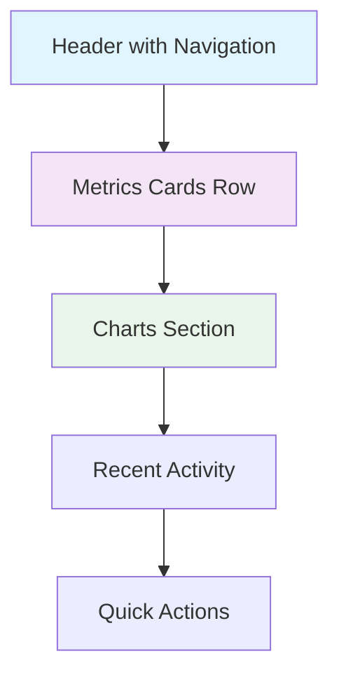

# ✨ Admin Console Features Specification

This document provides detailed specifications for all features in the Permiso Admin Console.

## 🏠 Dashboard Overview

### Main Dashboard Features

#### System Health Status
- **Real-time Health Monitoring**
  - Service status indicators (Permiso Auth, Database, Redis)
  - Response time metrics
  - Error rate monitoring
  - Uptime statistics

#### Key Metrics Cards
- **Authentication Metrics**
  - Total authentications today/week/month
  - Success rate percentage
  - Failed login attempts
  - Active sessions count

- **Client Metrics**
  - Total registered clients
  - Active clients
  - Token requests per hour
  - Most active clients

- **User Metrics**
  - Total users
  - Active users
  - New registrations
  - Locked accounts

#### Recent Activity Feed
- Recent login attempts
- New client registrations
- Permission changes
- System alerts

#### Quick Actions
- Register new client
- Create user account
- View audit logs
- System settings

### Dashboard Layout



## 🔐 Service Client Management

### Client List View

#### Features
- **Searchable Client List**
  - Search by client ID, name, or description
  - Filter by status (active/inactive)
  - Filter by client type (confidential/public)
  - Sort by creation date, last used, name

- **Client Information Display**
  - Client ID and name
  - Status indicator
  - Last used timestamp
  - Assigned scopes count
  - Request statistics

- **Bulk Operations**
  - Bulk enable/disable clients
  - Bulk scope assignment
  - Export client list

#### Client List Table Columns
| Column | Description | Sortable | Filterable |
|--------|-------------|----------|------------|
| Status | Active/Inactive indicator | No | Yes |
| Client ID | Unique identifier | Yes | Yes |
| Name | Display name | Yes | Yes |
| Type | Confidential/Public | Yes | Yes |
| Scopes | Number of assigned scopes | Yes | No |
| Last Used | Last authentication | Yes | No |
| Created | Creation date | Yes | No |
| Actions | Edit/Delete/View buttons | No | No |

### Client Details View

#### Client Information
- **Basic Information**
  - Client ID (read-only)
  - Display name
  - Description
  - Client type
  - Status (active/inactive)
  - Trusted status

- **Configuration**
  - Access token lifetime
  - Refresh token lifetime (if applicable)
  - Rate limiting settings
  - Allowed IP addresses
  - Webhook URL

- **Security Settings**
  - Client secret management
  - Secret rotation history
  - Last rotation date
  - Next recommended rotation

#### Assigned Scopes
- **Scope Management**
  - List of assigned scopes
  - Add/remove scopes
  - Scope descriptions
  - Permission implications

- **Scope Categories**
  - Read permissions
  - Write permissions
  - Admin permissions
  - Service permissions

#### Usage Statistics
- **Authentication Stats**
  - Total authentications
  - Success/failure rates
  - Peak usage times
  - Geographic distribution

- **Token Stats**
  - Active tokens
  - Expired tokens
  - Revoked tokens
  - Average token lifetime

### Client Creation/Edit Form

#### Form Sections

**Basic Information**
```typescript
interface ClientFormData {
  client_id: string;          // Auto-generated or custom
  name: string;               // Required, 1-100 chars
  description?: string;       // Optional, max 500 chars
  client_type: 'confidential' | 'public';
  is_active: boolean;
  is_trusted: boolean;
}
```

**Configuration**
```typescript
interface ClientConfig {
  access_token_lifetime: number;     // 300-86400 seconds
  refresh_token_lifetime?: number;   // Optional, min 3600 seconds
  rate_limit_per_minute: number;     // 1-1000 requests
  rate_limit_per_hour: number;       // 60-100000 requests
  allowed_ips?: string;              // Comma-separated IPs/ranges
  webhook_url?: string;              // Optional webhook endpoint
}
```

**Scope Assignment**
- Multi-select scope picker
- Scope search and filtering
- Scope descriptions and implications
- Bulk scope operations

#### Form Validation Rules
- Client ID: 3-50 characters, alphanumeric + underscore/hyphen
- Name: Required, 1-100 characters
- Description: Optional, max 500 characters
- Token lifetimes: Within specified ranges
- Rate limits: Positive integers within ranges
- IP addresses: Valid IP/CIDR format
- Webhook URL: Valid HTTP/HTTPS URL

## 👥 User Management

### User List View

#### Features
- **Advanced Search & Filtering**
  - Search by username, email, name
  - Filter by status (active/inactive/locked)
  - Filter by role
  - Filter by last login date
  - Filter by verification status

- **User Information Display**
  - Avatar/initials
  - Username and email
  - Full name
  - Status indicators
  - Role badges
  - Last login timestamp

#### User List Table
| Column | Description | Sortable | Filterable |
|--------|-------------|----------|------------|
| Avatar | User avatar/initials | No | No |
| Username | Unique username | Yes | Yes |
| Email | Email address | Yes | Yes |
| Name | Full name | Yes | Yes |
| Status | Active/Inactive/Locked | Yes | Yes |
| Roles | Assigned roles | No | Yes |
| Last Login | Last login timestamp | Yes | No |
| Created | Account creation date | Yes | No |
| Actions | Edit/Delete/Lock buttons | No | No |

### User Details View

#### User Profile
- **Personal Information**
  - Username (read-only)
  - Email address
  - First name
  - Last name
  - Display name
  - Bio/description
  - Avatar upload

- **Account Status**
  - Active/inactive status
  - Email verification status
  - Account lock status
  - Superuser status

#### Security Information
- **Authentication Details**
  - Last login timestamp
  - Failed login attempts
  - Account lockout history
  - Password last changed
  - Two-factor authentication status

- **Session Management**
  - Active sessions
  - Session history
  - Device information
  - Location data

#### Role & Permission Management
- **Assigned Roles**
  - List of user roles
  - Role assignment date
  - Role descriptions
  - Add/remove roles

- **Effective Permissions**
  - Computed permissions from roles
  - Direct scope assignments
  - Permission inheritance
  - Permission conflicts

### User Creation/Edit Form

#### Form Structure
```typescript
interface UserFormData {
  username: string;           // Required, unique, 3-50 chars
  email: string;             // Required, valid email
  password?: string;         // Required for creation
  first_name: string;        // Required, 1-50 chars
  last_name: string;         // Required, 1-50 chars
  display_name?: string;     // Optional display name
  bio?: string;              // Optional bio, max 500 chars
  is_active: boolean;        // Account status
  is_verified: boolean;      // Email verification
  is_superuser: boolean;     // Superuser privileges
  roles: string[];           // Assigned role IDs
}
```

#### Password Requirements
- Minimum 8 characters
- At least one uppercase letter
- At least one lowercase letter
- At least one digit
- At least one special character
- Not in common password list

## 🎭 Role Management

### Role List View

#### Features
- **Role Hierarchy Display**
  - Tree view of role hierarchy
  - Parent-child relationships
  - Role inheritance visualization
  - Drag-and-drop reordering

- **Role Information**
  - Role name and description
  - User count
  - Assigned scopes
  - Creation date
  - Last modified

#### Role Management Actions
- Create new role
- Edit existing role
- Delete role (with dependency check)
- Clone role
- Bulk operations

### Role Details View

#### Role Configuration
```typescript
interface RoleFormData {
  name: string;              // Required, unique, 3-50 chars
  description?: string;      // Optional description
  parent_role_id?: string;   // Optional parent role
  scopes: string[];          // Assigned scope IDs
  is_system_role: boolean;   // System-defined role
}
```

#### Scope Assignment
- **Available Scopes**
  - Categorized scope list
  - Search and filter scopes
  - Scope descriptions
  - Permission implications

- **Inherited Scopes**
  - Scopes from parent roles
  - Inheritance chain visualization
  - Override capabilities

#### User Assignment
- **Assigned Users**
  - List of users with this role
  - Assignment date
  - Direct vs inherited assignment
  - User management actions

## 🔑 Scope Management

### Scope Categories

#### Resource-Based Scopes
- **User Management**
  - `read:users` - View user information
  - `write:users` - Create/update users
  - `admin:users` - Full user management

- **Client Management**
  - `read:clients` - View service clients
  - `write:clients` - Create/update clients
  - `admin:clients` - Full client management

- **Role Management**
  - `read:roles` - View roles
  - `write:roles` - Create/update roles
  - `admin:roles` - Full role management

- **System Administration**
  - `admin:system` - System configuration
  - `admin:audit` - Audit log access
  - `admin:analytics` - Analytics access

#### Service-Specific Scopes
- **Trading Services**
  - `trade:read` - View trades
  - `trade:open` - Open new trades
  - `trade:close` - Close trades
  - `trade:modify` - Modify trades

- **Account Services**
  - `account:read` - View account info
  - `account:balance` - View balance
  - `account:modify` - Modify account

### Scope Management Interface

#### Scope List View
- **Scope Information**
  - Scope name
  - Description
  - Resource category
  - Action type
  - Usage count

#### Scope Creation Form
```typescript
interface ScopeFormData {
  name: string;              // Required, unique, format: action:resource
  description: string;       // Required description
  resource: string;          // Resource category
  action: string;           // Action type (read/write/admin)
  is_system_scope: boolean; // System-defined scope
}
```

## 📊 Audit Logs & Monitoring

### Audit Log Features

#### Event Types
- **Authentication Events**
  - Login attempts (success/failure)
  - Logout events
  - Token generation
  - Token revocation

- **Authorization Events**
  - Permission checks
  - Access denials
  - Scope violations
  - Role changes

- **Administrative Events**
  - User creation/modification
  - Client registration/updates
  - Role assignments
  - System configuration changes

#### Log Entry Structure
```typescript
interface AuditLogEntry {
  id: string;
  timestamp: Date;
  event_type: string;
  user_id?: string;
  client_id?: string;
  ip_address: string;
  user_agent?: string;
  resource: string;
  action: string;
  result: 'success' | 'failure';
  details: Record<string, any>;
  risk_level: 'low' | 'medium' | 'high';
}
```

### Audit Log Interface

#### Search & Filtering
- **Time Range Filters**
  - Last hour/day/week/month
  - Custom date range
  - Real-time updates

- **Event Filters**
  - Event type
  - User/client
  - Result status
  - Risk level
  - IP address

#### Log Visualization
- **Timeline View**
  - Chronological event timeline
  - Event clustering
  - Zoom and pan controls

- **Table View**
  - Sortable columns
  - Expandable details
  - Export functionality

### Security Monitoring

#### Real-time Alerts
- **Suspicious Activity**
  - Multiple failed logins
  - Unusual access patterns
  - Privilege escalation attempts
  - Geographic anomalies

- **System Health**
  - High error rates
  - Performance degradation
  - Service outages
  - Configuration changes

#### Alert Configuration
```typescript
interface AlertRule {
  id: string;
  name: string;
  description: string;
  condition: string;        // SQL-like condition
  threshold: number;
  time_window: number;      // Minutes
  severity: 'low' | 'medium' | 'high' | 'critical';
  enabled: boolean;
  notification_channels: string[];
}
```

## 📈 Analytics Dashboard

### Authentication Analytics

#### Metrics Overview
- **Authentication Volume**
  - Total authentications
  - Success/failure rates
  - Peak usage times
  - Trend analysis

- **User Behavior**
  - Active users
  - Session duration
  - Device types
  - Geographic distribution

#### Visualization Components
- **Time Series Charts**
  - Authentication volume over time
  - Success rate trends
  - Error rate patterns

- **Distribution Charts**
  - Client usage distribution
  - Geographic user distribution
  - Device type breakdown

### Token Analytics

#### Token Metrics
- **Token Lifecycle**
  - Tokens issued
  - Tokens expired
  - Tokens revoked
  - Average lifetime

- **Usage Patterns**
  - Token usage frequency
  - Peak usage times
  - Client token consumption

#### Performance Metrics
- **Response Times**
  - Token generation time
  - Validation time
  - API response times

- **Error Analysis**
  - Error types and frequencies
  - Error trends
  - Client-specific errors

### Custom Reports

#### Report Builder
- **Data Sources**
  - Authentication logs
  - User activity
  - Client statistics
  - System metrics

- **Visualization Options**
  - Charts and graphs
  - Tables and lists
  - Heatmaps
  - Geographic maps

#### Report Scheduling
- **Automated Reports**
  - Daily/weekly/monthly reports
  - Email delivery
  - PDF generation
  - Data export

## ⚙️ System Settings

### JWT Configuration

#### Key Management
- **Signing Keys**
  - Current active key
  - Key rotation schedule
  - Key history
  - Algorithm selection (HS256/RS256)

- **Token Settings**
  - Default token lifetimes
  - Maximum token lifetimes
  - Refresh token settings
  - Token revocation policies

#### Security Settings
```typescript
interface JWTSettings {
  algorithm: 'HS256' | 'RS256';
  access_token_lifetime: number;
  refresh_token_lifetime: number;
  service_token_lifetime: number;
  key_rotation_interval: number;
  require_audience: boolean;
  require_issuer: boolean;
}
```

### System Configuration

#### General Settings
- **Application Settings**
  - System name and branding
  - Default language
  - Timezone settings
  - Feature flags

- **Security Policies**
  - Password requirements
  - Account lockout policies
  - Session timeout
  - IP restrictions

#### Integration Settings
- **External Services**
  - Email service configuration
  - SMS service configuration
  - Webhook endpoints
  - Third-party integrations

### Environment Management

#### Configuration Profiles
- **Environment-Specific Settings**
  - Development configuration
  - Staging configuration
  - Production configuration
  - Custom environments

#### Backup & Restore
- **System Backup**
  - Configuration backup
  - Database backup
  - Automated backup scheduling
  - Backup verification

- **Disaster Recovery**
  - Restore procedures
  - Failover configuration
  - Recovery testing
  - Documentation

## 🔧 Administrative Tools

### Bulk Operations

#### User Management
- **Bulk User Operations**
  - Import users from CSV
  - Bulk role assignment
  - Bulk account activation/deactivation
  - Password reset campaigns

#### Client Management
- **Bulk Client Operations**
  - Import clients from configuration
  - Bulk scope assignment
  - Bulk credential rotation
  - Configuration templates

### System Maintenance

#### Database Maintenance
- **Cleanup Operations**
  - Expired token cleanup
  - Old audit log archival
  - Session cleanup
  - Cache maintenance

#### Performance Optimization
- **System Optimization**
  - Database query optimization
  - Cache configuration
  - Connection pool tuning
  - Resource monitoring

### Developer Tools

#### API Testing
- **Built-in API Client**
  - Endpoint testing
  - Authentication testing
  - Response inspection
  - Performance testing

#### Debug Tools
- **System Debugging**
  - Log level configuration
  - Debug mode toggle
  - Performance profiling
  - Error tracking

This comprehensive feature specification provides the foundation for building a powerful and user-friendly admin console for the Permiso Auth system.