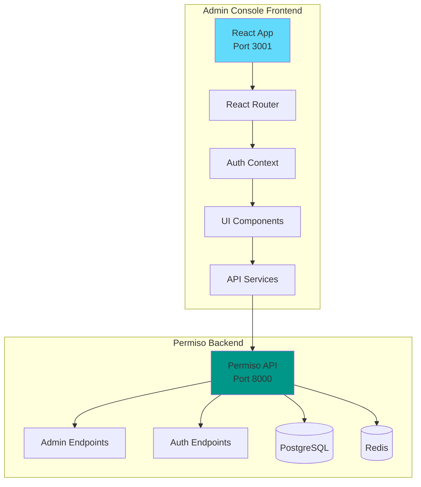
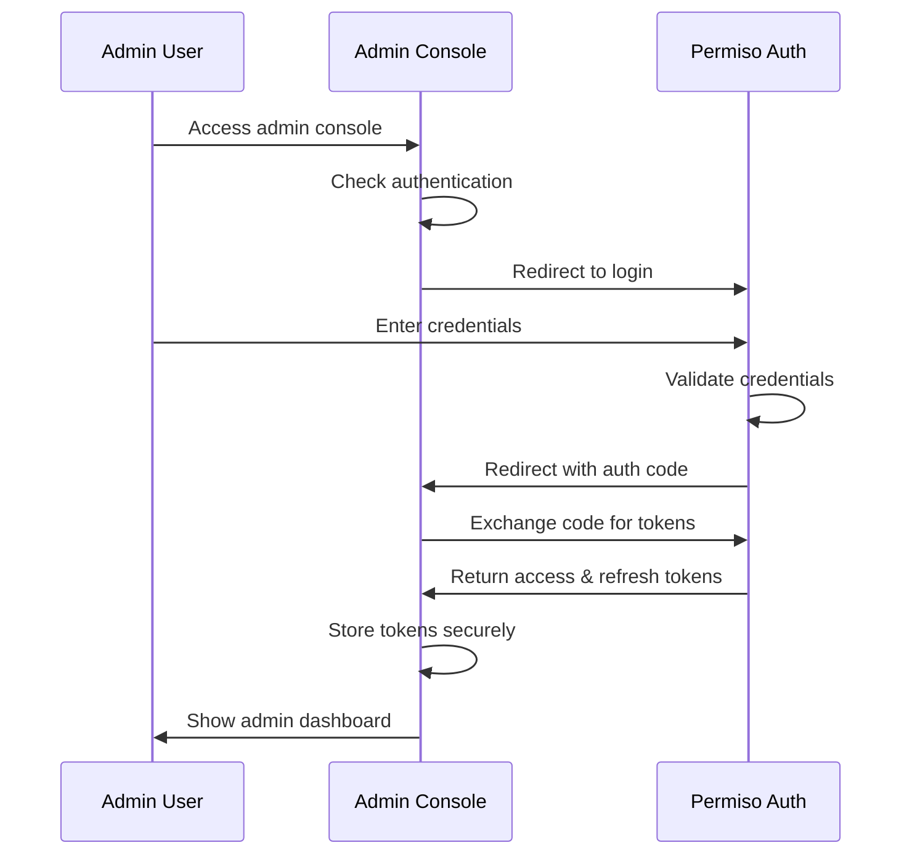

# 🔧 Permiso Admin Console

A comprehensive React-based admin console for managing the Permiso Authentication System. This console provides full control over the identity and access management system with a modern, responsive interface.

## 🎯 Overview

The Permiso Admin Console is designed for system administrators to manage clients, permissions, users, and monitor system activity. It provides a complete administrative interface for the Permiso Auth system.

## ✨ Features

### 🔐 Service Client Management
- Register new service clients
- Update existing client configurations
- View client details and statistics
- Manage client credentials and secrets
- Configure client scopes and permissions

### 🔑 Credential Management
- Issue new client credentials
- Revoke compromised credentials
- Rotate client secrets
- Monitor credential usage

### 🧑‍💼 User & Role Management
- Create and manage user accounts
- Define and assign roles
- Configure role hierarchies
- Manage user permissions

### 🧾 Scope & Permission Management
- Create and manage scopes
- Assign scopes to clients and roles
- Configure scope hierarchies
- Manage resource permissions

### 📊 Audit & Monitoring
- View authentication logs
- Monitor access events
- Track security incidents
- Generate audit reports

### 📈 Analytics & Statistics
- Token usage statistics
- Authentication success/failure rates
- Client activity metrics
- System performance monitoring

### ⚙️ System Configuration
- Manage JWT signing keys
- Configure environment settings
- System health monitoring
- Backup and restore operations

## 🏗️ Architecture



## 🚀 Quick Start

### Prerequisites
- Docker & Docker Compose
- Node.js 18+ (for local development)
- Access to Permiso Auth API

### Using Docker (Recommended)

```bash
# Clone the repository
git clone <repository-url>
cd frontend

# Start with Docker Compose
docker-compose up -d

# Access the admin console
open http://localhost:3001
```

### Local Development

```bash
# Install dependencies
npm install

# Set up environment variables
cp .env.example .env.local

# Start development server
npm run dev

# Access the admin console
open http://localhost:3000
```

## 🔧 Configuration

### Environment Variables

```bash
# API Configuration
REACT_APP_API_BASE_URL=http://localhost:8000
REACT_APP_API_VERSION=v1

# Authentication
REACT_APP_CLIENT_ID=admin-console
REACT_APP_CLIENT_SECRET=your-admin-client-secret
REACT_APP_REDIRECT_URI=http://localhost:3001/callback

# Features
REACT_APP_ENABLE_ANALYTICS=true
REACT_APP_ENABLE_AUDIT_LOGS=true
REACT_APP_ENABLE_SYSTEM_CONFIG=true

# UI Configuration
REACT_APP_THEME=light
REACT_APP_BRAND_NAME=Permiso Admin
REACT_APP_BRAND_LOGO=/logo.png
```

## 📁 Project Structure

```
frontend/
├── public/                     # Static assets
│   ├── index.html
│   ├── favicon.ico
│   └── logo.png
├── src/                        # Source code
│   ├── components/             # Reusable UI components
│   │   ├── common/            # Common components
│   │   ├── forms/             # Form components
│   │   ├── tables/            # Table components
│   │   └── charts/            # Chart components
│   ├── pages/                 # Page components
│   │   ├── Dashboard/         # Dashboard page
│   │   ├── Clients/           # Client management
│   │   ├── Users/             # User management
│   │   ├── Roles/             # Role management
│   │   ├── Scopes/            # Scope management
│   │   ├── Audit/             # Audit logs
│   │   ├── Analytics/         # Analytics dashboard
│   │   └── Settings/          # System settings
│   ├── services/              # API services
│   │   ├── api.ts             # Base API client
│   │   ├── auth.ts            # Authentication service
│   │   ├── clients.ts         # Client management API
│   │   ├── users.ts           # User management API
│   │   ├── roles.ts           # Role management API
│   │   ├── scopes.ts          # Scope management API
│   │   ├── audit.ts           # Audit log API
│   │   └── analytics.ts       # Analytics API
│   ├── hooks/                 # Custom React hooks
│   │   ├── useAuth.ts         # Authentication hook
│   │   ├── useApi.ts          # API hook
│   │   └── usePermissions.ts  # Permissions hook
│   ├── contexts/              # React contexts
│   │   ├── AuthContext.tsx    # Authentication context
│   │   ├── ThemeContext.tsx   # Theme context
│   │   └── NotificationContext.tsx # Notifications
│   ├── utils/                 # Utility functions
│   │   ├── constants.ts       # App constants
│   │   ├── helpers.ts         # Helper functions
│   │   └── validators.ts      # Form validators
│   ├── types/                 # TypeScript types
│   │   ├── api.ts             # API types
│   │   ├── auth.ts            # Auth types
│   │   └── common.ts          # Common types
│   ├── styles/                # Styling
│   │   ├── globals.css        # Global styles
│   │   └── components.css     # Component styles
│   ├── App.tsx                # Main app component
│   ├── index.tsx              # App entry point
│   └── setupTests.ts          # Test setup
├── tests/                     # Test files
│   ├── components/            # Component tests
│   ├── services/              # Service tests
│   ├── pages/                 # Page tests
│   └── utils/                 # Utility tests
├── docker/                    # Docker configuration
│   ├── Dockerfile             # Production Dockerfile
│   ├── Dockerfile.dev         # Development Dockerfile
│   └── nginx.conf             # Nginx configuration
├── docs/                      # Documentation
│   ├── DEPLOYMENT.md          # Deployment guide
│   ├── DEVELOPMENT.md         # Development guide
│   ├── API.md                 # API documentation
│   └── FEATURES.md            # Feature documentation
├── package.json               # Dependencies and scripts
├── tsconfig.json              # TypeScript configuration
├── tailwind.config.js         # Tailwind CSS configuration
├── vite.config.ts             # Vite configuration
├── docker-compose.yml         # Docker Compose configuration
├── .env.example               # Environment variables template
└── README.md                  # This file
```

## 🎨 Technology Stack

### Frontend Framework
- **React 18** - Modern React with hooks and concurrent features
- **TypeScript** - Type-safe development
- **Vite** - Fast build tool and dev server

### UI Framework
- **Tailwind CSS** - Utility-first CSS framework
- **Headless UI** - Unstyled, accessible UI components
- **Heroicons** - Beautiful hand-crafted SVG icons

### State Management
- **React Query (TanStack Query)** - Server state management
- **Zustand** - Client state management
- **React Hook Form** - Form state management

### Routing & Navigation
- **React Router v6** - Client-side routing
- **React Router DOM** - DOM bindings for React Router

### Data Visualization
- **Recharts** - Composable charting library
- **React Table** - Flexible table component

### Authentication
- **React OAuth2 Code PKCE** - OAuth2 PKCE flow implementation
- **JWT Decode** - JWT token decoding

### Development Tools
- **ESLint** - Code linting
- **Prettier** - Code formatting
- **Husky** - Git hooks
- **Jest** - Testing framework
- **React Testing Library** - Component testing

## 🔐 Authentication Flow

The admin console uses OAuth2 Authorization Code flow with PKCE for secure authentication:



## 📊 Key Features

### Dashboard Overview
- System health status
- Recent activity summary
- Key metrics and statistics
- Quick action buttons

### Client Management
- List all service clients
- Create new clients
- Edit client configurations
- View client statistics
- Manage client credentials

### User Management
- User directory
- Create and edit users
- Assign roles and permissions
- User activity monitoring

### Role & Scope Management
- Role hierarchy management
- Scope definition and assignment
- Permission matrix view
- Bulk operations

### Audit & Monitoring
- Real-time activity logs
- Security event monitoring
- Audit trail reports
- Alert management

### Analytics Dashboard
- Authentication metrics
- Usage statistics
- Performance monitoring
- Custom reports

## 🚀 Deployment

### Docker Deployment

```bash
# Build and run with Docker Compose
docker-compose up -d

# View logs
docker-compose logs -f admin-console

# Scale if needed
docker-compose up -d --scale admin-console=2
```

### Production Deployment

```bash
# Build production image
docker build -f docker/Dockerfile -t permiso-admin-console:latest .

# Run in production
docker run -d \
  --name permiso-admin-console \
  -p 3001:80 \
  -e REACT_APP_API_BASE_URL=https://api.yourdomain.com \
  permiso-admin-console:latest
```

## 🧪 Testing

```bash
# Run all tests
npm test

# Run tests with coverage
npm run test:coverage

# Run E2E tests
npm run test:e2e

# Run specific test suite
npm test -- --testPathPattern=components
```

## 🔧 Development

### Getting Started

```bash
# Install dependencies
npm install

# Start development server
npm run dev

# Run in development mode with hot reload
npm run dev:hot
```

### Code Quality

```bash
# Lint code
npm run lint

# Format code
npm run format

# Type check
npm run type-check

# Run all quality checks
npm run quality
```

## 📚 Documentation

- **[Deployment Guide](docs/DEPLOYMENT.md)** - Production deployment instructions
- **[Development Guide](docs/DEVELOPMENT.md)** - Development setup and guidelines
- **[API Documentation](docs/API.md)** - API integration details
- **[Feature Documentation](docs/FEATURES.md)** - Detailed feature descriptions

## 🤝 Contributing

1. Fork the repository
2. Create a feature branch
3. Make your changes
4. Add tests for new features
5. Run quality checks
6. Submit a pull request

## 📄 License

This project is licensed under the MIT License - see the LICENSE file for details.

## 🆘 Support

For support and questions:
- Create an issue in the repository
- Check the documentation
- Contact the development team

---

**Built with ❤️ for secure identity and access management**