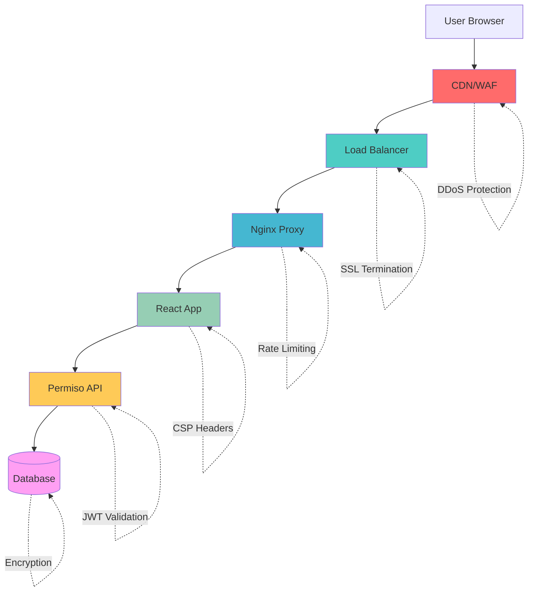

# 🔒 Security Guide

This document outlines the comprehensive security measures, best practices, and implementation details for the Permiso Admin Console.

## 🛡️ Security Overview

### Security Principles

1. **Defense in Depth**: Multiple layers of security controls
2. **Least Privilege**: Minimal access rights for users and systems
3. **Zero Trust**: Never trust, always verify
4. **Secure by Default**: Security built into the foundation
5. **Privacy by Design**: Data protection from the ground up

### Security Architecture



## 🔐 Authentication & Authorization

### OAuth2 PKCE Flow Implementation

```typescript
// src/services/auth/oauth.ts
import { generateCodeVerifier, generateCodeChallenge } from '@/utils/pkce'

interface OAuthConfig {
  clientId: string
  redirectUri: string
  scope: string
  authorizationEndpoint: string
  tokenEndpoint: string
}

class OAuthService {
  private config: OAuthConfig
  private codeVerifier: string | null = null

  constructor(config: OAuthConfig) {
    this.config = config
  }

  // Step 1: Initiate OAuth flow
  async initiateLogin(): Promise<string> {
    this.codeVerifier = generateCodeVerifier()
    const codeChallenge = await generateCodeChallenge(this.codeVerifier)
    
    // Store code verifier securely
    sessionStorage.setItem('oauth_code_verifier', this.codeVerifier)
    
    const params = new URLSearchParams({
      response_type: 'code',
      client_id: this.config.clientId,
      redirect_uri: this.config.redirectUri,
      scope: this.config.scope,
      code_challenge: codeChallenge,
      code_challenge_method: 'S256',
      state: this.generateState(),
    })

    return `${this.config.authorizationEndpoint}?${params.toString()}`
  }

  // Step 2: Handle callback and exchange code for token
  async handleCallback(code: string, state: string): Promise<TokenResponse> {
    // Validate state parameter
    const storedState = sessionStorage.getItem('oauth_state')
    if (state !== storedState) {
      throw new Error('Invalid state parameter')
    }

    const codeVerifier = sessionStorage.getItem('oauth_code_verifier')
    if (!codeVerifier) {
      throw new Error('Code verifier not found')
    }

    const response = await fetch(this.config.tokenEndpoint, {
      method: 'POST',
      headers: {
        'Content-Type': 'application/x-www-form-urlencoded',
      },
      body: new URLSearchParams({
        grant_type: 'authorization_code',
        client_id: this.config.clientId,
        code,
        redirect_uri: this.config.redirectUri,
        code_verifier: codeVerifier,
      }),
    })

    if (!response.ok) {
      throw new Error('Token exchange failed')
    }

    const tokens = await response.json()
    
    // Clean up temporary storage
    sessionStorage.removeItem('oauth_code_verifier')
    sessionStorage.removeItem('oauth_state')

    return tokens
  }

  private generateState(): string {
    const state = crypto.getRandomValues(new Uint8Array(32))
    const stateString = Array.from(state, byte => byte.toString(16).padStart(2, '0')).join('')
    sessionStorage.setItem('oauth_state', stateString)
    return stateString
  }
}
```

### JWT Token Management

```typescript
// src/services/auth/tokenManager.ts
interface TokenData {
  accessToken: string
  refreshToken?: string
  expiresAt: number
  tokenType: string
}

class TokenManager {
  private static readonly ACCESS_TOKEN_KEY = 'permiso_access_token'
  private static readonly REFRESH_TOKEN_KEY = 'permiso_refresh_token'
  private static readonly TOKEN_EXPIRY_KEY = 'permiso_token_expiry'

  // Secure token storage using httpOnly cookies (preferred) or encrypted localStorage
  static setTokens(tokens: TokenData): void {
    // In production, use httpOnly cookies
    if (this.isHttpOnlyCookieSupported()) {
      this.setHttpOnlyCookie('access_token', tokens.accessToken, tokens.expiresAt)
      if (tokens.refreshToken) {
        this.setHttpOnlyCookie('refresh_token', tokens.refreshToken, tokens.expiresAt + 86400) // 24h longer
      }
    } else {
      // Fallback to encrypted localStorage
      const encryptedData = this.encrypt(JSON.stringify(tokens))
      localStorage.setItem(this.ACCESS_TOKEN_KEY, encryptedData)
    }
  }

  static getAccessToken(): string | null {
    if (this.isHttpOnlyCookieSupported()) {
      return this.getHttpOnlyCookie('access_token')
    } else {
      const encryptedData = localStorage.getItem(this.ACCESS_TOKEN_KEY)
      if (!encryptedData) return null
      
      try {
        const decryptedData = this.decrypt(encryptedData)
        const tokens: TokenData = JSON.parse(decryptedData)
        
        // Check if token is expired
        if (Date.now() >= tokens.expiresAt * 1000) {
          this.clearTokens()
          return null
        }
        
        return tokens.accessToken
      } catch {
        this.clearTokens()
        return null
      }
    }
  }

  static isTokenExpired(): boolean {
    const token = this.getAccessToken()
    if (!token) return true

    try {
      const payload = JSON.parse(atob(token.split('.')[1]))
      return Date.now() >= payload.exp * 1000
    } catch {
      return true
    }
  }

  static clearTokens(): void {
    if (this.isHttpOnlyCookieSupported()) {
      this.clearHttpOnlyCookie('access_token')
      this.clearHttpOnlyCookie('refresh_token')
    } else {
      localStorage.removeItem(this.ACCESS_TOKEN_KEY)
      localStorage.removeItem(this.REFRESH_TOKEN_KEY)
      localStorage.removeItem(this.TOKEN_EXPIRY_KEY)
    }
  }

  private static encrypt(data: string): string {
    // Implement encryption using Web Crypto API
    // This is a simplified example - use proper encryption in production
    return btoa(data)
  }

  private static decrypt(encryptedData: string): string {
    // Implement decryption using Web Crypto API
    return atob(encryptedData)
  }

  private static isHttpOnlyCookieSupported(): boolean {
    // Check if running in secure context and cookies are available
    return window.isSecureContext && navigator.cookieEnabled
  }

  private static setHttpOnlyCookie(name: string, value: string, expiresAt: number): void {
    // This would typically be set by the server
    // Client-side implementation for demonstration
    const expires = new Date(expiresAt * 1000).toUTCString()
    document.cookie = `${name}=${value}; expires=${expires}; path=/; secure; samesite=strict`
  }

  private static getHttpOnlyCookie(name: string): string | null {
    const cookies = document.cookie.split(';')
    for (const cookie of cookies) {
      const [cookieName, cookieValue] = cookie.trim().split('=')
      if (cookieName === name) {
        return cookieValue
      }
    }
    return null
  }

  private static clearHttpOnlyCookie(name: string): void {
    document.cookie = `${name}=; expires=Thu, 01 Jan 1970 00:00:00 UTC; path=/; secure; samesite=strict`
  }
}
```

### Permission-Based Access Control

```typescript
// src/hooks/usePermissions.ts
import { useAuth } from './useAuth'

interface Permission {
  resource: string
  action: string
  scope?: string
}

export const usePermissions = () => {
  const { user } = useAuth()

  const hasPermission = (permission: string | Permission): boolean => {
    if (!user || !user.permissions) return false

    const permissionString = typeof permission === 'string' 
      ? permission 
      : `${permission.action}:${permission.resource}`

    return user.permissions.includes(permissionString) || user.permissions.includes('admin:system')
  }

  const hasAnyPermission = (permissions: (string | Permission)[]): boolean => {
    return permissions.some(permission => hasPermission(permission))
  }

  const hasAllPermissions = (permissions: (string | Permission)[]): boolean => {
    return permissions.every(permission => hasPermission(permission))
  }

  const canAccess = (resource: string, action: string): boolean => {
    return hasPermission(`${action}:${resource}`)
  }

  return {
    hasPermission,
    hasAnyPermission,
    hasAllPermissions,
    canAccess,
    permissions: user?.permissions || [],
  }
}

// Permission-based component wrapper
export const ProtectedComponent: React.FC<{
  permission: string | Permission
  fallback?: React.ReactNode
  children: React.ReactNode
}> = ({ permission, fallback = null, children }) => {
  const { hasPermission } = usePermissions()

  if (!hasPermission(permission)) {
    return <>{fallback}</>
  }

  return <>{children}</>
}
```

## 🛡️ Content Security Policy

### CSP Configuration

```typescript
// src/utils/security/csp.ts
export const generateCSPHeader = (nonce: string): string => {
  const cspDirectives = {
    'default-src': ["'self'"],
    'script-src': [
      "'self'",
      `'nonce-${nonce}'`,
      "'strict-dynamic'",
      // Allow specific trusted domains
      'https://cdn.jsdelivr.net',
      'https://unpkg.com',
    ],
    'style-src': [
      "'self'",
      "'unsafe-inline'", // Required for Tailwind CSS
      'https://fonts.googleapis.com',
    ],
    'img-src': [
      "'self'",
      'data:',
      'https:',
      'blob:',
    ],
    'font-src': [
      "'self'",
      'https://fonts.gstatic.com',
    ],
    'connect-src': [
      "'self'",
      process.env.VITE_API_BASE_URL || 'http://localhost:8000',
      process.env.VITE_WS_URL || 'ws://localhost:8000',
    ],
    'frame-src': ["'none'"],
    'object-src': ["'none'"],
    'base-uri': ["'self'"],
    'form-action': ["'self'"],
    'frame-ancestors': ["'none'"],
    'upgrade-insecure-requests': [],
  }

  return Object.entries(cspDirectives)
    .map(([directive, sources]) => `${directive} ${sources.join(' ')}`)
    .join('; ')
}

// CSP nonce generation
export const generateNonce = (): string => {
  const array = new Uint8Array(16)
  crypto.getRandomValues(array)
  return Array.from(array, byte => byte.toString(16).padStart(2, '0')).join('')
}
```

### Security Headers Component

```typescript
// src/components/security/SecurityHeaders.tsx
import { Helmet } from 'react-helmet-async'
import { generateCSPHeader, generateNonce } from '@/utils/security/csp'

export const SecurityHeaders: React.FC = () => {
  const nonce = generateNonce()
  const cspHeader = generateCSPHeader(nonce)

  return (
    <Helmet>
      {/* Content Security Policy */}
      <meta httpEquiv="Content-Security-Policy" content={cspHeader} />
      
      {/* Additional Security Headers */}
      <meta httpEquiv="X-Content-Type-Options" content="nosniff" />
      <meta httpEquiv="X-Frame-Options" content="DENY" />
      <meta httpEquiv="X-XSS-Protection" content="1; mode=block" />
      <meta httpEquiv="Referrer-Policy" content="strict-origin-when-cross-origin" />
      <meta httpEquiv="Permissions-Policy" content="camera=(), microphone=(), geolocation=()" />
      
      {/* HSTS (handled by server, but can be reinforced) */}
      <meta httpEquiv="Strict-Transport-Security" content="max-age=31536000; includeSubDomains; preload" />
    </Helmet>
  )
}
```

## 🔍 Input Validation & Sanitization

### Input Validation Utilities

```typescript
// src/utils/validation/sanitizer.ts
import DOMPurify from 'dompurify'

export class InputSanitizer {
  // Sanitize HTML content
  static sanitizeHtml(input: string): string {
    return DOMPurify.sanitize(input, {
      ALLOWED_TAGS: ['b', 'i', 'em', 'strong', 'p', 'br'],
      ALLOWED_ATTR: [],
    })
  }

  // Sanitize plain text (remove HTML tags)
  static sanitizeText(input: string): string {
    return DOMPurify.sanitize(input, { ALLOWED_TAGS: [], ALLOWED_ATTR: [] })
  }

  // Validate and sanitize email
  static sanitizeEmail(email: string): string {
    const sanitized = this.sanitizeText(email).toLowerCase().trim()
    const emailRegex = /^[^\s@]+@[^\s@]+\.[^\s@]+$/
    
    if (!emailRegex.test(sanitized)) {
      throw new Error('Invalid email format')
    }
    
    return sanitized
  }

  // Validate and sanitize username
  static sanitizeUsername(username: string): string {
    const sanitized = this.sanitizeText(username).trim()
    const usernameRegex = /^[a-zA-Z0-9_-]{3,50}$/
    
    if (!usernameRegex.test(sanitized)) {
      throw new Error('Username must be 3-50 characters and contain only letters, numbers, underscores, and hyphens')
    }
    
    return sanitized
  }

  // Sanitize URL
  static sanitizeUrl(url: string): string {
    const sanitized = this.sanitizeText(url).trim()
    
    try {
      const urlObj = new URL(sanitized)
      
      // Only allow HTTP and HTTPS protocols
      if (!['http:', 'https:'].includes(urlObj.protocol)) {
        throw new Error('Invalid URL protocol')
      }
      
      return urlObj.toString()
    } catch {
      throw new Error('Invalid URL format')
    }
  }

  // Prevent SQL injection in search queries
  static sanitizeSearchQuery(query: string): string {
    const sanitized = this.sanitizeText(query).trim()
    
    // Remove potentially dangerous SQL keywords
    const sqlKeywords = /\b(SELECT|INSERT|UPDATE|DELETE|DROP|CREATE|ALTER|EXEC|UNION|SCRIPT)\b/gi
    const cleaned = sanitized.replace(sqlKeywords, '')
    
    // Limit length
    return cleaned.substring(0, 100)
  }
}
```

### Form Validation Schema

```typescript
// src/utils/validation/schemas.ts
import { z } from 'zod'
import { InputSanitizer } from './sanitizer'

// User creation schema
export const createUserSchema = z.object({
  username: z.string()
    .min(3, 'Username must be at least 3 characters')
    .max(50, 'Username must be less than 50 characters')
    .regex(/^[a-zA-Z0-9_-]+$/, 'Username can only contain letters, numbers, underscores, and hyphens')
    .transform(InputSanitizer.sanitizeUsername),
  
  email: z.string()
    .email('Invalid email format')
    .transform(InputSanitizer.sanitizeEmail),
  
  firstName: z.string()
    .min(1, 'First name is required')
    .max(50, 'First name must be less than 50 characters')
    .transform(InputSanitizer.sanitizeText),
  
  lastName: z.string()
    .min(1, 'Last name is required')
    .max(50, 'Last name must be less than 50 characters')
    .transform(InputSanitizer.sanitizeText),
  
  password: z.string()
    .min(8, 'Password must be at least 8 characters')
    .regex(/^(?=.*[a-z])(?=.*[A-Z])(?=.*\d)(?=.*[@$!%*?&])[A-Za-z\d@$!%*?&]/, 
           'Password must contain uppercase, lowercase, number, and special character'),
  
  bio: z.string()
    .max(500, 'Bio must be less than 500 characters')
    .optional()
    .transform(val => val ? InputSanitizer.sanitizeHtml(val) : undefined),
})

// Client creation schema
export const createClientSchema = z.object({
  name: z.string()
    .min(1, 'Client name is required')
    .max(100, 'Client name must be less than 100 characters')
    .transform(InputSanitizer.sanitizeText),
  
  description: z.string()
    .max(500, 'Description must be less than 500 characters')
    .optional()
    .transform(val => val ? InputSanitizer.sanitizeText(val) : undefined),
  
  redirectUris: z.array(z.string().transform(InputSanitizer.sanitizeUrl))
    .min(1, 'At least one redirect URI is required'),
  
  allowedIps: z.string()
    .optional()
    .transform(val => {
      if (!val) return undefined
      // Validate IP addresses/CIDR ranges
      const ips = val.split(',').map(ip => ip.trim())
      const ipRegex = /^(\d{1,3}\.){3}\d{1,3}(\/\d{1,2})?$/
      
      for (const ip of ips) {
        if (!ipRegex.test(ip)) {
          throw new Error(`Invalid IP address: ${ip}`)
        }
      }
      
      return val
    }),
})
```

## 🔐 API Security

### Secure HTTP Client

```typescript
// src/services/http/secureClient.ts
import axios, { AxiosInstance, AxiosRequestConfig, AxiosResponse } from 'axios'
import { TokenManager } from '@/services/auth/tokenManager'

class SecureHttpClient {
  private client: AxiosInstance
  private readonly maxRetries = 3
  private readonly retryDelay = 1000

  constructor(baseURL: string) {
    this.client = axios.create({
      baseURL,
      timeout: 30000,
      headers: {
        'Content-Type': 'application/json',
        'X-Requested-With': 'XMLHttpRequest',
      },
    })

    this.setupInterceptors()
  }

  private setupInterceptors(): void {
    // Request interceptor
    this.client.interceptors.request.use(
      (config) => {
        // Add authentication token
        const token = TokenManager.getAccessToken()
        if (token) {
          config.headers.Authorization = `Bearer ${token}`
        }

        // Add CSRF token
        const csrfToken = this.getCSRFToken()
        if (csrfToken) {
          config.headers['X-CSRF-Token'] = csrfToken
        }

        // Add request ID for tracing
        config.headers['X-Request-ID'] = this.generateRequestId()

        return config
      },
      (error) => Promise.reject(error)
    )

    // Response interceptor
    this.client.interceptors.response.use(
      (response) => response,
      async (error) => {
        const originalRequest = error.config

        // Handle token expiration
        if (error.response?.status === 401 && !originalRequest._retry) {
          originalRequest._retry = true

          try {
            await this.refreshToken()
            const token = TokenManager.getAccessToken()
            if (token) {
              originalRequest.headers.Authorization = `Bearer ${token}`
              return this.client(originalRequest)
            }
          } catch (refreshError) {
            // Redirect to login
            window.location.href = '/login'
            return Promise.reject(refreshError)
          }
        }

        // Handle rate limiting
        if (error.response?.status === 429) {
          const retryAfter = error.response.headers['retry-after']
          const delay = retryAfter ? parseInt(retryAfter) * 1000 : this.retryDelay

          await this.delay(delay)
          return this.client(originalRequest)
        }

        return Promise.reject(error)
      }
    )
  }

  private async refreshToken(): Promise<void> {
    // Implement token refresh logic
    const refreshToken = TokenManager.getRefreshToken()
    if (!refreshToken) {
      throw new Error('No refresh token available')
    }

    const response = await axios.post('/api/auth/refresh', {
      refresh_token: refreshToken,
    })

    TokenManager.setTokens(response.data)
  }

  private getCSRFToken(): string | null {
    // Get CSRF token from meta tag or cookie
    const metaTag = document.querySelector('meta[name="csrf-token"]')
    return metaTag?.getAttribute('content') || null
  }

  private generateRequestId(): string {
    return crypto.randomUUID()
  }

  private delay(ms: number): Promise<void> {
    return new Promise(resolve => setTimeout(resolve, ms))
  }

  // Public methods
  async get<T>(url: string, config?: AxiosRequestConfig): Promise<T> {
    const response: AxiosResponse<T> = await this.client.get(url, config)
    return response.data
  }

  async post<T>(url: string, data?: any, config?: AxiosRequestConfig): Promise<T> {
    const response: AxiosResponse<T> = await this.client.post(url, data, config)
    return response.data
  }

  async put<T>(url: string, data?: any, config?: AxiosRequestConfig): Promise<T> {
    const response: AxiosResponse<T> = await this.client.put(url, data, config)
    return response.data
  }

  async delete<T>(url: string, config?: AxiosRequestConfig): Promise<T> {
    const response: AxiosResponse<T> = await this.client.delete(url, config)
    return response.data
  }
}

export const httpClient = new SecureHttpClient(
  process.env.VITE_API_BASE_URL || 'http://localhost:8000'
)
```

## 🔒 Data Protection

### Sensitive Data Handling

```typescript
// src/utils/security/dataProtection.ts
export class DataProtection {
  // Mask sensitive data for display
  static maskEmail(email: string): string {
    const [username, domain] = email.split('@')
    if (username.length <= 2) return email
    
    const maskedUsername = username[0] + '*'.repeat(username.length - 2) + username[username.length - 1]
    return `${maskedUsername}@${domain}`
  }

  static maskPhoneNumber(phone: string): string {
    if (phone.length <= 4) return phone
    return '*'.repeat(phone.length - 4) + phone.slice(-4)
  }

  static maskCreditCard(cardNumber: string): string {
    if (cardNumber.length <= 4) return cardNumber
    return '*'.repeat(cardNumber.length - 4) + cardNumber.slice(-4)
  }

  // Secure data storage
  static secureStore(key: string, data: any): void {
    try {
      const encrypted = this.encrypt(JSON.stringify(data))
      sessionStorage.setItem(key, encrypted)
    } catch (error) {
      console.error('Failed to securely store data:', error)
    }
  }

  static secureRetrieve(key: string): any {
    try {
      const encrypted = sessionStorage.getItem(key)
      if (!encrypted) return null
      
      const decrypted = this.decrypt(encrypted)
      return JSON.parse(decrypted)
    } catch (error) {
      console.error('Failed to securely retrieve data:', error)
      return null
    }
  }

  static secureRemove(key: string): void {
    sessionStorage.removeItem(key)
  }

  // Simple encryption (use proper encryption in production)
  private static encrypt(data: string): string {
    // This is a simplified example - use Web Crypto API in production
    return btoa(data)
  }

  private static decrypt(encryptedData: string): string {
    return atob(encryptedData)
  }

  // Clear sensitive data from memory
  static clearSensitiveData(): void {
    // Clear form data
    const forms = document.querySelectorAll('form')
    forms.forEach(form => form.reset())

    // Clear clipboard if it contains sensitive data
    if (navigator.clipboard) {
      navigator.clipboard.writeText('')
    }

    // Clear session storage
    sessionStorage.clear()
  }
}
```

## 🚨 Security Monitoring

### Security Event Logging

```typescript
// src/utils/security/securityLogger.ts
interface SecurityEvent {
  type: 'auth_failure' | 'permission_denied' | 'suspicious_activity' | 'data_access'
  severity: 'low' | 'medium' | 'high' | 'critical'
  message: string
  metadata?: Record<string, any>
  timestamp: Date
  userId?: string
  sessionId?: string
  ipAddress?: string
  userAgent?: string
}

export class SecurityLogger {
  private static events: SecurityEvent[] = []
  private static readonly MAX_EVENTS = 1000

  static logSecurityEvent(event: Omit<SecurityEvent, 'timestamp'>): void {
    const fullEvent: SecurityEvent = {
      ...event,
      timestamp: new Date(),
      sessionId: this.getSessionId(),
      ipAddress: this.getClientIP(),
      userAgent: navigator.userAgent,
    }

    this.events.push(fullEvent)

    // Keep only recent events
    if (this.events.length > this.MAX_EVENTS) {
      this.events = this.events.slice(-this.MAX_EVENTS)
    }

    // Send critical events immediately
    if (event.severity === 'critical') {
      this.sendEventToServer(fullEvent)
    }

    // Log to console in development
    if (process.env.NODE_ENV === 'development') {
      console.warn('Security Event:', fullEvent)
    }
  }

  static logAuthFailure(reason: string, metadata?: Record<string, any>): void {
    this.logSecurityEvent({
      type: 'auth_failure',
      severity: 'medium',
      message: `Authentication failed: ${reason}`,
      metadata,
    })
  }

  static logPermissionDenied(resource: string, action: string): void {
    this.logSecurityEvent({
      type: 'permission_denied',
      severity: 'medium',
      message: `Permission denied for ${action} on ${resource}`,
      metadata: { resource, action },
    })
  }

  static logSuspiciousActivity(activity: string, metadata?: Record<string, any>): void {
    this.logSecurityEvent({
      type: 'suspicious_activity',
      severity: 'high',
      message: `Suspicious activity detected: ${activity}`,
      metadata,
    })
  }

  static logDataAccess(resource: string, action: string): void {
    this.logSecurityEvent({
      type: 'data_access',
      severity: 'low',
      message: `Data access: ${action} on ${resource}`,
      metadata: { resource, action },
    })
  }

  private static getSessionId(): string {
    let sessionId = sessionStorage.getItem('session_id')
    if (!sessionId) {
      sessionId = crypto.randomUUID()
      sessionStorage.setItem('session_id', sessionId)
    }
    return sessionId
  }

  private static getClientIP(): string {
    // This would typically be provided by the server
    return 'unknown'
  }

  private static async sendEventToServer(event: SecurityEvent): Promise<void> {
    try {
      await fetch('/api/security/events', {
        method: 'POST',
        headers: {
          'Content-Type': 'application/json',
        },
        body: JSON.stringify(event),
      })
    } catch (error) {
      console.error('Failed to send security event to server:', error)
    }
  }

  // Get events for security dashboard
  static getEvents(): SecurityEvent[] {
    return [...this.events]
  }

  static getEventsByType(type: SecurityEvent['type']): SecurityEvent[] {
    return this.events.filter(event => event.type === type)
  }

  static getEventsBySeverity(severity: SecurityEvent['severity']): SecurityEvent[] {
    return this.events.filter(event => event.severity === severity)
  }
}
```

## 🔧 Security Configuration

### Environment-Specific Security Settings

```typescript
// src/config/security.ts
interface SecurityConfig {
  csp: {
    enabled: boolean
    reportOnly: boolean
    reportUri?: string
  }
  hsts: {
    enabled: boolean
    maxAge: number
    includeSubDomains: boolean
    preload: boolean
  }
  tokenSecurity: {
    httpOnlyTokens: boolean
    secureTokens: boolean
    sameSitePolicy: 'strict' | 'lax' | 'none'
    tokenRotationInterval: number
  }
  rateLimiting: {
    enabled: boolean
    windowMs: number
    maxRequests: number
  }
  logging: {
    securityEvents: boolean
    sensitiveDataMasking: boolean
    logLevel: 'debug' | 'info' | 'warn' | 'error'
  }
}

const developmentConfig: SecurityConfig = {
  csp: {
    enabled: false,
    reportOnly: true,
  },
  hsts: {
    enabled: false,
    maxAge: 0,
    includeSub