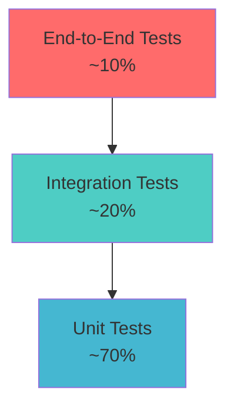

# 🧪 Testing Strategy & Guide

This document outlines the comprehensive testing strategy for the Permiso Admin Console, including unit tests, integration tests, end-to-end tests, and security testing.

## 📋 Testing Overview

### Testing Pyramid



### Testing Stack
- **Test Runner**: Vitest
- **Testing Library**: React Testing Library
- **E2E Testing**: Playwright
- **Mocking**: MSW (Mock Service Worker)
- **Coverage**: c8
- **Visual Testing**: Chromatic/Storybook

## 🔧 Test Configuration

### Vitest Configuration (vitest.config.ts)

```typescript
import { defineConfig } from 'vitest/config'
import react from '@vitejs/plugin-react'
import path from 'path'

export default defineConfig({
  plugins: [react()],
  test: {
    globals: true,
    environment: 'jsdom',
    setupFiles: ['./tests/setup.ts'],
    css: true,
    coverage: {
      provider: 'c8',
      reporter: ['text', 'json', 'html'],
      exclude: [
        'node_modules/',
        'tests/',
        '**/*.d.ts',
        '**/*.config.*',
        '**/index.ts',
        'src/main.tsx',
      ],
      thresholds: {
        global: {
          branches: 80,
          functions: 80,
          lines: 80,
          statements: 80,
        },
      },
    },
  },
  resolve: {
    alias: {
      '@': path.resolve(__dirname, './src'),
    },
  },
})
```

### Test Setup (tests/setup.ts)

```typescript
import '@testing-library/jest-dom'
import { cleanup } from '@testing-library/react'
import { afterEach, beforeAll, afterAll } from 'vitest'
import { server } from './mocks/server'

// Mock IntersectionObserver
global.IntersectionObserver = class IntersectionObserver {
  constructor() {}
  disconnect() {}
  observe() {}
  unobserve() {}
}

// Mock ResizeObserver
global.ResizeObserver = class ResizeObserver {
  constructor() {}
  disconnect() {}
  observe() {}
  unobserve() {}
}

// Mock matchMedia
Object.defineProperty(window, 'matchMedia', {
  writable: true,
  value: (query: string) => ({
    matches: false,
    media: query,
    onchange: null,
    addListener: () => {},
    removeListener: () => {},
    addEventListener: () => {},
    removeEventListener: () => {},
    dispatchEvent: () => {},
  }),
})

// Setup MSW
beforeAll(() => server.listen({ onUnhandledRequest: 'error' }))
afterEach(() => {
  server.resetHandlers()
  cleanup()
})
afterAll(() => server.close())
```

### Test Utilities (tests/test-utils.tsx)

```typescript
import React, { ReactElement } from 'react'
import { render, RenderOptions } from '@testing-library/react'
import { BrowserRouter } from 'react-router-dom'
import { QueryClient, QueryClientProvider } from 'react-query'
import { AuthProvider } from '@/contexts/AuthContext'

// Mock user for testing
const mockUser = {
  id: '1',
  username: 'testuser',
  email: 'test@example.com',
  roles: ['admin'],
  permissions: ['admin:system', 'admin:users'],
}

interface CustomRenderOptions extends Omit<RenderOptions, 'wrapper'> {
  initialEntries?: string[]
  user?: typeof mockUser | null
}

const AllTheProviders = ({ 
  children, 
  initialEntries = ['/'],
  user = mockUser 
}: {
  children: React.ReactNode
  initialEntries?: string[]
  user?: typeof mockUser | null
}) => {
  const queryClient = new QueryClient({
    defaultOptions: {
      queries: {
        retry: false,
      },
    },
  })

  return (
    <QueryClientProvider client={queryClient}>
      <BrowserRouter>
        <AuthProvider initialUser={user}>
          {children}
        </AuthProvider>
      </BrowserRouter>
    </QueryClientProvider>
  )
}

const customRender = (
  ui: ReactElement,
  options: CustomRenderOptions = {}
) => {
  const { initialEntries, user, ...renderOptions } = options
  
  return render(ui, {
    wrapper: (props) => (
      <AllTheProviders {...props} initialEntries={initialEntries} user={user} />
    ),
    ...renderOptions,
  })
}

export * from '@testing-library/react'
export { customRender as render }
```

## 🧩 Unit Testing

### Component Testing

#### Button Component Test

```typescript
// tests/components/ui/Button.test.tsx
import { render, screen, fireEvent } from '@/tests/test-utils'
import { Button } from '@/components/ui/Button'

describe('Button', () => {
  it('renders with correct text', () => {
    render(<Button>Click me</Button>)
    expect(screen.getByRole('button', { name: /click me/i })).toBeInTheDocument()
  })

  it('handles click events', () => {
    const handleClick = vi.fn()
    render(<Button onClick={handleClick}>Click me</Button>)
    
    fireEvent.click(screen.getByRole('button'))
    expect(handleClick).toHaveBeenCalledTimes(1)
  })

  it('applies variant styles correctly', () => {
    render(<Button variant="danger">Delete</Button>)
    const button = screen.getByRole('button')
    expect(button).toHaveClass('bg-red-600')
  })

  it('is disabled when loading', () => {
    render(<Button loading>Loading</Button>)
    const button = screen.getByRole('button')
    expect(button).toBeDisabled()
    expect(screen.getByTestId('loading-spinner')).toBeInTheDocument()
  })
})
```

#### Form Component Test

```typescript
// tests/components/forms/UserForm.test.tsx
import { render, screen, fireEvent, waitFor } from '@/tests/test-utils'
import { UserForm } from '@/components/forms/UserForm'

describe('UserForm', () => {
  const mockOnSubmit = vi.fn()

  beforeEach(() => {
    mockOnSubmit.mockClear()
  })

  it('renders all form fields', () => {
    render(<UserForm onSubmit={mockOnSubmit} />)
    
    expect(screen.getByLabelText(/username/i)).toBeInTheDocument()
    expect(screen.getByLabelText(/email/i)).toBeInTheDocument()
    expect(screen.getByLabelText(/first name/i)).toBeInTheDocument()
    expect(screen.getByLabelText(/last name/i)).toBeInTheDocument()
  })

  it('validates required fields', async () => {
    render(<UserForm onSubmit={mockOnSubmit} />)
    
    fireEvent.click(screen.getByRole('button', { name: /save/i }))
    
    await waitFor(() => {
      expect(screen.getByText(/username is required/i)).toBeInTheDocument()
      expect(screen.getByText(/email is required/i)).toBeInTheDocument()
    })
    
    expect(mockOnSubmit).not.toHaveBeenCalled()
  })

  it('validates email format', async () => {
    render(<UserForm onSubmit={mockOnSubmit} />)
    
    fireEvent.change(screen.getByLabelText(/email/i), {
      target: { value: 'invalid-email' }
    })
    fireEvent.click(screen.getByRole('button', { name: /save/i }))
    
    await waitFor(() => {
      expect(screen.getByText(/invalid email format/i)).toBeInTheDocument()
    })
  })

  it('submits form with valid data', async () => {
    render(<UserForm onSubmit={mockOnSubmit} />)
    
    fireEvent.change(screen.getByLabelText(/username/i), {
      target: { value: 'testuser' }
    })
    fireEvent.change(screen.getByLabelText(/email/i), {
      target: { value: 'test@example.com' }
    })
    fireEvent.change(screen.getByLabelText(/first name/i), {
      target: { value: 'Test' }
    })
    fireEvent.change(screen.getByLabelText(/last name/i), {
      target: { value: 'User' }
    })
    
    fireEvent.click(screen.getByRole('button', { name: /save/i }))
    
    await waitFor(() => {
      expect(mockOnSubmit).toHaveBeenCalledWith({
        username: 'testuser',
        email: 'test@example.com',
        firstName: 'Test',
        lastName: 'User',
      })
    })
  })
})
```

### Hook Testing

```typescript
// tests/hooks/useAuth.test.tsx
import { renderHook, act } from '@testing-library/react'
import { useAuth } from '@/hooks/useAuth'
import { AuthProvider } from '@/contexts/AuthContext'

const wrapper = ({ children }: { children: React.ReactNode }) => (
  <AuthProvider>{children}</AuthProvider>
)

describe('useAuth', () => {
  it('provides authentication state', () => {
    const { result } = renderHook(() => useAuth(), { wrapper })
    
    expect(result.current.user).toBeNull()
    expect(result.current.isAuthenticated).toBe(false)
    expect(result.current.isLoading).toBe(false)
  })

  it('handles login', async () => {
    const { result } = renderHook(() => useAuth(), { wrapper })
    
    await act(async () => {
      await result.current.login('test@example.com', 'password')
    })
    
    expect(result.current.isAuthenticated).toBe(true)
    expect(result.current.user).toMatchObject({
      email: 'test@example.com'
    })
  })

  it('handles logout', async () => {
    const { result } = renderHook(() => useAuth(), { wrapper })
    
    // First login
    await act(async () => {
      await result.current.login('test@example.com', 'password')
    })
    
    // Then logout
    await act(async () => {
      await result.current.logout()
    })
    
    expect(result.current.isAuthenticated).toBe(false)
    expect(result.current.user).toBeNull()
  })
})
```

### Service Testing

```typescript
// tests/services/api/users.test.ts
import { describe, it, expect, beforeEach } from 'vitest'
import { server } from '@/tests/mocks/server'
import { rest } from 'msw'
import { usersApi } from '@/services/api/users'

describe('Users API', () => {
  it('fetches users successfully', async () => {
    const mockUsers = [
      { id: '1', username: 'user1', email: 'user1@example.com' },
      { id: '2', username: 'user2', email: 'user2@example.com' },
    ]

    server.use(
      rest.get('/api/users', (req, res, ctx) => {
        return res(ctx.json({ users: mockUsers, total: 2 }))
      })
    )

    const result = await usersApi.getUsers()
    expect(result.users).toEqual(mockUsers)
    expect(result.total).toBe(2)
  })

  it('handles API errors', async () => {
    server.use(
      rest.get('/api/users', (req, res, ctx) => {
        return res(ctx.status(500), ctx.json({ error: 'Internal server error' }))
      })
    )

    await expect(usersApi.getUsers()).rejects.toThrow('Internal server error')
  })

  it('creates user successfully', async () => {
    const newUser = {
      username: 'newuser',
      email: 'newuser@example.com',
      firstName: 'New',
      lastName: 'User',
    }

    server.use(
      rest.post('/api/users', (req, res, ctx) => {
        return res(ctx.json({ id: '3', ...newUser }))
      })
    )

    const result = await usersApi.createUser(newUser)
    expect(result).toMatchObject({ id: '3', ...newUser })
  })
})
```

## 🔗 Integration Testing

### Page Integration Tests

```typescript
// tests/pages/Users/UserList.test.tsx
import { render, screen, waitFor, fireEvent } from '@/tests/test-utils'
import { UserList } from '@/pages/Users/UserList'
import { server } from '@/tests/mocks/server'
import { rest } from 'msw'

describe('UserList Page', () => {
  it('displays users list', async () => {
    const mockUsers = [
      { id: '1', username: 'user1', email: 'user1@example.com', roles: ['user'] },
      { id: '2', username: 'user2', email: 'user2@example.com', roles: ['admin'] },
    ]

    server.use(
      rest.get('/api/users', (req, res, ctx) => {
        return res(ctx.json({ users: mockUsers, total: 2 }))
      })
    )

    render(<UserList />)

    await waitFor(() => {
      expect(screen.getByText('user1')).toBeInTheDocument()
      expect(screen.getByText('user2')).toBeInTheDocument()
    })
  })

  it('handles search functionality', async () => {
    render(<UserList />)

    const searchInput = screen.getByPlaceholderText(/search users/i)
    fireEvent.change(searchInput, { target: { value: 'john' } })

    await waitFor(() => {
      // Verify API call was made with search parameter
      expect(screen.getByDisplayValue('john')).toBeInTheDocument()
    })
  })

  it('handles user deletion', async () => {
    const mockUsers = [
      { id: '1', username: 'user1', email: 'user1@example.com', roles: ['user'] },
    ]

    server.use(
      rest.get('/api/users', (req, res, ctx) => {
        return res(ctx.json({ users: mockUsers, total: 1 }))
      }),
      rest.delete('/api/users/1', (req, res, ctx) => {
        return res(ctx.status(204))
      })
    )

    render(<UserList />)

    await waitFor(() => {
      expect(screen.getByText('user1')).toBeInTheDocument()
    })

    fireEvent.click(screen.getByRole('button', { name: /delete/i }))
    fireEvent.click(screen.getByRole('button', { name: /confirm/i }))

    await waitFor(() => {
      expect(screen.queryByText('user1')).not.toBeInTheDocument()
    })
  })
})
```

### Authentication Flow Tests

```typescript
// tests/integration/auth-flow.test.tsx
import { render, screen, fireEvent, waitFor } from '@/tests/test-utils'
import { App } from '@/App'
import { server } from '@/tests/mocks/server'
import { rest } from 'msw'

describe('Authentication Flow', () => {
  it('redirects unauthenticated users to login', () => {
    render(<App />, { user: null, initialEntries: ['/dashboard'] })
    
    expect(screen.getByText(/sign in/i)).toBeInTheDocument()
  })

  it('allows authenticated users to access protected routes', () => {
    render(<App />, { initialEntries: ['/dashboard'] })
    
    expect(screen.getByText(/dashboard/i)).toBeInTheDocument()
  })

  it('handles login process', async () => {
    server.use(
      rest.post('/api/auth/login', (req, res, ctx) => {
        return res(ctx.json({
          access_token: 'mock-token',
          user: {
            id: '1',
            username: 'testuser',
            email: 'test@example.com',
          }
        }))
      })
    )

    render(<App />, { user: null, initialEntries: ['/login'] })

    fireEvent.change(screen.getByLabelText(/email/i), {
      target: { value: 'test@example.com' }
    })
    fireEvent.change(screen.getByLabelText(/password/i), {
      target: { value: 'password' }
    })
    fireEvent.click(screen.getByRole('button', { name: /sign in/i }))

    await waitFor(() => {
      expect(screen.getByText(/dashboard/i)).toBeInTheDocument()
    })
  })
})
```

## 🎭 End-to-End Testing

### Playwright Configuration (playwright.config.ts)

```typescript
import { defineConfig, devices } from '@playwright/test'

export default defineConfig({
  testDir: './e2e',
  fullyParallel: true,
  forbidOnly: !!process.env.CI,
  retries: process.env.CI ? 2 : 0,
  workers: process.env.CI ? 1 : undefined,
  reporter: 'html',
  use: {
    baseURL: 'http://localhost:3000',
    trace: 'on-first-retry',
    screenshot: 'only-on-failure',
  },
  projects: [
    {
      name: 'chromium',
      use: { ...devices['Desktop Chrome'] },
    },
    {
      name: 'firefox',
      use: { ...devices['Desktop Firefox'] },
    },
    {
      name: 'webkit',
      use: { ...devices['Desktop Safari'] },
    },
    {
      name: 'Mobile Chrome',
      use: { ...devices['Pixel 5'] },
    },
  ],
  webServer: {
    command: 'npm run dev',
    url: 'http://localhost:3000',
    reuseExistingServer: !process.env.CI,
  },
})
```

### E2E Test Examples

```typescript
// e2e/auth.spec.ts
import { test, expect } from '@playwright/test'

test.describe('Authentication', () => {
  test('should login successfully', async ({ page }) => {
    await page.goto('/login')
    
    await page.fill('[data-testid="email-input"]', 'admin@example.com')
    await page.fill('[data-testid="password-input"]', 'password')
    await page.click('[data-testid="login-button"]')
    
    await expect(page).toHaveURL('/dashboard')
    await expect(page.locator('[data-testid="user-menu"]')).toBeVisible()
  })

  test('should show error for invalid credentials', async ({ page }) => {
    await page.goto('/login')
    
    await page.fill('[data-testid="email-input"]', 'invalid@example.com')
    await page.fill('[data-testid="password-input"]', 'wrongpassword')
    await page.click('[data-testid="login-button"]')
    
    await expect(page.locator('[data-testid="error-message"]')).toBeVisible()
    await expect(page.locator('[data-testid="error-message"]')).toContainText('Invalid credentials')
  })
})

// e2e/user-management.spec.ts
import { test, expect } from '@playwright/test'

test.describe('User Management', () => {
  test.beforeEach(async ({ page }) => {
    // Login before each test
    await page.goto('/login')
    await page.fill('[data-testid="email-input"]', 'admin@example.com')
    await page.fill('[data-testid="password-input"]', 'password')
    await page.click('[data-testid="login-button"]')
    await expect(page).toHaveURL('/dashboard')
  })

  test('should create new user', async ({ page }) => {
    await page.goto('/users')
    await page.click('[data-testid="create-user-button"]')
    
    await page.fill('[data-testid="username-input"]', 'newuser')
    await page.fill('[data-testid="email-input"]', 'newuser@example.com')
    await page.fill('[data-testid="first-name-input"]', 'New')
    await page.fill('[data-testid="last-name-input"]', 'User')
    await page.fill('[data-testid="password-input"]', 'password123')
    
    await page.click('[data-testid="save-button"]')
    
    await expect(page.locator('[data-testid="success-message"]')).toBeVisible()
    await expect(page.locator('text=newuser')).toBeVisible()
  })

  test('should edit existing user', async ({ page }) => {
    await page.goto('/users')
    await page.click('[data-testid="user-row"]:first-child [data-testid="edit-button"]')
    
    await page.fill('[data-testid="first-name-input"]', 'Updated')
    await page.click('[data-testid="save-button"]')
    
    await expect(page.locator('[data-testid="success-message"]')).toBeVisible()
  })

  test('should delete user', async ({ page }) => {
    await page.goto('/users')
    
    const userRow = page.locator('[data-testid="user-row"]').first()
    const userName = await userRow.locator('[data-testid="username"]').textContent()
    
    await userRow.locator('[data-testid="delete-button"]').click()
    await page.click('[data-testid="confirm-delete-button"]')
    
    await expect(page.locator('[data-testid="success-message"]')).toBeVisible()
    await expect(page.locator(`text=${userName}`)).not.toBeVisible()
  })
})
```

## 🔒 Security Testing

### Security Test Suite

```typescript
// tests/security/auth-security.test.tsx
import { render, screen, fireEvent } from '@/tests/test-utils'
import { LoginForm } from '@/components/auth/LoginForm'

describe('Authentication Security', () => {
  it('prevents XSS in login form', () => {
    const xssPayload = '<script>alert("xss")</script>'
    render(<LoginForm />)
    
    fireEvent.change(screen.getByLabelText(/email/i), {
      target: { value: xssPayload }
    })
    
    const emailInput = screen.getByLabelText(/email/i) as HTMLInputElement
    expect(emailInput.value).toBe(xssPayload)
    expect(document.querySelector('script')).toBeNull()
  })

  it('sanitizes user input in forms', () => {
    const maliciousInput = ''
    render(<LoginForm />)
    
    fireEvent.change(screen.getByLabelText(/email/i), {
      target: { value: maliciousInput }
    })
    
    // Verify input is sanitized when displayed
    expect(screen.queryByRole('img')).toBeNull()
  })

  it('validates CSRF token', async () => {
    // Mock CSRF token validation
    const mockSubmit = vi.fn()
    render(<LoginForm onSubmit={mockSubmit} />)
    
    fireEvent.change(screen.getByLabelText(/email/i), {
      target: { value: 'test@example.com' }
    })
    fireEvent.change(screen.getByLabelText(/password/i), {
      target: { value: 'password' }
    })
    fireEvent.click(screen.getByRole('button', { name: /sign in/i }))
    
    // Verify CSRF token is included in request
    expect(mockSubmit).toHaveBeenCalledWith(
      expect.objectContaining({
        csrfToken: expect.any(String)
      })
    )
  })
})
```

### Permission Testing

```typescript
// tests/security/permissions.test.tsx
import { render, screen } from '@/tests/test-utils'
import { UserManagement } from '@/pages/Users/UserManagement'

describe('Permission-based Access', () => {
  it('shows admin features for admin users', () => {
    const adminUser = {
      id: '1',
      username: 'admin',
      email: 'admin@example.com',
      roles: ['admin'],
      permissions: ['admin:users', 'admin:system']
    }
    
    render(<UserManagement />, { user: adminUser })
    
    expect(screen.getByRole('button', { name: /create user/i })).toBeInTheDocument()
    expect(screen.getByRole('button', { name: /delete/i })).toBeInTheDocument()
  })

  it('hides admin features for regular users', () => {
    const regularUser = {
      id: '2',
      username: 'user',
      email: 'user@example.com',
      roles: ['user'],
      permissions: ['read:users']
    }
    
    render(<UserManagement />, { user: regularUser })
    
    expect(screen.queryByRole('button', { name: /create user/i })).not.toBeInTheDocument()
    expect(screen.queryByRole('button', { name: /delete/i })).not.toBeInTheDocument()
  })

  it('redirects unauthorized users', () => {
    const unauthorizedUser = {
      id: '3',
      username: 'limited',
      email: 'limited@example.com',
      roles: ['limited'],
      permissions: []
    }
    
    render(<UserManagement />, { user: unauthorizedUser })
    
    expect(screen.getByText(/access denied/i)).toBeInTheDocument()
  })
})
```

## 📊 Performance Testing

### Performance Test Suite

```typescript
// tests/performance/load.test.ts
import { test, expect } from '@playwright/test'

test.describe('Performance Tests', () => {
  test('dashboard loads within acceptable time', async ({ page }) => {
    const startTime = Date.now()
    
    await page.goto('/dashboard')
    await page.waitForLoadState('networkidle')
    
    const loadTime = Date.now() - startTime
    expect(loadTime).toBeLessThan(3000) // 3 seconds
  })

  test('large user list renders efficiently', async ({ page }) => {
    await page.goto('/users')
    
    // Wait for initial load
    await page.waitForSelector('[data-testid="user-row"]')
    
    // Measure scroll performance
    const startTime = Date.now()
    await page.evaluate(() => {
      window.scrollTo(0, document.body.scrollHeight)
    })
    await page.waitForTimeout(100)
    const scrollTime = Date.now() - startTime
    
    expect(scrollTime).toBeLessThan(500) // 500ms
  })
})
```

## 🚀 Test Automation

### GitHub Actions Workflow

```yaml
# .github/workflows/test.yml
name: Test Suite

on:
  push:
    branches: [main, develop]
  pull_request:
    branches: [main]

jobs:
  unit-tests:
    runs-on: ubuntu-latest
    steps:
      - uses: actions/checkout@v3
      - uses: actions/setup-node@v3
        with:
          node-version: '18'
          cache: 'npm'
      
      - run: npm ci
      - run: npm run test:coverage
      
      - name: Upload coverage to Codecov
        uses: codecov/codecov-action@v3
        with:
          file: ./coverage/lcov.info

  e2e-tests:
    runs-on: ubuntu-latest
    steps:
      - uses: actions/checkout@v3
      - uses: actions/setup-node@v3
        with:
          node-version: '18'
          cache: 'npm'
      
      - run: npm ci
      - run: npx playwright install --with-deps
      - run: npm run build
      - run: npm run test:e2e
      
      - uses: actions/upload-artifact@v3
        if: failure()
        with:
          name: playwright-report
          path: playwright-report/

  security-tests:
    runs-on: ubuntu-latest
    steps:
      - uses: actions/checkout@v3
      - uses: actions/setup-node@v3
        with:
          node-version: '18'
          cache: 'npm'
      
      - run: npm ci
      - run: npm audit --audit-level high
      - run: npx snyk test
```

### Test Scripts (package.json)

```json
{
  "scripts": {
    "test": "vitest",
    "test:ui": "vitest --ui",
    "test:coverage": "vitest --coverage",
    "test:watch": "vitest --watch",
    "test:e2e": "playwright test",
    "test:e2e:ui": "playwright test --ui",
    "test:security": "npm audit && snyk test",
    "test:all": "npm run test:coverage && npm run test:e2e && npm run test:security"
  }
}
```

## 📈 Coverage Reports

### Coverage Configuration

```typescript
// vitest.config.ts coverage configuration
export default defineConfig({
  test: {
    coverage: {
      provider: 'c8',
      reporter: ['text', 'json', 'html', 'lcov'],
      reportsDirectory: './coverage',
      exclude: [
        'node_modules/',
        'tests/',
        '**/*.d.ts',
        '**/*.config.*',
        '**/index.ts',
        'src/main.tsx',
        'src/vite-env.d.ts',
      ],
      thresholds: {
        global: {
          branches: 80,
          functions: 80,
          lines: 80,
          statements: 80,
        },
        'src/components/': {
          branches: 85,
          functions: 85,
          lines: 85,
          statements: 85,
        },
        'src/hooks/': {
          branches: 90,
          functions: 90,
          lines: 90,
          statements: 90,
        },
      },
    },
  },
})
```

This comprehensive testing strategy ensures the Permiso Admin Console is thoroughly tested across all layers, from individual components to complete user workflows, with strong emphasis on security and performance.